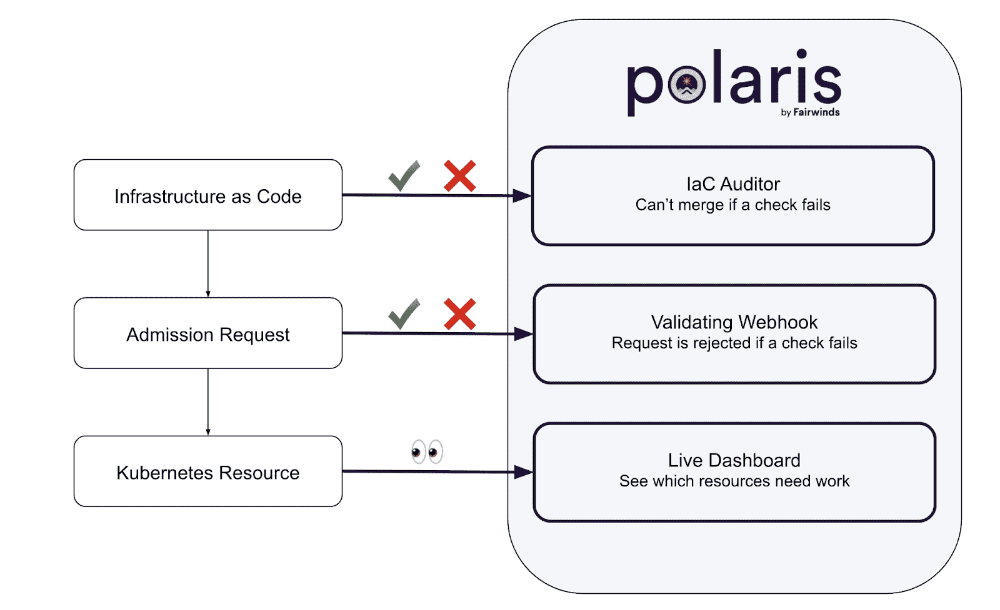
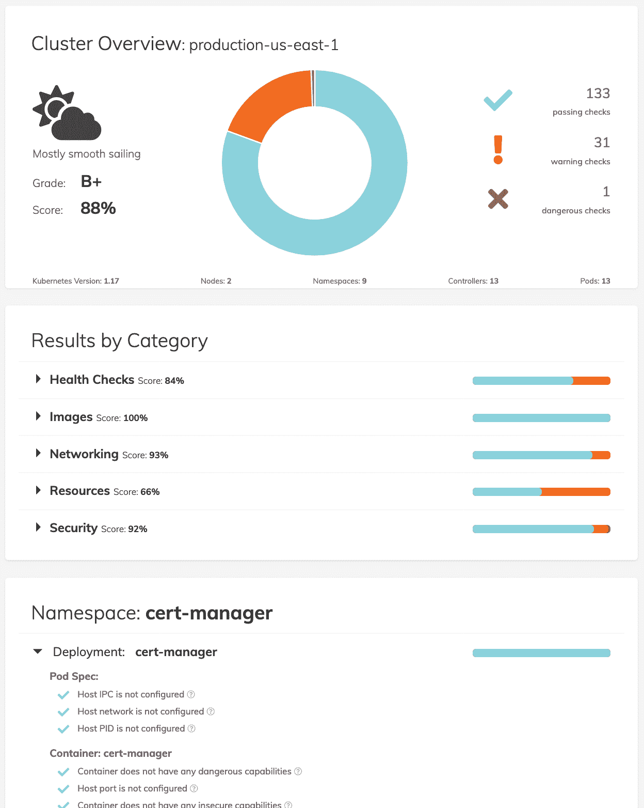

# K8s 教程:使用 Polaris 快速识别集群中的 Kubernetes 安全性、可靠性和效率问题

> 原文：<https://www.fairwinds.com/blog/how-to-use-polaris-to-identify-kubernetes-security>

 Fairwinds 的站点可靠性工程团队拥有为各种公司管理数百个 Kubernetes 集群的独特经验，他们发现客户经常将资源放入他们的集群，这导致他们的公司在云成本上花费额外的资金，使他们的应用程序不太可用，并使他们的集群容易受到恶意行为者的攻击。作为我们帮助客户缓解这些问题的努力的一部分，Fairwinds 软件工程团队开发了一种自动检查这些问题的方法，并作为名为 [Polaris](https://polaris.docs.fairwinds.com/) 的开源项目发布了该工具。

Polaris 运行数十项检查，以确保您的 Kubernetes pods 和控制器使用集群[安全性](https://polaris.docs.fairwinds.com/checks/security/)、[效率](https://polaris.docs.fairwinds.com/checks/efficiency/)和[可靠性](https://polaris.docs.fairwinds.com/checks/reliability/)方面的最佳实践进行配置。北极星是一个强大的工具，因为你可以用三种不同的方式使用它。第一个是作为一个仪表板，可视化集群中当前运行的工作负载的问题。第二个是作为准入控制器，因此您可以自动拒绝不符合组织策略的工作负载。第三种是作为命令行工具，因此您可以在您的计算机上测试本地 YAML 文件，或者作为 CI/CD 过程的一部分。



在本教程中，我们将向您展示如何安装 Polaris，并开始使用每种方法。

## 安装和查看北极星仪表板

Polaris dashboard 旨在让您可视化集群中已经运行的有问题的工作负载。

在本教程中，我们将向您展示如何使用 Helm 安装 Polaris，Helm 是 Kubernetes 的软件包管理系统。如果你喜欢用另一种方式安装 Polaris，可以从 GitHub 发布页面安装或者用 T2 自制软件安装。

要安装 Polaris with Helm，首先，将 fairwinds-stable 图表库添加到本地可用的 Helm 图表中:

```
helm repo add fairwinds-stable https://charts.fairwinds.com/stable
```

接下来，在一个新的演示命名空间中创建一个名为 polaris 的 Helm 版本:

```
helm upgrade --install polaris fairwinds-stable/polaris --namespace demo --create-namespace
```

如果安装成功，您可以通过端口转发 polaris-dashboard 服务来启动仪表板:

```
kubectl port-forward --namespace demo svc/polaris-dashboard 8080:80
```

最后，在浏览器中打开 [https://localhost:8080](https://localhost:8080/) 查看 Polaris 仪表盘。

您将看到北极星仪表盘，上面有集群健康状况的概述，包括字母等级、通过检查的百分比分数，以及反映集群状态的天气报告，从“前方有风暴，小心”到“一帆风顺”。



要深入查看结果，您可以只查看标记为警告和危险的检查，或者按名称空间查看结果。

我们将在以后的博客文章中向您展示如何对修复进行优先级排序。

## 将北极星设置为 Kubernetes 准入控制器

Polaris 可以被配置为一个[准入控制器](https://kubernetes.io/docs/reference/access-authn-authz/admission-controllers/)，它将扫描您试图部署的工作负载，并拒绝任何不符合 Polaris 标准的[效率](https://polaris.docs.fairwinds.com/checks/efficiency/)、[可靠性](https://polaris.docs.fairwinds.com/checks/reliability/)和[安全性](https://polaris.docs.fairwinds.com/checks/security/)。

像安装仪表板的说明一样，本教程将向您展示如何使用 Helm 来安装 Polaris 并将其设置为验证 webhook。

Polaris 验证 Webhook 需要有效的 TLS 证书。如果您的群集中安装了 cert-manager，则下面的安装方法将有效。

如果您不使用 cert-manager，您需要:

*   用 webhook.caBundle 提供一个 CA 包

*   使用使用该 CA 的有效证书在集群中创建 TLS 机密

*   使用 webhook.secretName 参数传递该机密的名称。

首先，将顺风-稳定海图存储库添加到本地可用的舵图中:

```
helm repo add fairwinds-stable https://charts.fairwinds.com/stable
```

接下来，在一个新的演示命名空间中创建一个名为 polaris 的 Helm release，启用 webhook 并禁用仪表板:

```
helm upgrade --install polaris fairwinds-stable/polaris --namespace demo --create-namespace --set webhook.enable=true --set dashboard.enable=false
```

如果安装成功，您将看到类似以下内容的消息:

```
Release "polaris" does not exist. Installing it now.
NAME: polaris
LAST DEPLOYED: Thu Jul 28 19:56:21 2022
NAMESPACE: demo
STATUS: deployed
REVISION: 1
TEST SUITE: None
NOTES:
** Please be patient while the chart is being deployed **

Enjoy Polaris and smooth sailing!
To view the dashboard execute this command:

kubectl port-forward --namespace demo svc/polaris-dashboard 8080:80

Then open http://localhost:8080 in your browser.
```

启用 Polaris 准入控制器后，当您尝试部署包含危险级别问题的工作负载时，验证 webhook 将阻止应用部署。

例如，如果开发人员试图部署一个名为 basic-demo 的不带 image 标记的 Helm 版本，他们将会看到一条类似于以下内容的错误消息:

```
helm upgrade --install -n demo basic-demo fairwinds-incubator/basic-demo --create-namespace --set image.pullPolicy=IfNotPresent
Release "basic-demo" does not exist. Installing it now.

Error: admission webhook "polaris.fairwinds.com" denied the request:
Polaris prevented this deployment due to configuration problems:
- Container basic-demo: Image tag should be specified
```

当开发人员添加图像标签并再次尝试部署基本演示版时，Polaris 验证 Webhook 不会干扰，他们将会看到来自 Helm 的成功消息:

```
Release "basic-demo" has been upgraded. Happy Helming!
NAME: app
LAST DEPLOYED: Fri Jul 29 16:07:35 2022
NAMESPACE: demo
STATUS: deployed
REVISION: 2
TEST SUITE: None
NOTES:
1\. Get the application URL by running these commands:
  export POD_NAME=$(kubectl get pods --namespace staging-app -l "app.kubernetes.io/name=basic-demo,app.kubernetes.io/instance=app" -o jsonpath="{.items[0].metadata.name}")
  echo "Visit http://127.0.0.1:8080 to use your application"
  kubectl port-forward $POD_NAME 8080:80
```

在未来的博客文章中，我们将描述如何设置变异的 webhooks，以便在发现问题时自动改变部署。

## 使用 Polaris CLI 工具审计您的基础设施代码

使用 Polaris 的最后一种方法是使用命令行工具审计存储在 YAML 文件中的本地 Kubernetes 清单。这对于将 Polaris 作为 CI/CD 管道的一部分在您的基础设施代码上运行特别有帮助。

你可以使用[自制软件](https://polaris.docs.fairwinds.com/infrastructure-as-code/#install-the-cli)或者从 Github 发布页面安装 Polaris。

首先，访问[版本页面](https://github.com/fairwindsops/polaris/releases)，找到适合您环境的版本。例如，在采用 amd64 处理器的 Linux 机器上，您将需要下载适用于 Linux amd64 的版本。

运行以下命令下载并安装 Polaris:

```
curl -L "https://github.com/FairwindsOps/polaris/releases/download/7.0.1/polaris_linux_amd64.tar.gz" > polaris.tar.gz
tar -xvf polaris.tar.gz
sudo mv polaris /usr/local/bin/
```

可以使用 Polaris 来审核您计算机上的 Kubernetes yaml 清单。例如，如果要扫描名为 deploy 的目录中的清单，请运行以下命令:

```
polaris audit --audit-path ./deploy/ --format=pretty
```

北极星将显示一个分数，并向您显示成功、警告和危险级别问题，如下所示:

```
Polaris audited Path ./deploy/ at 2022-07-29T16:40:08-05:00
    Nodes: 0 | Namespaces: 0 | Controllers: 1
    Final score: 55

Deployment kube-info-deployment in namespace demo
    deploymentMissingReplicas            🎉 Success
        Reliability - Multiple replicas are scheduled
    hostIPCSet                           🎉 Success
        Security - Host IPC is not configured
    hostNetworkSet                       🎉 Success
        Security - Host network is not configured
    hostPIDSet                           🎉 Success
        Security - Host PID is not configured
  Container kube-info
    runAsPrivileged                      🎉 Success
        Security - Not running as privileged
    cpuLimitsMissing                     😬 Warning
        Efficiency - CPU limits should be set
    livenessProbeMissing                 😬 Warning
        Reliability - Liveness probe should be configured
    memoryLimitsMissing                  😬 Warning
        Efficiency - Memory limits should be set
    memoryRequestsMissing                😬 Warning
        Efficiency - Memory requests should be set
    privilegeEscalationAllowed           ❌ Danger
        Security - Privilege escalation should not be allowed
    readinessProbeMissing                😬 Warning
        Reliability - Readiness probe should be configured
    tagNotSpecified                      🎉 Success
        Reliability - Image tag is specified
    insecureCapabilities                 😬 Warning
        Security - Container should not have insecure capabilities
    runAsRootAllowed                     ❌ Danger
        Security - Should not be allowed to run as root
    cpuRequestsMissing                   😬 Warning
        Efficiency - CPU requests should be set
    dangerousCapabilities                🎉 Success
        Security - Container does not have any dangerous capabilities
    hostPortSet                          🎉 Success
        Security - Host port is not configured
    notReadOnlyRootFilesystem            😬 Warning
        Security - Filesystem should be read only
    pullPolicyNotAlways                  😬 Warning
        Reliability - Image pull policy should be "Always"
```

Polaris 还可以审计现有集群中的工作负载。确保您已经设置了 KUBECONFIG 文件，然后运行命令

```
polaris audit --format=pretty
```

在以后的文章中，我们将向您展示如何在 CI/CD 管道中使用 Polaris。

## 使用 Polaris 一次审计多个集群

如果你有多个集群，并想用北极星一次性扫描它们，Fairwinds 提供了一个名为 [Insights](https://www.fairwinds.com/insights) 的平台。用户可以跨集群一致地集中管理 Polaris，以确保您的 Kubernetes 工作负载尽可能高效、可靠和安全。

### 资源

[](https://cta-redirect.hubspot.com/cta/redirect/2184645/34aa4987-a1f9-438a-a145-d7d82d5c479a)