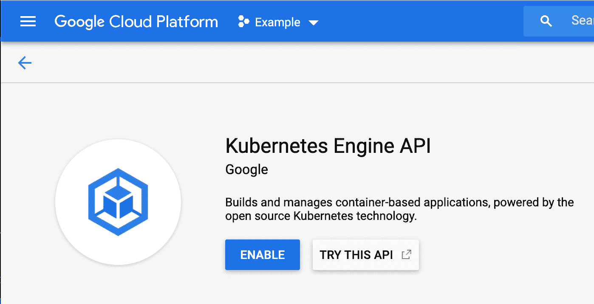
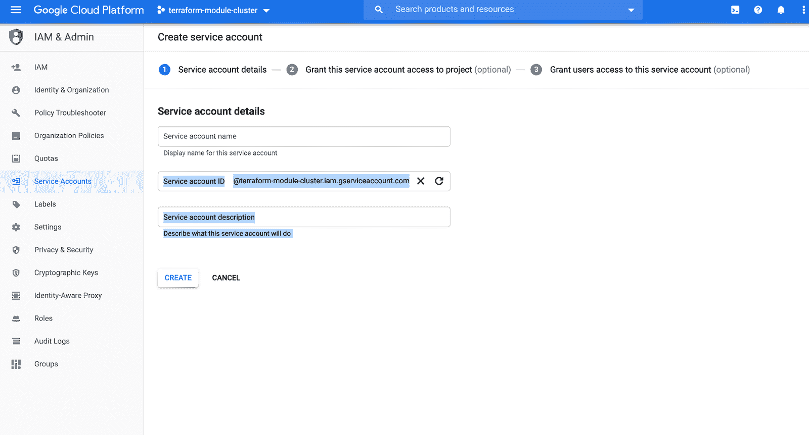
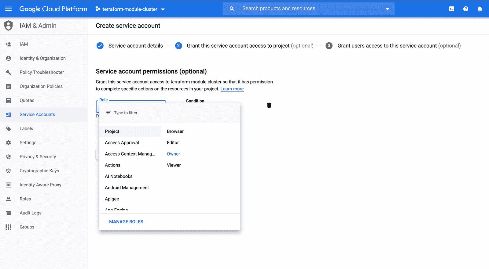
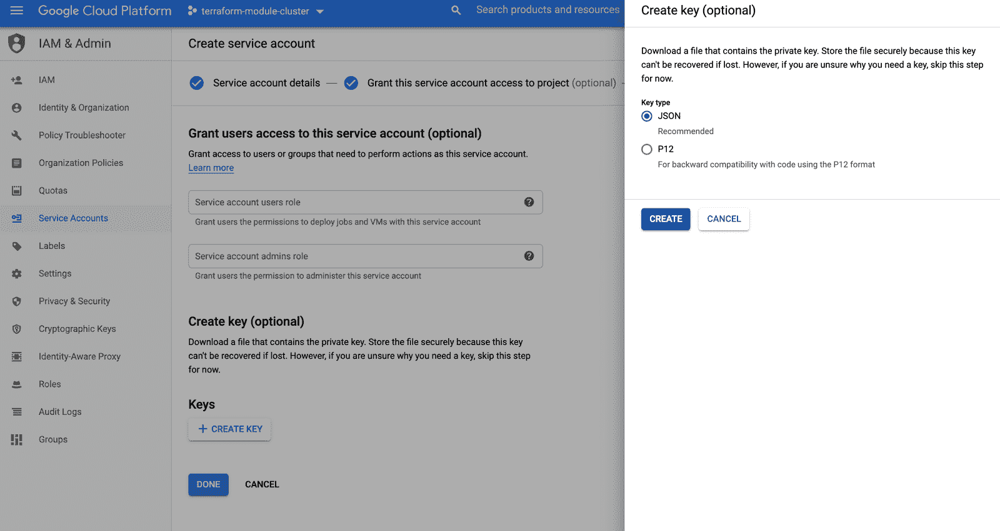

# 如何将 Terraform 与 GKE 一起使用:部署第一个集群的分步指南

> 原文：<https://www.fairwinds.com/blog/how-to-use-terraform-with-gke-a-step-by-step-guide-to-deploying-your-first-cluster>

 为了确保 Kubernetes 在构建基础设施方面的最佳实践，Fairwinds 使用了提供一致性和定制性的通用模式。Terraform 是我们管理基础设施整个生命周期的首选工具，以[基础设施作为代码](https://www.fairwinds.com/blog/why-infrastructure-as-code-kubernetes)。你可以在之前的博客中了解原因。

本博客提供了如何开始使用 Terraform 在 GKE 建立第一个 Kubernetes 集群的分步指南。

## **先决条件**

如果您想在 Terraform 中创建自己的 GKE 集群，请遵循以下步骤。

*   在您的 Google Cloud 帐户云控制台中创建一个项目
    *   一般会有一个默认创建的项目，你可以使用，或者点击 Google 云平台 logo 旁边的`My First Project` 下拉菜单，创建一个新项目。


*   一旦创建了项目，并在下拉列表中选中了它，在左侧找到 `Kubernetes Engine → Configuration` 并启用 Kubernetes 引擎 API，如下所示。



## **步骤**

在您的终端中，为您的 Terraform 文件创建一个项目目录，就像`terraform-gke.`您创建的第一个文件将是 Google Terraform Provider 的文件，它让 Terraform 知道它可以创建什么类型的资源。

您将需要一个文件，其中包含 Terraform 与 Google Cloud API 交互以创建集群和相关网络组件所需的凭据。前往谷歌云控制台导航侧边栏的 IAM &管理部分，选择 `Service Accounts.` ，创建一个服务帐户:



创建服务帐户后，系统会提示您为其选择一个角色。在本练习中，您可以从`Role`d下拉菜单中选择 `Project: Owner`



在下一页，点击 `CREATE KEY` ，选择一个 JSON 键类型:



一旦创建，文件将被下载到您的电脑上。将文件移动到 Terraform 项目目录。

接下来，创建一个名为`provider.tf,`的文件，并添加以下代码行:

```
 provider "google" {
  credentials = file("./.json")
  project     = ""
  region      = "us-central1"
  version     = "~> 2.5.0"
} 
```

在项目名称中填入您在 GCP 控制台中创建的项目的 ID，在凭证文件名中填入您刚刚下载并移动到项目文件夹中的服务帐户密钥文件的名称。完成后，创建一个名为`cluster.tf.`的新文件，添加以下代码来设置网络:

```
 module "network" {
  source = "git@github.com:FairwindsOps/terraform-gcp-vpc-native.git//default?ref=default-v2.1.0"
  // base network parameters
  network_name     = "kube"
  subnetwork_name  = "kube-subnet"
  region           = "us-central1"
  enable_flow_logs = "false"
  // subnetwork primary and secondary CIDRS for IP aliasing
  subnetwork_range    = "10.40.0.0/16"
  subnetwork_pods     = "10.41.0.0/16"
  subnetwork_services = "10.42.0.0/16"
} 
```

您将在`source`字段中注意到，网络模块是从我们的 git repo 中提取的:https://github . com/FairwindsOps/terra form-GCP-VPC-native/tree/master/default 如果您研究该 repo，尤其是`main.tf`文件，您将看到该模块负责创建的所有不同的资源和变量，如网络和子网，因此您不必单独创建它们。您可能会注意到，该模块也可以用于创建带有私有节点的云 NAT，但是我们在这里将保持简单。接下来，将这个模块代码添加到集群本身的`cluster.tf`文件中:

```
 module "cluster" {
  source                           = "git@github.com:FairwindsOps/terraform-gke.git//vpc-native?ref=vpc-native-v1.2.0"
  region                           = "us-central1"
  name                             = "gke-example"
  project                          = "terraform-module-cluster"
  network_name                     = "kube"
  nodes_subnetwork_name            = module.network.subnetwork
  kubernetes_version               = "1.16.10-gke.8"
  pods_secondary_ip_range_name     = module.network.gke_pods_1
  services_secondary_ip_range_name = module.network.gke_services_1
} 
```

您会注意到某些值，如`module.network.network_name,`是从网络模块引用的。Terraform 的这一特性使您能够在模块或资源上设置值，并在其他模块或资源上使用它们。最后，将这段代码添加到`cluster.tf`中，以设置包含 Kubernetes 工作节点的节点池:

```
 module "node_pool" {
  source             = "git@github.com:/FairwindsOps/terraform-gke//node_pool?ref=node-pool-v3.0.0"
  name               = "gke-example-node-pool"
  region             = module.cluster.region
  gke_cluster_name   = module.cluster.name
  machine_type       = "n1-standard-4"
  min_node_count     = "1"
  max_node_count     = "2"
  kubernetes_version = module.cluster.kubernetes_version
} 
```

就是这样！你的地形文件已经准备好了。下一步是通过运行`terraform init.`初始化 terra form。terra form 将生成一个名为`.terraform`的目录，并下载在`cluster.tf.`中声明的每个模块源。初始化将获取这些模块所需的任何提供程序，在本例中，它将下载`google`提供程序。如果进行了配置，Terraform 还将配置用于存储状态文件的`backend`。

```
 $ terraform init
Initializing modules...
Downloading git@github.com:FairwindsOps/terraform-gke.git?ref=vpc-native-v1.2.0 for cluster...
- cluster in .terraform/modules/cluster/vpc-native
Downloading git@github.com:FairwindsOps/terraform-gcp-vpc-native.git?ref=default-v2.1.0 for network...
- network in .terraform/modules/network/default
Downloading git@github.com:/FairwindsOps/terraform-gke?ref=node-pool-v3.0.0 for node_pool...
- node_pool in .terraform/modules/node_pool/node_pool

Initializing the backend...

Initializing provider plugins...
- Checking for available provider plugins...
- Downloading plugin for provider "google" (hashicorp/google) 2.20.3...
- Downloading plugin for provider "random" (hashicorp/random) 2.2.1...

The following providers do not have any version constraints in configuration,
so the latest version was installed.

To prevent automatic upgrades to new major versions that may contain breaking
changes, it is recommended to add version = "..." constraints to the
corresponding provider blocks in configuration, with the constraint strings
suggested below.

* provider.random: version = "~> 2.2"

Terraform has been successfully initialized!

After Terraform has been successfully initialized, you should be able to run terraform plan. It is always a good idea to run terraform plan and review the output before allowing Terraform to make any changes. 

$ terraform plan
Refreshing Terraform state in-memory prior to plan...
The refreshed state will be used to calculate this plan, but will not be
persisted to local or remote state storage.
------------------------------------------------------------------------
An execution plan has been generated and is shown below.
Resource actions are indicated with the following symbols:
  + create

Terraform will perform the following actions:

  # module.cluster.google_container_cluster.cluster will be created
  + resource "google_container_cluster" "cluster" {
      + additional_zones            = (known after apply)
      ....
    }

  # module.network.google_compute_network.network will be created
  + resource "google_compute_network" "network" {
      + auto_create_subnetworks         = false
      ....
    }

  # module.network.google_compute_subnetwork.subnetwork will be created
  + resource "google_compute_subnetwork" "subnetwork" {
      + creation_timestamp       = (known after apply)
      ....
    }

  # module.node_pool.google_container_node_pool.node_pool will be created
  + resource "google_container_node_pool" "node_pool" {
      + cluster             = "gke-example"
      ....
    }

  # module.node_pool.random_id.entropy will be created
  + resource "random_id" "entropy" {
      + b64         = (known after apply)
      ....
    }

Plan: 5 to add, 0 to change, 0 to destroy. 
```

请注意，这个片段已经被稍微编辑过，以减少这篇文章的篇幅。如上例所示，Terraform 将采取措施添加我们的 5 个 GKE 资源。应用后，Terraform 将创建我们的网络、子网(用于 pod 和服务)、GKE 集群和节点池。`random_id`资源来自节点池模块；它用于跟踪节点池资源的更改。计划通过验证后，通过运行最后一个验证步骤`terraform apply.`应用更改，Terraform 将再次输出计划，并在应用前提示确认。完成此步骤大约需要 10-15 分钟。

```
 Do you want to perform these actions?
  Terraform will perform the actions described above.
  Only 'yes' will be accepted to approve.

  Enter a value: yes

module.node_pool.random_id.entropy: Creating...
module.node_pool.random_id.entropy: Creation complete after 0s [id=dcY]
module.network.google_compute_network.network: Creating...
module.network.google_compute_network.network: Still creating... [10s elapsed]
module.network.google_compute_network.network: Creation complete after 17s [id=kube]
module.network.google_compute_subnetwork.subnetwork: Creating...
module.network.google_compute_subnetwork.subnetwork: Still creating... [10s elapsed]
...
module.network.google_compute_subnetwork.subnetwork: Creation complete after 37s [id=us-central1/kube-subnet]
module.cluster.google_container_cluster.cluster: Creating...
module.cluster.google_container_cluster.cluster: Still creating... [10s elapsed]
...
module.cluster.google_container_cluster.cluster: Still creating... [7m50s elapsed]
module.cluster.google_container_cluster.cluster: Creation complete after 7m56s [id=gke-example]
module.node_pool.google_container_node_pool.node_pool: Creating...
module.node_pool.google_container_node_pool.node_pool: Still creating... [10s elapsed]
module.node_pool.google_container_node_pool.node_pool: Still creating... [20s elapsed]
...
module.node_pool.google_container_node_pool.node_pool: Still creating... [2m0s elapsed]
module.node_pool.google_container_node_pool.node_pool: Creation complete after 2m7s [id=us-central1/gke-example/gke-example-node-pool-75c6]

Apply complete! Resources: 5 added, 0 changed, 0 destroyed. 
```

请注意，这个片段已经被稍微编辑过，以减少这篇文章的篇幅。现在您的集群已经配置好了，使用 gcloud 来检索`kubectl.`的集群配置。该命令会将新的集群配置合并到您的`KUBECONFIG`中，默认为`~/.kube/config.`

```
 $ gcloud container clusters get-credentials gke-example --region us-central1
Fetching cluster endpoint and auth data.
kubeconfig entry generated for gke-example. 
```

检索到凭据后，通过运行`kubectl get nodes.`确认您可以连接

```
 $ kubectl get nodes
NAME                                                  STATUS   ROLES    AGE   VERSION
gke-gke-example-gke-example-node-pool-953475c5-lrm8   Ready       17m   v1.16.10-gke.8
gke-gke-example-gke-example-node-pool-d9071150-m8mh   Ready       17m   v1.16.10-gke.8
gke-gke-example-gke-example-node-pool-df7578a5-htw9   Ready       17m   v1.16.10-gke.8 
```

恭喜您，您已经使用 Terraform 成功部署了 Kubernetes GKE 集群！您现在可以开始将您的应用程序部署到 Kubernetes 了！

## 资源