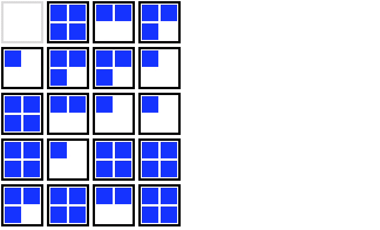
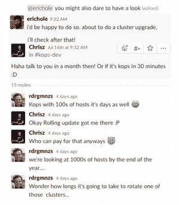

# 我们如何学会不再担心并爱上集群升级

> 原文：<https://www.fairwinds.com/blog/how-we-learned-to-stop-worrying-and-love-cluster-upgrades>

 ### **当前进程**

有经验的 Kubernetes 集群操作员知道升级可能很棘手。像`kops`这样的工具试图让这个过程变得更好，但是这还不是一个已经解决的问题。集群升级可能会很可怕，甚至很危险。在 [Fairwinds](/) ，我们进行了大量的集群升级，客户依靠我们来确保它们的正确性。当我们说我们做了很多时，我们指的是每个客户至少 2 个集群(通常超过 2 个)，并且我们每年大约更新 4 次。这意味着我们需要大量的滚动更新，这给了我们大量的机会来思考和制定策略。我们想出了一些让这个过程变得更好的技巧，我们把它们整理在这里与你分享。

首先，让我们用 [kops](https://www.github.com/kubernetes/kops) 回顾一下当前状态，因为我们的大多数集群都是由 it 管理的。滚动更新策略记录在[这里](https://github.com/kubernetes/kops/blob/master/docs/cli/kops_rolling-update_cluster.md#synopsis)，工作方式如下:

对于每个节点:

1.耗尽节点

2.终止 EC2 实例

3.等待 ASG(自动扩展组)中的替换节点加入群集

4.等待群集得到验证

这种更新策略有几个问题。随着集群变得越来越大，这些问题变得更加棘手:

第一个问题涉及到节点排水和周围的吊舱洗牌。当 Kubernetes 在准备删除一个节点时，它必须重新调度正在运行的工作负载。如果你仔细观察上面的例子，你会注意到 pod 经常被移动多次！对于第一个节点，*每个*重新安排的 Pod 至少需要再移动*1 次*。随着时间的推移，pod 被多次重新调度的机会越来越大，但这不是一个可行的长期调度策略。这有点傻，因为我们知道哪些节点会提前离开。

其次，等待一个节点被删除，一个新节点启动然后加入群集可能需要 10 分钟。当集群包含 20 个或更多节点时，此过程可能需要几个小时。

如果你的应用程序是有弹性的，并在被要求关闭时礼貌地关闭，这种混乱通常是令人讨厌的。如果你的应用程序不能很好地运行，这可能会产生实际的问题。它放大了升级所需的时间。

### **更好的方法**

在云中，短时间运行额外的实例相对便宜。在 [Fairwinds](/) 时，我们打算花费更多我们丰富的计算资源来保留我们最稀缺的资源:*时间*。

我们从书本开始升级过程:我们对主文档使用滚动更新过程。这将一个接一个地消耗和替换实例。然后，我们把我们的扭曲。

对于每个“节点”实例组:

1.节点数量翻倍

2.封锁旧节点

3.排空旧节点

4.终止那些节点

这比滚动更新快得多。它使节点的启动并行化，因此这一切都是同时发生的。这有一个很好的副作用:它给了你大量的空间来安排你将要消耗的所有能量。然后，所有完成接收流量的节点立即被封锁。这意味着你只需要为你的豆荚找一个家。那很酷。

### **细节决定成败**

#### 最后一部分是关于理论和挥手的大篇幅。你实际上是怎么做的？

一旦母版被更新，这个过程就非常简单了，但是我们已经列出了下面的步骤，这样你就可以避免一些不太明显的问题出现。

1.**禁用集群自动缩放器(如果已安装)。**这不是可选的。当您的流量预计相对稳定且理想情况下最小时，请进行升级。那是你升级的时候，对吗？:)如果不禁用它，cluster-autoscaler 真的想删除所有新节点，因为它们都是空的。我们发现将集群自动缩放器扩展到 0 个副本就足够了。

2.**集群规模翻倍。**这有几种方法，但最简单的是编辑自动缩放组(或`kops`实例组)。新节点将使用新的启动配置进行初始化，新版本的 Kubernetes 运行`kubectl get nodes`来查看新版本上的所有节点。

3.**如果您正在使用 ELBs，在这里花点时间验证您的新节点是 ELB 中的** `<strong>Healthy</strong>` **。**
这一点很重要，因为标记为`SchedulingDisabled`的节点被视为不可用，并将从其连接的 ELB 中移除。如果我们在将新节点添加到 ELB 之前封锁所有旧节点，这将导致中断。

4.**如果您在您的任何** `<strong>LoadBalancer</strong>` **-type** `<strong>Services</strong>` **上使用** `<strong>externalTrafficPolicy: Local</strong>` **，在您继续之前临时设置** `<strong>externalTrafficPolicy: Cluster</strong>` **是很重要的。**
如果我们在一个新节点上的服务单元可用之前封锁所有旧节点，我们保证在 ELB 有 0 个`Healthy`节点，并且有一个中断。如果暂时设置`externalTrafficPolicy: Cluster`对您来说不是一个选项，请确保在继续之前让一个 Pod 在一个新节点上运行。

5.**封锁所有旧节点。**
如果您正在升级版本，使用类似`kubectl get nodes | grep <old version> | awk '{print $1}' | xargs kubectl cordon`的命令快速定位旧节点。这就是我们如何防止豆荚被重新安排超过一次。

6.**引流旧节点。**我们发现类似下面这样的东西很有用:`kubectl get nodes | grep SchedulingDisabled | awk '{print $1}' | xargs kubectl drain --ignore-daemonsets --delete-local-data --force`

7.**重新打开集群自动缩放功能！**
旧节点空了，我们不再需要它们了。Cluster-autoscaler 可以快速解决这些问题。

PSA:鉴于你的新版本 Kubernetes，这可能是一个很好的时间来验证你安装的所有那些随机的第三方位是否还在工作，你是否还在运行一个合适的版本。

### **kops 意识到了这一点**

kops repo 上有一个[公开的 PR](https://github.com/kubernetes/kops/pull/4038) 介绍了这个策略以及其他策略，希望在接下来的几个版本中可以使用。在此之前，我们发现所有这些都是有用的，我们希望你也一样！