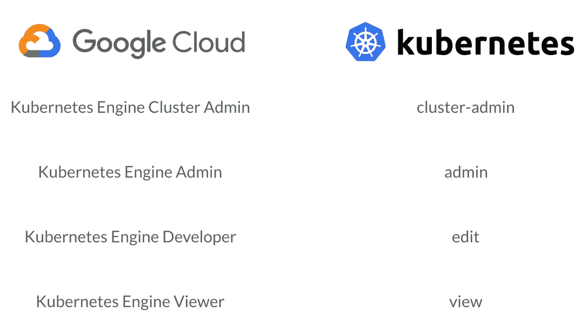
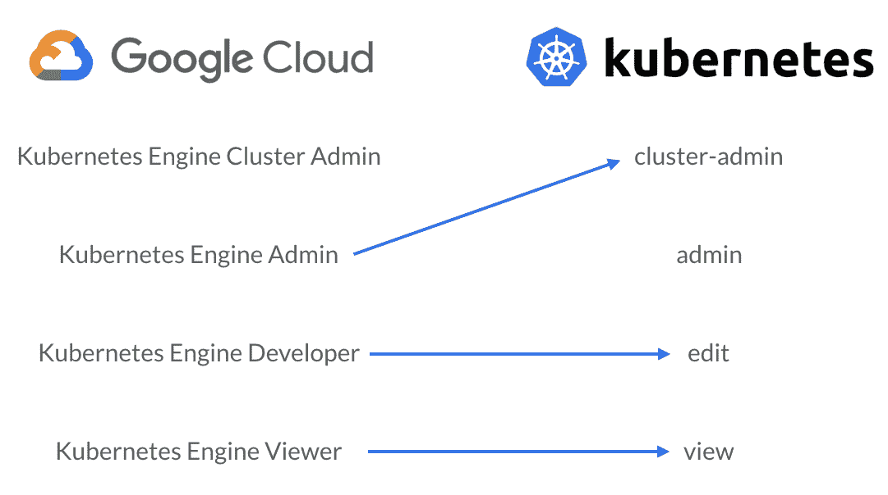

# 我们如何管理 Kubernetes RBAC 和我在 GKE 的角色

> 原文：<https://www.fairwinds.com/blog/how-we-manage-kubernetes-rbac-and-iam-roles-on-gke>

 Google 的托管 Kubernetes 服务一直是我最喜欢的运行 Kubernetes 集群的方式之一。谷歌 Kubernetes 引擎(GKE)提供了一些令人难以置信的功能，使 Kubernetes 更愉快地工作。也就是说，GKE 最好的功能之一是经常被误解的，Google Cloud IAM 和 Kubernetes RBAC 之间的关系。如果配置正确，它们可以为 Kubernetes 授权提供一种简单而强大的方法。

#### RBAC 建立在 GKE 的基础上

对于 Google Cloud 中的大多数服务，设置授权只需要配置 IAM 角色。虽然这也是 GKE 的一个选项，但是您可能需要添加一些 RBAC 配置，作为有效的 Kubernetes 授权策略的一部分。

本质上，所有 IAM 配置都适用于整个 Google Cloud 项目，以及该项目中的所有集群。Kubernetes RBAC 配置分别应用于每个集群，并支持名称空间级别的细粒度授权。在 GKE 中，这些授权方法并行工作，用户的能力有效地代表了分配给他们的 IAM 和 RBAC 角色的联合。

#### 常见的 IAM 和 RBAC 角色

Google Cloud IAM 和 Kubernetes RBAC 都提供了默认角色，作为任何授权策略的良好起点。



GCP IAM and Kubernetes RBAC have similarly named roles (cluster admin, admin, developer/edit, and viewer)

根据上图，您可能会认为左边的 Google Cloud IAM 角色与右边相应的 Kubernetes RBAC 角色相匹配。虽然这基本上是对的，但是在集群管理员角色方面有很大的不同。

在 Kubernetes RBAC 中，集群管理员角色授予创建、编辑或删除集群中任何资源的完全管理权限。使用 Google Cloud IAM，Kubernetes 引擎集群管理员角色实际上只授予更改集群基础设施的能力，而不是实际访问集群中的任何资源。当然，这两个角色名称在单独使用时是有意义的，但是考虑到 IAM 和 RBAC 的效果之间的重叠，这种命名可能会令人困惑。以下是 IAM 角色与 RBAC 角色实际关联的大概情况:



The GKE Admin role actually matches up more closely with the cluster-admin RBAC role while the GKE developer and viewer roles line up closely with RBAC edit and view roles.

这些 IAM 角色与 RBAC 角色并不完全匹配，但是这些箭头所连接的角色中的功能通常非常接近。还值得注意的是，项目范围的所有者、编辑者和查看者 IAM 角色分别包括 GKE 管理员、开发人员和查看者功能(有几个有趣的例外)。

#### 一起使用 IAM 和 RBAC

有了最小特权原则作为我们的指路明灯，我们可以使用简单的方法与 IAM 和 RBAC 一起实现全面授权。由于 IAM 角色授予对 GCP 项目中所有集群的访问权限，因此应该谨慎使用。例如，授予“Kubernetes Engine Developer”角色将授予对所有名称空间的编辑访问权，包括`kube-system`允许具有此 IAM 角色的任何人修改核心系统组件。当然，我们仍然需要使用 IAM 授予某种形式的基本访问权限，以使用户能够获得访问集群的凭证。在 GKE 上，如果没有至少一些 IAM 来授予初始集群访问权限，RBAC 是无能为力的。

考虑到这一点，我们通常建议使用“Kubernetes 引擎查看器”IAM 角色来授予只读访问权限。然后，可以使用粒度 RBAC 配置来扩展这种访问，该配置授予对特定名称空间的写和/或管理访问权限。对于 GKE，IAM 是授权的基础，而 RBAC 是建立在基础之上的结构。

实际上，这意味着在名称空间级别向特定用户授予集群中的`edit`或`admin`角色，以构建您使用 IAM 授予他们的只读访问权限。一个简单的角色绑定在`web`名称空间中授予 Jane edit 访问权限，如下所示:

```
kind: RoleBinding
apiVersion: rbac.authorization.k8s.io/v1
metadata:
  name: jane-web
  namespace: web
subjects:
- kind: User
  name: jane@example.com
  apiGroup: rbac.authorization.k8s.io
roleRef:
  kind: ClusterRole
  name: edit
  apiGroup: rbac.authorization.k8s.io

```

像这样定义 RBAC 配置在小范围内工作得相对较好，但是很快会变得难以跨各种名称空间或用户进行管理。当一半的配置位于 Google Cloud IAM，而另一半位于 RBAC 的 Kubernetes 时，也很难获得集群中授权的全貌。在不断遇到这些问题后，我们创建了一些开源工具来帮助解决。

#### 简化 RBAC 管理

在 Fairwinds，我们为各种各样的组织管理集群，这意味着我们亲眼目睹了 RBAC 配置在规模上可以变得多么复杂。更糟糕的是，很难以任何有意义的方式自动化对 RBAC 配置的更改。像许多组织一样，我们尽可能使用 CI/CD 和基础设施作为代码，这对 RBAC 来说确实很难。角色绑定不能更改，而是需要在为用户分配不同角色时删除并重新创建。此外，在任何 CI/CD 工作流中，注意到缺少资源并基于此进行更改变得非常复杂。对于 RBAC，这是一个非常重要的细节。撤销访问需要移除角色绑定，这可能很难跟踪。

我们在构建 rbac 管理器时考虑到了所有这些因素。rbac-manager 是一个定制运营商，可以轻松部署到您的集群中，显著简化您的 rbac 工作流。使用 rbac-manager 的自定义资源(rbac 定义)，我们经常看到 yaml 的数量减少到原始配置的 1/3。重要的是，使用 rbac-manager 更改和撤销角色的工作方式与您预期的一样。如果绑定到用户的角色在 RBAC 定义中发生更改，rbac-manager 会负责删除和重新创建与新角色绑定的关联角色。此外，如果从 RBAC 定义中删除了与用户绑定的角色，则关联的角色绑定也会自动删除。

所有这些改进都相对较小，但是当组合成一个单一的工具时，它们可以使 RBAC 更容易使用。

#### 简化 RBAC(和 IAM)的可见性

借助 GKE 提供的 RBAC 和 IAM 的独特组合，很难全面了解谁有权访问集群。我们创建了 [rbac-lookup](https://github.com/reactiveops/rbac-lookup) 来帮助解决这个问题。使用类似于`rbac-lookup rob`的简单命令，它将输出所有匹配该名称的用户、服务帐户或组，并显示他们在集群中被赋予的 RBAC 角色。

在我们最新的版本中，我们引入了 GKE IAM 集成，这也将在输出中包括与这些用户相关联的容器 IAM 角色。因此，如果您运行`rbac-lookup rob --gke`，它将包括所有相关的 RBAC 角色，以及与匹配用户的 GKE 访问相关联的所有相关 IAM 角色。

在 Fairwinds，我们相信在您的 Kubernetes 集群上配置和理解授权应该很容易。我们希望 [rbac-manager](https://github.com/reactiveops/rbac-manager) 和 [rbac-lookup](http://github.com/reactiveops/rbac-lookup) 都有助于让每个人更容易接近 rbac。

[](https://cta-redirect.hubspot.com/cta/redirect/2184645/cb39a009-a458-4282-9211-41e010cb3376)