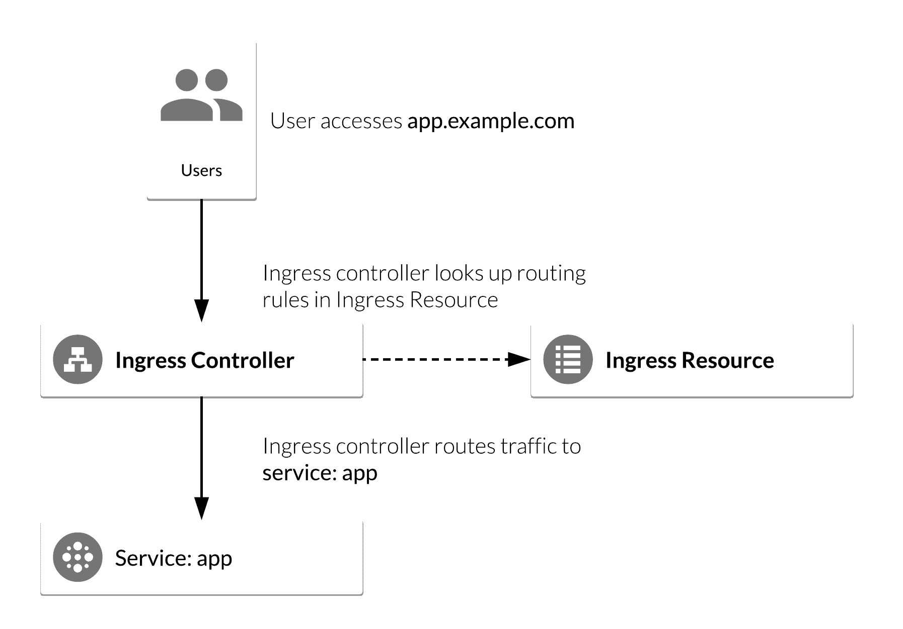
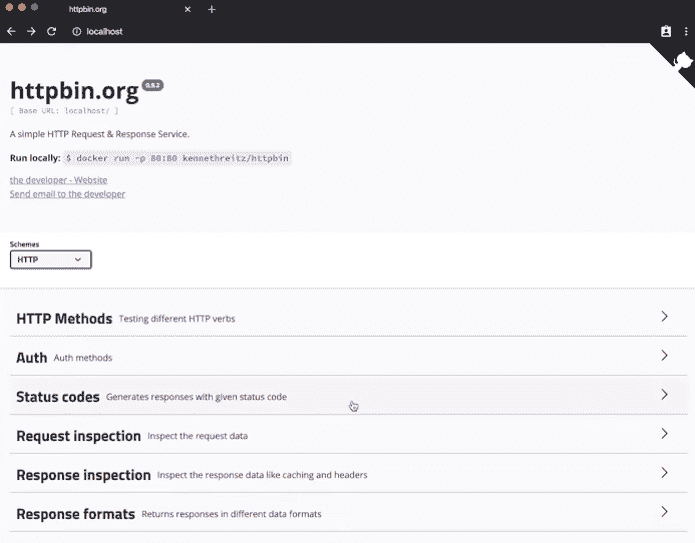

# Kube ingress 简介:在 Kubernetes 裸机中设置 nginx Ingress

> 原文：<https://www.fairwinds.com/blog/intro-to-kubernetes-ingress-set-up-nginx-ingress-in-kubernetes-bare-metal>

 入口是使流量从外部进入 Kubernetes 集群的资源。这通常是对 HTTP 或 HTTPS 服务。有一些方法可以将非 HTTP 服务映射到入口，但是这种方法不太常见。这个博客将只关注 HTTP 和 HTTPS 流量。

入口资源的一个更有趣的方面是，尽管它是 Kubernetes 附带的基本原语，如 pod、部署、副本集等。实际上，它需要在群集上安装一个称为入口控制器的东西，以便入口资源发挥作用。在没有安装任何一个控制器的情况下创建入口资源将不起作用。

由于入口资源要求控制器运行，因此入口的配置可能有点开放。任何特定于您选择的控制器类型的配置通常都是通过注释入口资源来完成的。

您可以将入口控制器视为 Kubernetes 集群中所有服务的一种 web 服务器。它被配置为将请求路由到适当的服务；这与在裸机服务器上安装 Apache 以将网站暴露给互联网的时代没有什么不同。

您可以看到入口控制器和入口资源是如何构建的:



来源: [谷歌社区教程](https://cloud.google.com/community/tutorials/nginx-ingress-gke)

大多数入口控制器都允许你进行基于主机的路由，因此 foo.com 应该路由到 foo 名称空间中的 foo 服务，以及基于路径的路由-foo.com/dashboard 应该路由到 foo-dashboard 服务。

为了简单起见，我将演示一个入口控制器 nginx 入口控制器。这是 Kubernetes 社区中的一个流行选择，但我也希望鼓励您研究现有的各种入口控制器，并决定哪一种最适合您的应用。

让我们看一个例子。

你首先需要安装 nginx 入口控制器，文件在 [GitHub 库](https://kubernetes.github.io/ingress-nginx/deploy/) 中。这将启动 pod 和相关资源，为您处理和提供入口资源。 [Nginx Ingress 入门](https://kubernetes.github.io/ingress-nginx/deploy/) 页面提供了 Kubernetes 清单，用于在自己的机器、AWS、GCP 或 Azure clouds 上安装 Kubernetes。例如，要在您的机器上运行的 Kubernetes 中安装 Nginx Ingress:

```
kubectl apply -f 
https://raw.githubusercontent.com/kubernetes/ingress-nginx/controller-v0.34.1/deploy/static/provider/baremetal/deploy.yaml
```

```
…..
NodePort:                 http  32316/TCP 
```

接下来测试 Kubernetes 服务，它提供对 Nginx 入口控制器 pods 的访问，进而提供对入口对象的访问。在您的机器上运行的 Kubernetes 将配置有 NodePort 服务，云安装配置有 LoadBalancer 服务。要连接到节点端口服务，在您的机器上运行 Kubernetes 的情况下:

`$ kubectl describe service -n ingress-nginx ingress-nginx-controller`

在这种情况下，连接到您机器上的 localhost:32316。您应该会收到一个显示“404 未找到”的页面，这是入口控制器的默认响应。如果您使用的是云托管的 Kubernetes，请使用上面的“kubectl describe”命令，并连接到负载平衡器的主机名。

现在您将向 Kubernetes 部署一个测试应用程序。

这个应用程序是 httpbin，一个用于从 API 请求和接收回复的简单工具。它提供了 API 和前端，因此非常适合测试。该服务属于 ClusterIP 类型，入口将向该服务的端点(pods)发送流量。现在看一下上面的命令所应用的入口清单。

```
apiVersion: networking.k8s.io/v1beta1
kind: Ingress
metadata:
  name: httpbin
  namespace: httpbin
  annotations:
    kubernetes.io/ingress.class: nginx
spec:
  rules:
  - host: localhost
    http:
      paths:
      - backend:
          serviceName: httpbin
          servicePort: 80
        path: / 
```

nginx 是我们正在使用的类。控制器查找这个注释，并知道它拥有这个入口。您会注意到，在 rules 部分，我们将主机设置为 localhost。如果您正在启动一个生产部署，这显然会有所不同——它可能是您公司的网站，或者您用于应用程序的任何 url。对于后端，我们指向刚刚启动的 httpbin 服务。现在确保 httpbin pods 正在运行。

`$ kubectl get po -n httpbin -w`

```
 NAME                       READY   STATUS    RESTARTS   AGE   IP               NODE       NOMINATED NODE   READINESS GATES
httpbin-675dcdbdbd-w64f7   1/1     Running   0          9s    10.244.120.104   NodeName         none		none 
```

这个应用程序还提供了一个 restful API，JSON。你可以在 `localhost:` 浏览器里看一下



我们还可以通过访问 Nginx Ingress Controller 服务来查看浏览器中的 API，确保将“localhost”指定为 HTTP 主机头。主机头必须与入口中指定的主机名匹配。例如，将“ServiceHostName”替换为 localhost(如果在您的机器上运行 Kubernetes)或您的云负载平衡器的主机名: `curl --header "HOST: localhost" http://ServiceHostName`

有更多的入口。我们鼓励您阅读更多文档或试用其他入口控制器。如果你需要帮助，请联系。Fairwinds 提供 Kubernetes 服务，可在您的云原生之旅的任何阶段提供帮助。

## **附加资源**