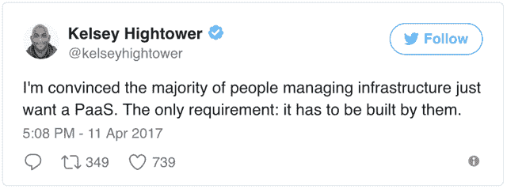

# 介绍五角大楼

> 原文：<https://www.fairwinds.com/blog/introducing-pentagon>

 ## 背景

2015 年，当我创立了 Fairwinds(又名 ReactiveOps)时，我们从一个简单的想法开始:为那些不能或不想自己做这件事的公司带来伟大的基础设施。我们想雇佣优秀的 sre，为解决复杂问题的大团队填补空缺。在此期间，我们与客户合作，如管道交易和改善。我们提供的东西有市场，事情进展很快。

当我们聘用 Justin Mound 时，他认为人们在云基础架构领域的需求大多是相同的。每个人都希望零停机时间和全自动部署、日志记录、指标、警报等…这个列表很长，但感觉每个人的列表基本上都是一样的。因此，我们开始尝试能否以可重复的方式解决这些问题，并通过为一大群对 Heroku 来说太大，但对网飞来说又太小的公司制作复杂的基础设施模板来发展业务。

最初，我们在 AWS 上解决了这个问题，使用 Terraform 构建了一个 VPC，使用 Packer 构建了 ami，然后我们编写了大量的 Ansible 来通过不同的环境将所有东西运送到生产中。我们建造的东西真的令人印象深刻。但是当我们建造这个 Docker 的时候，容器编排系统越来越受欢迎。

当 Kubernetes 在一年多前推出 1.2 版本时，我们(几乎)扔掉了我们写的所有东西，全力投入到 Kubernetes 上。Kubernetes 解决了很多我们之前解决的相同问题，但它做得更好；有了社区的支持和市场的需求，我们知道这是正确的方向。但是 Kubernetes 只解决了上面提到的那一长串中大家想要的一部分。

## 介绍五角大楼

上周，我们  [公开采购了五角大楼](https://github.com/reactiveops/pentagon)，这是我们构建基于库本内特斯的基础设施的框架。在您深入讨论之前，我们想谈谈我们在五角大楼所做工作的几点考虑。

1.  五角大楼本身并不是基础设施，而是设计  *来建造* 基于 Kubernetes 的基础设施。  *它不是一个 PaaS* ，它只是在你自己的 AWS 账户中以一种自以为是的方式构建一个普通的基于 Kubernetes 的基础设施。
2.  五角大楼严重依赖  [Kops](https://github.com/kubernetes/kops) 在 AWS 上构建集群(我们有一个 GCP 替代五角大楼，但它还没有准备好见光)。
3.  Pentagon 专为那些拥有比 Heroku(或任何其他“一刀切”的黑盒平台)这样的 PaaS 所能提供的更复杂需求的公司而设计。如果 Heroku 每月花费你 50 美元，不要离开。如果 Heroku 每月花费您 10，000 美元，并且您准备建立自己的基础设施，那么 Pentagon 可能是您的理想选择。我们有客户运行大数据设置，使用 Consul 或 Prometheus 等工具，并有不同寻常的安全需求:五角大楼是为了允许复杂的定制而建造的。
4.  五角大楼是为 Fairwinds 设计的，允许我们快速建立许多复杂的基础设施，并安全和经济地维护它们，并从一个到另一个保持一致。它并没有考虑到您公司的具体需求。但是可以根据贵公司的需求进行定制。

还有更多的话要说，但这应该足够了。我想补充的是，当我们的工程师在 [Fairwinds](/) 上船时，他们在如何使用框架方面得到了很好的培训，我确信  [我们的文档](https://github.com/reactiveops/pentagon) 还不足以让一切变得显而易见。所以，如果你选择这样做，就要小心地投入进去，并为大量的摆弄做好准备。当然，我们会不断改进，欢迎回来查看。拉请求，当然是欢迎的；所有代码都是 Apache2 授权的。

你可以用  [五边形](https://github.com/reactiveops/pentagon)做到这一点。