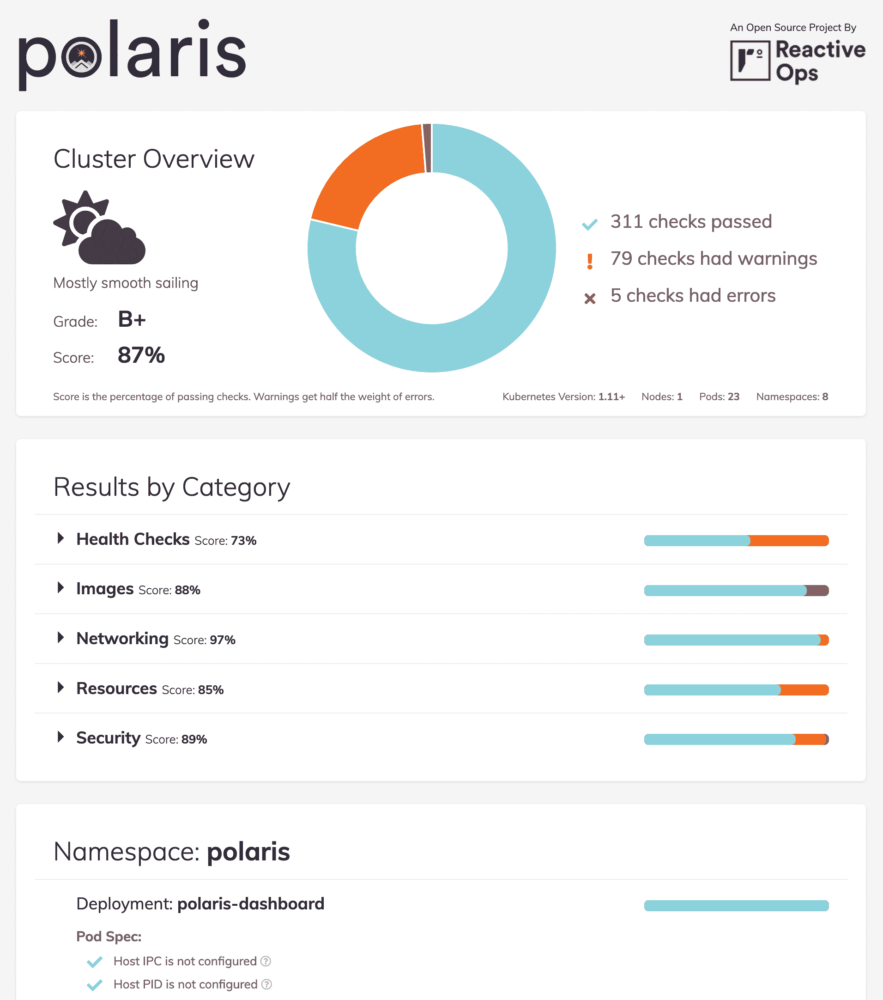

# 北极星简介:保持你的 Kubernetes 集群健康

> 原文：<https://www.fairwinds.com/blog/introducing-polaris-keeping-your-kubernetes-clusters-healthy>

 我很高兴向大家介绍 [Polaris](/polaris) ，这是一个开源项目，有助于保持 Kubernetes 集群的健康。我们设计了 Polaris 来自动化我们在 [Fairwinds](/) 使用的一些最佳实践，以便为各种各样的客户安全可靠地运行集群。今天我们将它开源。

我们一次又一次地看到，部署配置中看似微小的失误可能会导致更大的问题，最终让您夜不能寐。像忘记配置资源请求这样简单的事情可能会破坏自动伸缩，甚至导致您的工作负载耗尽资源。像这样的小配置问题在过去会导致生产中断，现在使用 Polaris 完全可以避免。

Polaris 可以帮助您避免影响应用程序稳定性、可靠性、可扩展性和安全性的配置问题。它提供了一种简单的方法来识别部署配置中的缺点，并防止将来出现问题。有了 Polaris，您可以高枕无忧，因为您知道您的应用程序是按照一套经过充分测试的标准部署的。

## 我们开发的北极星包含两个关键组件:

1.  一个控制面板，概述了当前部署在集群中的配置情况。

2.  一个实验性的验证 webhook，可以防止任何不符合配置标准的未来部署。

北极星仪表盘

## 我们开发了 Polaris dashboard，通过它可以简单直观地了解您的 Kubernetes 部署的当前状态，以及可以改进的地方。该控制面板提供了集群范围的概览，以及按类别、命名空间和部署分类的结果。



我们在北极星的默认标准相当高，所以如果您的分数低于您的预期，不要感到惊讶。北极星的一个关键目标是设定一个高标准，并在默认情况下追求卓越的配置。如果我们包含的默认值太严格，很容易在部署配置中调整配置，以更好地适应您的工作负载。

作为发布 Polaris 的一部分，我们决定不仅发布该工具，还将发布我们选择包含的检查的完整文档。每个检查包括一个到相应文档的链接，这些文档解释了我们为什么认为它是重要的，并带有到围绕该主题的更多资源的链接。

北极星网钩

## 仪表板提供了当前部署配置状态的概述，而 webhook 组件则提供了一种方法，可以对集群的所有未来部署实施更高的标准。

一旦您有机会解决仪表板确定的任何问题，您可以部署 Polaris webhook 来确保配置不会再次低于该标准。当部署在您的集群中时，webhook 将阻止任何具有任何“错误”级别配置违规的部署。

虽然我们对这个 webhook 的潜力感到非常兴奋，但在我们准备考虑它的生产就绪之前，我们仍在进行更彻底的测试。这仍然是一个实验性的特性，是一个全新的开源项目的一部分。因为它确实有可能阻止对您的部署进行更新，所以请谨慎使用。

入门指南

## 希望如果你已经做到这一步，北极星是一个对你有用的工具。如果您想亲自查看结果，可以很容易地将仪表板部署到集群中。这是以最低限度的只读权限部署的，所有数据都由您保管。要使用 kubectl 部署仪表板，运行:

从那里，您可以使用端口转发在端口 8080 上本地访问仪表板:

```
kubectl apply -f
https://raw.githubusercontent.com/fairwindsops/polaris/master/deploy/dashboard.yaml
```

当然，还有许多其他方式来使用或部署北极星，包括与头盔。要了解更多信息，请查看 Github 上的[北极星回购。](https://github.com/fairwindsops/polaris)

```
kubectl port-forward --namespace polaris svc/polaris-dashboard 8080:80
```

这仅仅是开始

### 我们对已经构建到北极星中的东西感到兴奋，但还有更多的东西要做。我们有各种各样的新检查，我们希望添加以扩大 Polaris 的范围，我们也在努力寻找最佳方式来为我们的验证规则提供名称空间或资源级别的异常。关于我们将要做的更多信息，请查看 Github 上[北极星报告中的](https://github.com/fairwindsops/polaris)[路线图](https://github.com/fairwindsops/polaris/blob/master/ROADMAP.md)。

如果北极星听起来对你有用，请花些时间试一试。无论是问题、反馈、想法还是拉动式请求，我们都希望收到您的反馈。在这里，在 [Github](https://github.com/fairwindsops/polaris) 或 [Twitter](https://twitter.com/fairwindsops) 上开始对话。

If Polaris sounds like something that could be useful for you, please take some time to give it a try. Whether it’s questions, feedback, ideas, or pull requests, we’d love to hear from you. Start the conversation here, on [Github](https://github.com/fairwindsops/polaris), or on [Twitter](https://twitter.com/fairwindsops).