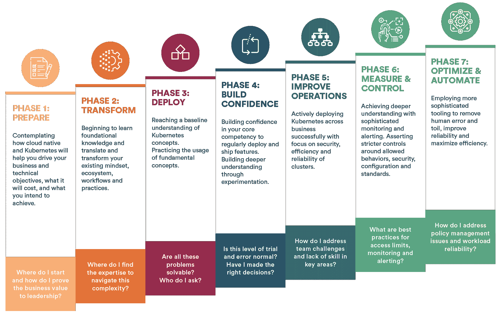

# Kubernetes 成熟度模型简介

> 原文：<https://www.fairwinds.com/blog/introducing-the-kubernetes-maturity-model>

 无论您是 Kubernetes 新手还是有部署经验，Kubernetes 都有您需要克服的复杂性。在 Fairwinds，自 2015 年以来，我们一直在帮助公司建立生产级 Kubernetes 集群。我们已经构建、测试和管理了数百个 Kubernetes 生产实例，重点关注安全、可靠和可扩展的环境。

由于这种端到端的体验，我们处于一个独特的位置。这就是我们创建 [Kubernetes 成熟度模型](//www.fairwinds.com/kubernetes-maturity-model)的原因。我们的 Kubernetes SREs 团队花时间考虑整个端到端的旅程，您将经历哪些阶段，以及在每个阶段您需要学习/开展哪些技能和活动。

Kubernetes 成熟度模型旨在帮助您自我识别所处的阶段，了解您环境中的差距，并深入了解如何增强和改进您的 Kubernetes 堆栈。

当您使用成熟度模型时，要知道如果您确实到达了某个阶段，您可能仍然需要重新访问以前的阶段。此外，要明白 Kubernetes 的成熟不会一蹴而就——它需要时间。Kubernetes 成熟度模型应该作为一种工具，帮助您了解在您的云原生之旅中，您需要关注或需要帮助的地方。

这里我们提供了每个阶段的快速总结。

[第 1 阶段准备](//www.fairwinds.com/kubernetes-maturity-model/phase-1-prepare):您正在考虑 cloud native 和 Kubernetes 将如何帮助您实现业务和技术目标，成本是多少，以及您打算实现什么目标。

[第二阶段转型](//www.fairwinds.com/kubernetes-maturity-model/phase-2-transform):您正在建立 Kubernetes 基础设施，并将工作负载转移到平台上。你必须转化和改变你现有的思维模式、工作流程和实践。

[第 3 阶段部署](//www.fairwinds.com/kubernetes-maturity-model/phase-3-deploy):您已经对 Kubernetes 的概念有了基本的了解，并且正在通过练习开发、部署、管理和故障排除技能来练习基本概念的使用。您将实现过程、CI/CD、授权开发人员并引入一些监控和可观察性。

[第 4 阶段建立信心](//www.fairwinds.com/kubernetes-maturity-model/phase-4-build-confidence):您正在建立对自己核心能力的信心，以便成功地定期部署和发布功能。您还对 Kubernetes 有了更深入的了解，使您能够在整个组织中进行定制、试验和部署。

[第 5 阶段改善运营](//www.fairwinds.com/kubernetes-maturity-model/phase-5-improve-operations):您正在积极地成功地跨业务部署 Kubernetes。现在，您希望提高 Kubernetes 集群的安全性、效率和可靠性。

[第 6 阶段测量&控制](//www.fairwinds.com/kubernetes-maturity-model/phase-6-measure-control):您正在了解您想要测量的内容，并实施复杂的监控和警报。您还需要确定在安全性、配置和标准方面需要控制的行为。

第 7 阶段优化&自动化:您正在使用更复杂的工具来消除人为错误和劳动，提高可靠性并最大化效率。