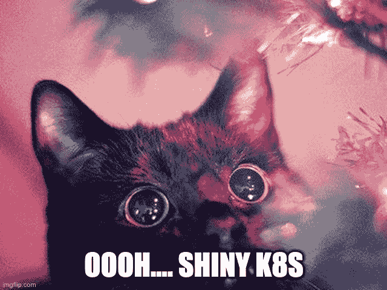

# Kubernetes 是新的闪亮的工程玩具吗？

> 原文：<https://www.fairwinds.com/blog/is-kubernetes-a-new-shiny-engineering-toy>

 ## **你担心你的工程师只是想摆弄新技术**

你的工程师确实想摆弄新技术。现在，理解 Kubernetes 的工程师比不理解的工程师对市场更有吸引力。但是这并不一定是一件坏事，让你的工程师使用被广泛采用和大肆宣传的技术是吸引和留住人才的好方法。

Kubernetes 有很多关于它的宣传。我们只是在炒作的开始。Kubernetes 托管产品的三个主要云的采用以及生态系统中工具和公司的激增证明了炒作不只是烟幕和镜子。

