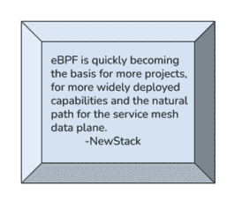
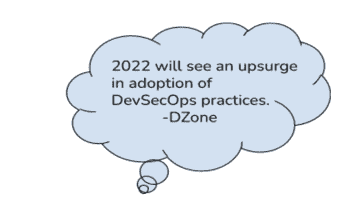
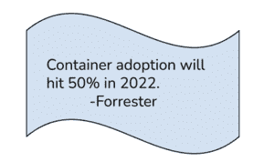

# 是时候看看我们的专家在 Kubernetes 中给出的这 6 个关键预测了

> 原文：<https://www.fairwinds.com/blog/its-time-to-check-out-these-6-key-predictions-in-kubernetes-from-our-experts>

 当然，没有人真正知道未来会发生什么。在经历了两年出人意料的全球疫情，以及随后的的伟大辞职后，这是一个我们都学会欣赏的现实。我们知道疫情为领先的云提供商带来了更多收入，同时也加速了传统企业技术的转型。因此，企业肯定会继续向云原生应用转移，以应对其竞争挑战和目标。*但是对于技术创新和 Kubernetes 的采用，还有什么其他的前景吗？*

Predictions are fun, so we asked some of our own experts here at Fairwinds—Kendall Miller, Andy Suderman, Joe Pelletier, Robert Brennan and Ivan Fetch—to share some of their thoughts and perspectives on how Kubernetes technology and service ownership will likely evolve over the next year—and what we can expect to see as a result. 

## Fairwinds 专家对 Kubernetes 的未来有什么预测？

作为首席执行官和客户联络员，我看到了即将到来的一个重大主题，这个主题肯定会在未来一年引发行动，即不断提高网络安全的需求。关于 CVEs 的话题，有趣的是看到拜登政府最近要求几乎所有联邦机构修补数百个现有的安全漏洞。这是一个迫不及待的举动，正如最近涉及 log4j(一个广泛使用的开源组件)的 note 漏洞所证明的那样。

供应链在 2021 年无疑是一个热门话题，实体供应链的显著中断导致短缺和通胀压力。在软件供应链中，安全性在 2021 年的不同时刻都是一个问题，但随着新的一年的发展，我们肯定会看到更多的关注。目标是让组织改进其方法，以降低风险、避免中断并找到卓越的企业适应性，包括增强强化、弹性和合规性的需求。

****

### **肯德尔·米勒，总裁**

2022 年将是 eBPF 的全盛之年。将可观察性、跟踪、安全和网络监控的内核级控制视为驱动主题。由于起源于 Linux 内核，eBPF(Extended Berkeley Packet Filter)可以在不改变源代码或加载内核模块的情况下扩展内核的功能。我们可能会看到 Kubernetes 领域的长期参与者取得重大进展，因为术语“eBPF”变得更加熟悉，人们开始了解这项技术的力量。随着 Kubernetes 继续成为容器编排的事实上的标准，以及所有未来云基础设施的基础，持续集成将是实现这一现实的基础。

### 安迪·苏德曼，研发与技术总监&

作为处理 Kubernetes 集群管理和应用交付的一种方式，GitOps 很可能成为工作流的一种更常见的标准。GitOps 的工作原理是将 Git 作为基础设施和应用程序的单一事实来源。由于 Git 处于交付管道的中心，开发人员可以使用熟悉的工具来发出拉取请求，从而加速和简化 Kubernetes 中的应用程序部署和操作任务。此外，集群生命周期——升级和插件管理——肯定会从第三方解决方案中看到巨大的改进。

### **乔·佩尔蒂埃，战略副总裁**

在最近与销售团队交流后，很明显，更多运行 Kubernetes 的平台工程/运营团队将寻求为开发人员提供反馈和最佳实践。作为全面服务所有权的一个关键原则，消除团队间的摩擦和增强团队间的协作的愿望——推动创新和业务——仍然是我们最关心的问题。随着公司在多个团队中采用 Kubernetes，他们可能会发现需要更有效的护栏和开发人员的反馈回路。

### **罗伯特·布伦南，开源软件总监**

因为开发人员需要了解他们的应用程序如何在 Kubernetes 上运行，所以全面的服务所有权将仍然是 2022 年值得关注的一个重要主题。遵循 DevSecOps 原则，诸如健康检查和资源调整之类的职责将继续向开发团队转移。此外，插件管理很可能会走到前台，因为人们开始在 Kubernetes 中部署更多的第三方工具，如 nginx-ingress、cert-manager、Istio、Kubeflow 和其他工具。

### 软件工程师 Ivan Fetch

像 Kubernetes 这样的分布式系统的使用越来越多，使得将警报提取为核心发现变得极其重要。例如，“这 100 个应用程序有 15 个容器漏洞”变成了“更新此基础映像以解决影响这 100 个应用程序的这 15 个容器漏洞。”

团队最终将更加关注 Kube 托管应用的运行时分析，这有助于跟踪自上次部署以来的新问题以及由错误配置或网络攻击等原因导致的不良行为。当检测到运行时问题时，团队将考虑使用更多的自动化来减少风险和浪费的时间。

### 自动化有可能导致新的问题，如在对不必要的行为做出动态反应时无意中影响客户访问。然而，随着新的和不太熟悉的工作负载类型被部署到 Kubernetes，集群操作将需要自动调整一些参数来帮助保持这些工作负载的运行，而这一切都不会牺牲集群或相邻工作负载的稳定性。

## 你如何为 Kubernetes 的未来做准备？

仅仅理解将要发生的事情是不够的。您需要尽快解决最紧迫的问题，以缩短创新愿景和卓越业务影响力之间的距离。因为有一件事是肯定的，2022 年是大胆和颠覆性的一年。

我们的 Kubernetes 治理和安全平台[fair winds Insights](https://www.fairwinds.com/insights)，集成了一套可扩展的可信开源审计工具，帮助您的组织在整个开发生命周期(从 CI 到准入到生产)中管理 Kubernetes 的安全性、效率和可靠性。

> 对使用 Fairwinds Insights 感兴趣吗？免费提供！点击此处了解更多信息。

使您的 DevOps 团队能够在应用从开发进入生产时发现并防止 Kubernetes 的错误配置。Insights 提供了与 CI/CD 工作流 的现成[、用于在预部署时强制执行客户策略的](https://insights.docs.fairwinds.com/run/ci/about/)(使用 Polaris 或开放策略代理)以及用于运行 [Kubernetes 审计工具](https://insights.docs.fairwinds.com/run/agent/about/) 的自动化。调查结果和建议存储在一个位置，使运营商能够了解和控制多个集群，跟踪和优先处理问题，并有效监控 Kubernetes 工作负载的安全性和成本。

