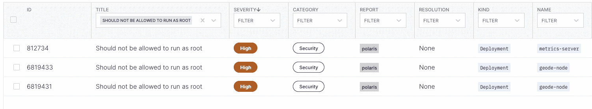
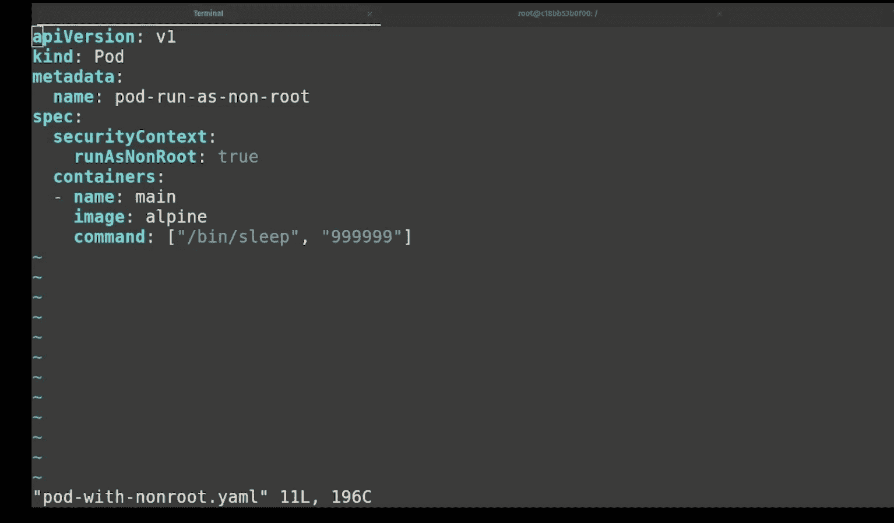

# Kubernetes 基础教程:确保容器不以 Root 用户身份运行

> 原文：<https://www.fairwinds.com/blog/kubernetes-basics-tutorial-ensure-containers-do-not-run-as-root>

 容器是一个软件单元，它将代码及其所有依赖项集合在一起，使得在不同的计算环境中快速可靠地运行应用程序成为可能。Docker 容器是独立的轻量级软件包，包含运行应用程序所需的一切，包括代码、系统工具、系统库、运行时和设置。容器映像在运行时成为容器，容器化的软件在任何基础设施中都以同样的方式运行。它们被称为容器，因为它们包含*——它们将软件与环境隔离，并且它们被设计成统一运行。当然，Kubernetes 是一个开源的容器编排系统。它自动化了软件部署、扩展和管理。Kubernetes 使用 pod 作为最小的可部署单元，但是每个 pod 必须包含一个或多个容器。换句话说，没有容器你就不能真正拥有 Kubernetes。*

 *这就是为什么理解容器安全性以及容器的权限如何影响 Kubernetes 工作负载如此重要。 [美国国家安全局的 Kubernetes 强化指南](https://media.defense.gov/2022/Aug/29/2003066362/-1/-1/0/CTR_KUBERNETES_HARDENING_GUIDANCE_1.2_20220829.PDF) 特别建议组织使用已经构建的容器作为非根用户运行应用程序。通常(默认情况下)，许多容器服务作为特权根用户运行，即使这些应用程序不需要特权执行。当您努力强化 Kube 环境时，您需要花一些时间调查哪些容器以 root 身份运行，然后进行更改以防止 root 执行，这样您就可以限制容器受损的影响。

## 检测允许作为根运行的容器

[北极星](https://www.fairwinds.com/polaris) 是一个验证 Kubernetes 配置的开源项目。它包含一个内置检查，专门用于检测允许以 root 用户身份运行的容器。Polaris 内置于[fair winds Insights](https://www.fairwinds.com/insights)(如果您尚未使用 Insights，则有一个免费层 [可用于多达 20 个节点、两个集群和一个 repo 的环境)，这使得 Insights 用户可以确切地看到集群中的哪些工作负载有权以 root 用户身份运行。您也可以在没有洞察力的情况下使用 Polaris，它将帮助您确保您的容器以最小特权运行。Polaris 策略可以帮助您避免权限提升，并确保您尽可能使用只读文件系统。Insights 允许您运行相同的策略来查找允许在 CI/CD 管道中作为 root 运行的容器；这有助于确保基础设施代码的变化不会引入能够以 root 用户身份运行的新资源。](https://www.fairwinds.com/insights-pricing)

## 见解行动项目

Insights 从安装的所有报告中收集数据，并将它们一起显示在仪表板中。如果你查看名为 `should not be allowed to run as root` 的动作项，你可以在截图中看到这是一个安全问题，严重性很高，北极星检测到了该问题。

在操作项中，Insights 包括关于 Kubernetes 对象类型、名称空间和 Kubernetes 对象名称的信息。您也可以点击标题来查看这些信息。现在，您可以轻松地确定需要更改的资源。Insights 还显示一个描述部分，其中包括对行动项目的简短说明。

## 补救问题

“补救”部分提供了可用于补救措施项的步骤。对于此操作项，补救步骤要求您设置 security context . runasnonroot = true，并提供了类似的示例。

要添加安全上下文参数，通常需要转到资源定义的源。这可能是存储库中的 Helm 值文件或平面清单文件，具体取决于您在环境中的部署方式。

在 [穿越视频](https://training.fairwinds.com/action-item-ensure-containers-do-not-run-as-root) 中，我在本地机器上编辑了一个 pod 定义文件  `pod with nonroot.yaml` 文件。如修正步骤所示，您可以在 pod 或容器级别添加安全上下文。最好在 pod 级别添加这个安全上下文，因为它将是所有容器的默认上下文。如果您有令人信服的理由不在 pod 级别设置它，您将需要为 pod 中的每个容器设置它。

那么，如果您试图运行一个定义了这个安全上下文键的 pod，会发生什么呢？在视频中，我做了一个 `k apply -f pod-with-nonroot.yaml` 来部署吊舱。(在我的系统上，我有一个别名为 K 的 kube control。)当我按回车键时，你可以看到它说 pod 已经被创建了。但如果看 pod，状态说， `create container config error` 。这意味着 pod 实际上没有运行。你可以通过做一个 `k describe po pod-run-as-non-root` 来找出原因。

在显示的事件中，您可以看到一条消息，上面写着， `Error: container has runAsNonRoot and image will run as root` 。由于该安全上下文设置，API 服务器将不再启动此 pod。这很好——您没有运行一个过度许可的容器。但是这很糟糕，因为现在你的容器根本不运行了。

## 你如何修理集装箱？

现在您有了一个不能在集群中运行的容器，您需要知道如何修复它。在 Docker 文件中，您可能希望创建自己的用户和/或组，并在运行入口点或命令参数之前切换到该实体。这将使容器按照 docker 文件中指定的用户运行。

或者，您可以在容器规范中使用 `RunAsUser` 指令。该键的值必须是用户 ID，并且用户 ID 还必须是容器中存在的用户。请记住，当您以非 Root 用户身份运行您的容器时，您将希望确保您创建的用户拥有在您的容器内运行流程的正确权限。

不管在哪里定义替代非根用户，建议仍然将安全上下文设置为 `RunasNonRoot` 以增加容器的安全性。

## 防御以根用户身份运行的工作负载

一旦您更新了您的 pod 和 containers，以确保它们不再能够以 root 身份跨您的工作负载运行，请考虑在 Insights 许可控制器中打开 Polaris。这为在 Kubernetes 环境中以根用户身份运行的工作负载提供了最强有力的防御，能够从一开始就阻止这些工作负载进入您的集群。对于真正需要 root 访问权限的工作负载(不应该有很多)，您可以配置 Insights 来允许特定的豁免。为此使用一个允许列表，并在默认情况下拒绝以 root 用户身份运行，这将有助于确保您的容器尽可能安全地运行。*