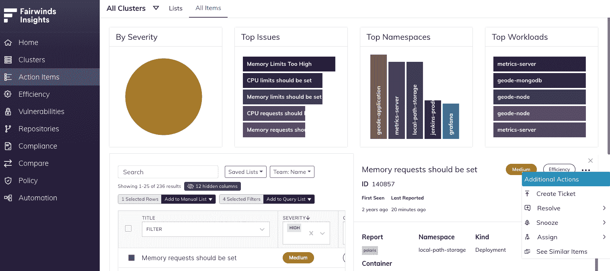
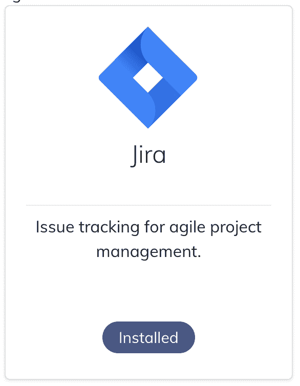

# Kubernetes 基础教程:如何整合吉拉和费尔温德见解

> 原文：<https://www.fairwinds.com/blog/kubernetes-basics-tutorial-how-to-integrate-jira-and-fairwinds-insights>

 吉拉是 Atlassian 的问题和项目跟踪解决方案。许多组织使用作为跨团队协作的方式，帮助他们规划项目、分配任务、跟踪进度、报告状态和管理工作——无论你的组织是初创公司还是企业。吉拉是来自 [Atlassian](https://www.atlassian.com/) 的解决方案，因此它已经与他们的其他解决方案无缝集成，如 Confluence 和 Trello。它通常用于工作管理、It 服务管理以及敏捷和开发运维。因为它已经被敏捷团队用于 bug 跟踪和软件开发，所以使用[fair winds Insights](https://www.fairwinds.com/insights)来跟踪和分配您在 Kubernetes 环境中发现的问题是很有帮助的。

## fair winds Insights 中的行动项目

一旦您安装了洞察代理 并从您的审计中获得结果，您可能会看到很多行动项目出现。当你开始的时候，你会希望看到什么样的项目正在出现，并决定你要把精力集中在哪里。通常，团队会查看工作负载配置操作项，以查看是否有需要设置的基本配置设置，包括 [资源限制](https://www.fairwinds.com/blog/kubernetes-resource-limits) 和 [活跃度探测器](https://www.fairwinds.com/blog/how-to-identify-missing-readiness-probes-in-kubernetes) 。Insights 还将识别容器漏洞，这有助于您确定优先修补哪些漏洞，以提高您的 [容器安全性](https://insights.docs.fairwinds.com/first-steps/container-security/) 。成本效率是 Kubernetes 面临的另一个挑战，因为很难发现过度配置或配置不足的工作负载，因此 Insights 将在 [成本效率](https://insights.docs.fairwinds.com/first-steps/cost-efficiency) 方面需要改进的领域也作为行动项目。Insights 平台在一个易于阅读的仪表板中显示行动项目，因此您可以轻松查看行动项目的严重性、主要问题、主要命名空间和主要工作负载。

## 为什么要将吉拉与 Fairwinds Insights 整合在一起？

随着您更多地运行 Insights 并提高开发速度，您将发现越来越多的行动项目。虽然 Insights 可以帮助您将这些问题从低到中到高到关键进行分类，并确定首要问题，但手动将行动项目分配给各个利益相关方并包含快速解决问题所需的信息仍然非常耗时。在 Insights 和吉拉中分别跟踪所有这些项目很快会变得很麻烦，您可能会在不同的团队中失去对优先级和严重性的跟踪。在吉拉和 Fairwinds Insights 之间建立 [集成](https://insights.docs.fairwinds.com/installation/integrations/jira/#installation) 可以为您的开发团队和平台工程师实现两者之间的无缝连接，从而快速解决这些问题。

## 如何整合吉拉和 Fairwinds 的见解

集成很简单。首先，您需要创建一个帐户来使用。我们建议您创建一个“机器人帐户”来连接到您的 Insights 组织。授予该用户在您的所有吉拉项目上创建票据的权限。这样，关联帐户将显示为通过 Insights 创建的任何票证的创建者。

接下来，只需登录您的 Fairwinds Insights 帐户(如果您尚未使用 Insights，则有一个免费层可用于最多 20 个节点、两个集群和一个回购的环境)并导航至左侧导航中的设置。点击顶部导航的集成，您可以看到您可以添加的集成的所有不同选项。

您将在可用集成列表中看到吉拉。点击 ***添加积分*** 。这将提示您在 Atlassian 中授权应用程序。完成授权后，返回到集成页面并重新加载它。您可以看到现在已经安装了吉拉集成。

就这么简单！

## 为洞察创造吉拉门票

快速手动创建票证的一种方法是，单击操作项，单击您要通过吉拉分配的操作项，导航到附加操作菜单，然后单击创建票证。接下来，您可以选择一个项目，然后在屏幕上单击“创建票据”。现在，您已经在吉拉为该票证创建了一个行动项。您也可以使用 [自动化规则](https://insights.docs.fairwinds.com/configure/automation/integrations/#tickets) 为行动项自动创建记号。您只能为每个行动项创建一个票证，但是如果您设置了集成，您可以使用`CreateTicket`函数从任何行动项创建吉拉、GitHub 或 Azure DevOps 问题。该函数有三个参数:字符串、项目和标签。如果与吉拉车票相关联的动作项被标记为`Resolved` 或`Fixed`，吉拉车票将自动关闭。

如果您想了解更多关于这个集成的信息，请查看 Insights [文档](https://insights.docs.fairwinds.com/installation/integrations/jira/#installation) ，特别是在集成下。Fairwinds Insights 还集成了您的团队已经熟悉的其他工具和开源解决方案，包括 Slack、PagerDuty、Travis CI、CircleCI、Jenkins、Datadog、Styra 等等。 [立即开始洞察](https://www.fairwinds.com/insights-pricing) 为您的 Kubernetes 环境带来秩序和自动化。

