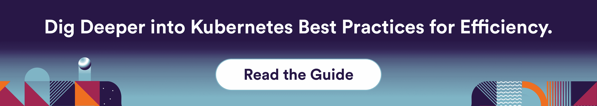

# Kubernetes 高效利用资源的最佳实践

> 原文：<https://www.fairwinds.com/blog/kubernetes-best-practice-efficient-resource-utilization>

 我们都知道我们需要有效地管理 Kubernetes。这类似于我们都知道我们需要更高效地驾驶汽车。但是我们不能仅仅通过检查燃油表来做到这一点，我们需要改变我们的驾驶习惯。Kubernetes 也是如此。我们不能简单地监控资源利用率，我们必须改变工作负载的配置方式以提高效率。

## **Kubernetes 最佳实践:效率最大化**

Kubernetes 的资源限制和请求的概念允许有效地利用资源，如果使用得当的话。但是，在为工作负载配置资源限制和请求时，可能很难知道使用什么值。在这篇博文中，我们将向您展示如何使用 Fairwinds 的开源工具 [Goldilocks](https://github.com/FairwindsOps/goldilocks) 轻松找到这些值。

### **设定 Kubernetes 限制并请求正确的方式**

对应用程序设置太低的请求和限制会导致问题。例如，如果你的内存限制太低，Kubernetes 一定会因为你违反了它的限制而杀死你的应用程序。

同时，将请求和限制设置得太高会导致资源过度分配。你浪费了资源，最终导致更高的账单。

因为很难设定这些设置，一些团队从来没有设定过要求或限制，而另一些团队在初始测试时将它们设定得太高，然后就永远不会正确。

那么，您如何知道 Kubernetes 集群的适当限制和要求是什么呢？传统上，这需要大量的试验和错误。然而，为了加速这一过程，Fairwinds 开发了金发姑娘。

## **金发女孩:提高 Kubernetes 效率的开源工具**

Goldilocks 是一个免费的开源工具，可以帮助团队将资源分配到他们的 Kubernetes 部署中，并获得正确的资源校准。

Goldilocks 是一个 Kubernetes 控制器，它收集关于正在运行的 pod 的数据，并就如何设置资源请求和限制提供建议。它可以帮助组织了解资源使用情况、资源成本以及围绕使用效率的最佳实践。

> Goldilocks 是 Kubernetes 的一个开源工具，它帮助您了解资源使用和成本，以便您可以围绕效率实施 K8S 最佳实践。
> 
> **[点击发微博](https://ctt.ac/h8p4J)**

Goldilocks 采用 Kubernetes 垂直 Pod 自动定标机(VPA)。它会考虑工作负载的历史内存和 CPU 使用情况，以及 pod 的当前资源使用情况，以便建议如何设置资源请求和限制。(虽然 VPA 实际上可以为您设置限制，但通常最好仅使用 VPA 引擎来提供建议。)本质上，该工具为名称空间中的每个部署创建一个 VPA，然后查询该部署的信息。

如果构建健康、高效的 Kubernetes 部署对您来说是一个挑战，那么一定要看看 Goldilocks。

您可以[阅读更多 k8s 效率的最佳实践](https://www.fairwinds.com/kubernetes-best-practices-comprehensive-white-paper?hsCtaTracking=e68d92d3-c876-4525-b775-6123e46c7212%7C51c2a79a-6e55-476d-85ff-f29099a9730c)，了解如何启用资源推荐并更好地了解您的工作负载平衡。

