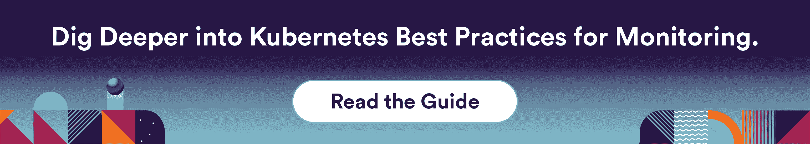
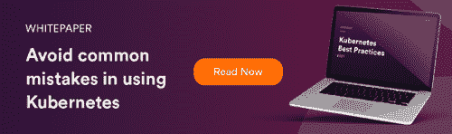

# Kubernetes 监控和警报的最佳实践

> 原文：<https://www.fairwinds.com/blog/kubernetes-best-practices-monitoring-alerts>

 事实是，对大多数人来说，Kubernetes 的正确监控是一种幻想。这是一个在动态的、不断变化的 Kubernetes 环境中被放大的问题。这是一个严重的问题。

虽然组织通常希望获得可用性保险，但很少有人能很好地监控他们的环境，主要原因有两个:

*   监控很难跟上不断变化的环境。
*   监控配置通常是事后才想到的——直到出现问题时才进行设置，并且监控更新很少随着工作负载的变化而进行。

当一般组织最终认识到其对应用程序/系统监控的需求时，团队已经不堪重负，只想着保持基础架构和应用程序“正常运行”,而没有能力去发现问题。许多组织甚至无法监控正确的事情来识别应用程序或基础架构日常面临的问题。

> 事实是，对大多数人来说，Kubernetes 的正确监控是一种幻想。
> 
> **[点击发微博](https://ctt.ac/pnIou)**

## 【Kubernetes 监控不当的后果

如果没有足够的监控，您将面临许多后果(一些是普遍的，另一些在 Kubernetes 中举例说明)。

*   没有正确的监控，操作可能会中断。
*   您的 SRE 团队可能无法尽快响应问题(或正确的问题)。
*   监控管理必须反映集群和工作负载的状态。
*   手动配置会增加可用性和性能风险，因为监视器可能不存在或不够准确，无法触发关键性能指标(KPI)的变化。
*   未检测到的问题可能会导致违反 SLA。
*   不正确的显示器设置可能会导致传呼机发出噪音。

监控不足会带来大量繁重的工作，因为您需要不断地检查系统，以确保它们反映您想要的状态。

## **Kubernetes 监控和警报的最佳实践**

我们需要的是发现未知的未知的监控和警报——也称为可观察性。 [Kubernetes 最佳实践](https://www.fairwinds.com/kubernetes-best-practices-comprehensive-white-paper)认识到监控是关键，需要使用正确的工具来优化您的监控能力。需要监控什么，为什么？这里我们建议一些最佳实践。

### **1。创建您的监控标准** 

使用 Kubernetes，您必须构建监控系统和工具来响应环境的动态特性。因此，您需要关注可用性和工作负载性能。一种典型的方法是尽可能收集所有的指标，然后使用这些指标来尝试解决出现的任何问题。这使得运营商的工作变得更加复杂，因为他们需要筛选过多的信息来找到他们真正需要的信息。开源工具如[普罗米修斯](https://prometheus.io/)、 [OpenMetrics](https://openmetrics.io/) 和供应商如 [Datadog](https://www.datadoghq.com/) 帮助标准化如何收集和显示指标。我们建议 Kubernetes 监控的最佳实践包括:

*   没有副本的 Kubernetes 部署
*   水平 Pod 自动缩放器(HPA)缩放问题
*   主机磁盘使用情况
*   高 IO 等待时间
*   网络错误增加
*   豆荚粉碎增加
*   不健康库伯莱
*   nginx 配置重新加载失败
*   未就绪的节点
*   大量未处于运行状态的 pod
*   外部 DNS 错误注册记录

### **2。实施监控为代码**

Kubernetes 的天才之处在于，您可以将基础设施实现为代码(IaC)——使用配置文件管理 IT 基础设施的过程。在 Fairwinds，通过将监控作为代码来实施，这一点更进了一步。我们使用由我们团队构建的开源软件项目 [Astro](https://www.fairwinds.com/blog/introducing-astro-managing-monitors-in-a-dynamic-environment-0) ，来帮助实现更好的生产力和集群性能。Astro 是为与[数据狗](https://www.datadoghq.com/)一起工作而建造的。Astro 根据定义的模式监视集群中的对象，并根据该状态管理 Datadog 监视器。作为在 Kubernetes 集群中运行的控制器，它订阅集群中的更新。如果在集群中创建了一个新的 Kubernetes 部署或其他对象，Astro 会知道，并根据集群中的状态创建监视器。本质上，它提供了一种以 Datadog 能够理解的方式动态创建和管理警报的机制。

### **3。识别所有权** 

由于监控集群工作负载涉及一组不同的利益相关者，您必须从基础设施和工作负载的角度确定谁负责什么。例如，您希望确保在正确的时间提醒正确的人，以限制提醒与您无关的事情的噪音。

### **4。从一级监控转移到二级监控** 

监控工具必须足够灵活以满足复杂的需求，同时足够容易快速设置，以便我们可以超越第 1 层监控(例如，它是否工作？").第 2 层监控需要仪表板来揭示安全漏洞在哪里，是否符合合规性标准，以及有针对性的改进方法。

### **5。**定义紧急

影响和紧迫性是必须持续确定和评估的关键标准。关于影响，能够确定警报是否可操作、基于影响的严重性以及已经或将要受到影响的用户或业务服务的数量至关重要。紧迫性也发挥了作用。例如，问题需要立即解决，还是在接下来的一个小时或第二天解决？

很难总是提前知道要监控什么，所以当有人不可避免地在半夜被吵醒并需要将一切恢复正常时，你至少需要足够的背景来找出哪里出了问题。如果没有这种程度的理解，您的团队就无法分析应该监控什么，也无法知道什么时候该咧嘴笑，什么时候该忍着发出警报。

[阅读深入见解](https://www.fairwinds.com/kubernetes-best-practices-comprehensive-white-paper)了解如何在 Kubernetes 环境中优化监控和警报功能。

## 其他资源:

