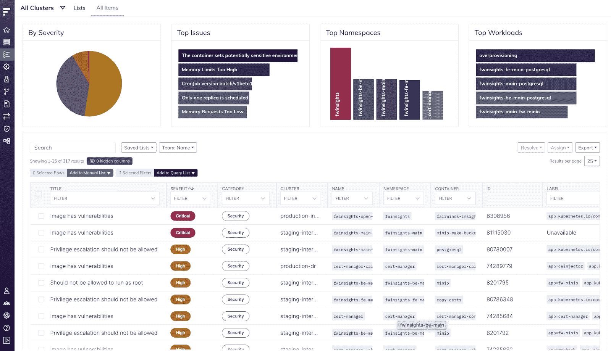
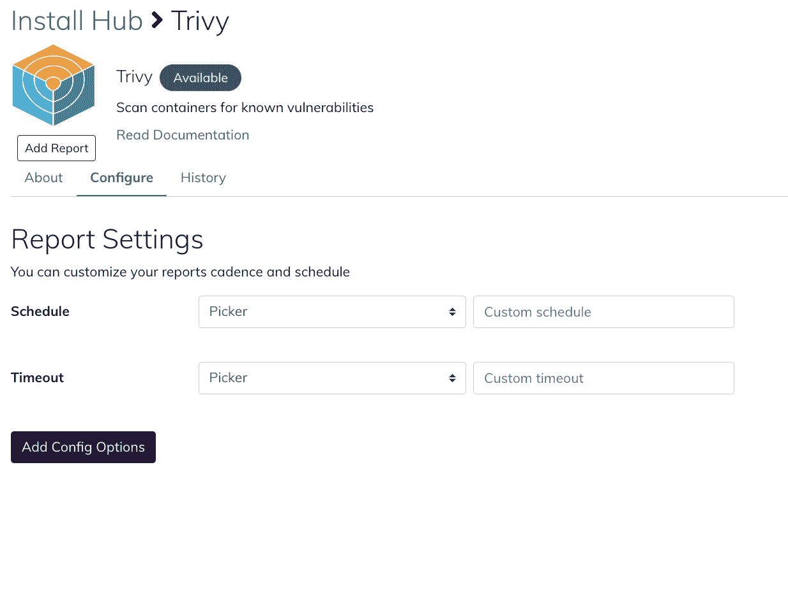
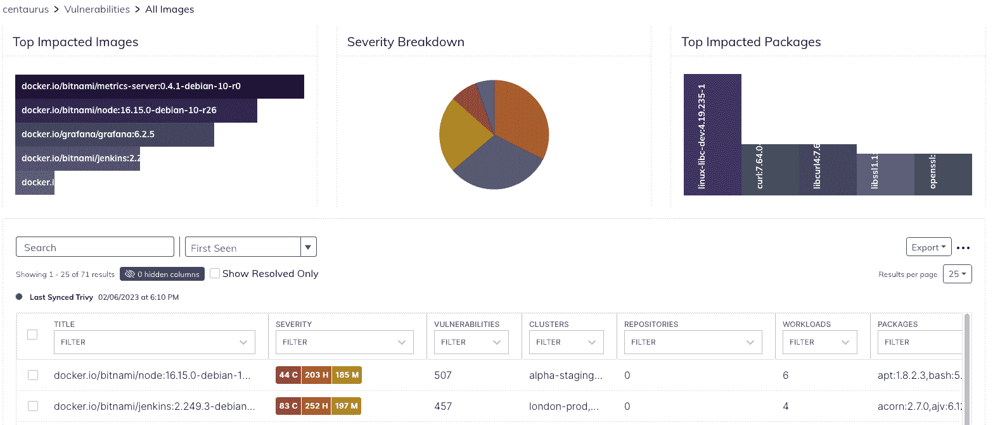
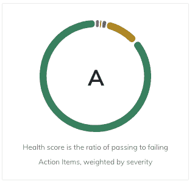
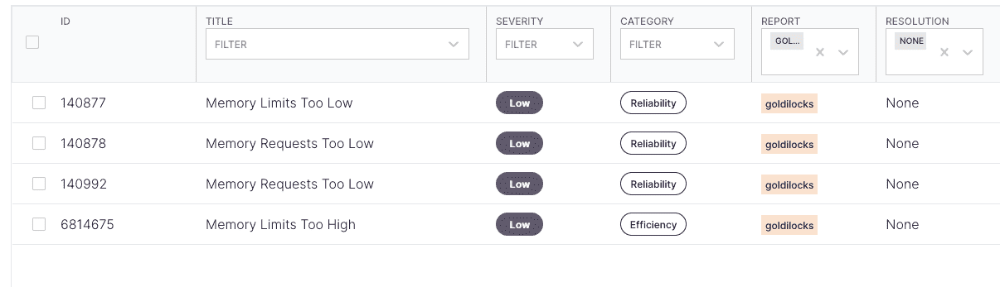

# Kubernetes 诊所:了解如何检查您的 Kubernetes 集群健康状况

> 原文：<https://www.fairwinds.com/blog/kubernetes-clinic-check-your-kubernetes-cluster-health>

 新年伊始，我们都想开始做些事情，让自己更健康、更有效率或更快乐。你的 Kubernetes 集群值得同样的爱！这是确定您的集群是否是您希望进入新的一年的那种集群的好时机。那么，如何检查这一点并做出改变以改善 Kubernetes 集群的健康状况呢？

## 开源工具

有一些很棒的开源工具可以用来检查 Kubernetes 集群的健康状况。Fairwinds Insights 平台聚集了许多非常酷的开源工具，你可以使用它们在一个地方查看所有这些信息。现在，Insights 推出了 [免费层](https://www.fairwinds.com/insights-pricing) ，可用于多达 20 个节点、两个集群和一个 repo 的环境，允许您跨多个集群运行所有这些工具，并在一个集中的控制面板中获得结果。

为了让您的集群成为 Insights 生态系统的一部分，以便您可以管理和检查它，您需要 [安装 Insights 代理](https://www.fairwinds.com/blog/fairwinds-insights-basics-tutorial-how-to-install-the-in-cluster-agent) 。免费的洞察层功能齐全，因此所有报告都可用。当您 [注册免费等级](https://www.fairwinds.com/blog/get-started-with-fairwinds-insights-free-tier) 时，您将收到一封确认电子邮件，其中包含设置页面的链接。在这里，您将能够创建一个组织，然后通过提供所需的集群名称来添加您的第一个集群。然后，您将收到安装 Insights 代理的说明。安装由安装代理的 Helm 命令和控制要安装的组件的 values.yaml 文件组成。您可以调整这些值来改变应用程序的行为或设置。

## 洞察代理&扫描

默认情况下，免费层会自动安装:

*   [北极星](https://www.fairwinds.com/polaris) ，Kubernetes 的开源策略引擎

*   [开放策略代理](https://www.openpolicyagent.org/) (OPA)，通用策略引擎

*   [Nova](https://nova.docs.fairwinds.com/) ，一个命令行界面，用于查找过时或废弃的舵图

*   [Pluto](https://pluto.docs.fairwinds.com/) ，一个在代码仓库和 Helm 版本中发现弃用的 Kubernetes apiVersions 的实用程序

这个设置很容易操作，会给你很多信息。Insights 提供的 values.yaml 文件包括用于标识您的帐户的令牌和启用的开源工具(这些称为报告)。将 values.yaml 文件的内容复制到您自己的本地目录中。运行提供的舵命令；编辑-f 标志，使其指向本地目录中的值文件。该命令声明您将使用的 Insights 版本，并创建一个 insights-agent 名称空间，在其中安装各种组件。

一旦设置完成，您将看到 Insights 代理已经运行了 Pluto、Polaris、OPA 和 Nova 报告。您可以回到 Insights，您将开始在行动项目中看到数据。

很快，您可以看到该报告为您提供了所发现内容的描述以及您可以采取的一些补救措施。它提供了可用于更改部署清单的数据。完成这些更改后，报告将清除这些行动项目。

## 扫描集装箱和集装箱图像的安全漏洞

从安全角度来看，扫描您的容器和容器图像非常重要

安全漏洞。使用 Insights 免费层也很容易做到这一点——你只需要去安装中心添加 [Trivy](https://www.aquasec.com/products/trivy/) ，这是一个开源的漏洞扫描器。只需点击**可用的**按钮并进行配置。

单击“添加报告”按钮，您将看到一个新版本的 values.yaml 文件，您可以将其复制并粘贴到本地文件上。

Trivy 运行的时间要长一点，因为它遍历并扫描它在集群中找到的每一个图像。完成后，查看一下漏洞，您可以很容易地看到受影响最大的图像、按严重性的细分以及受影响最大的图像。您可以按严重性进行排序，并单击以获取有关已发现漏洞的更多信息。

## 检查您的 Kubernetes 集群的健康得分

转到 Fairwinds Insights 并选择 Cluster 选项卡。你首先看到的是一个健康评分；这是通过与未通过行动项目的比率，更倾向于关键行动项目。

Action items 是一个单一的位置，在这里您可以查看来自 Polaris、OPA、Nova、Pluto、Trivy 和您安装的任何其他报告的所有信息。如果您查看行动项目表，您可以快速看到一些有趣的摘要信息。

### 北极星

Polaris 有大约 30 个最佳实践的内置策略。一些与安全相关的策略包括:

在这个平台中，我们有关于以 root 用户身份运行意味着什么的信息。每个行动项目都有参考链接，该平台还解决了补救问题。有相当多的详细信息是关于改变你的容器版本，使之不作为 root 运行，然后在你的 pod 定义中设置你的安全上下文。Insights 提供了尽可能多的上下文，这样您就不会查看**操作项，**看到某个东西正在以 root 身份运行，然后想知道您可以对此做些什么。Insights 甚至提供了解决该问题所需的一些代码示例。

### 吉拉整合

您还可以 [将 Insights 连接到吉拉](https://www.fairwinds.com/blog/kubernetes-basics-tutorial-how-to-integrate-jira-and-fairwinds-insights) 并点击创建票证，然后将其直接发送给负责该票证的团队，请他们进行修复。如果您知道某个措施项正在按设计运行(即使它被标记为措施项)，您可以解决该措施项。如果您对某个措施项无能为力，您可以将其标记为已解决。这不会修复任何问题，但会删除行动项目。你也可以暂停一件事，这样你就不会在下一周再次想起它，如果它是你知道但不想马上处理的事情。

### 查看多份报告

如果您想知道某个操作项来自哪个报告，您可以显示报告列，然后过滤到特定的报告。或者你可以按类别来看。

所有行动项目都属于以下三个类别之一:安全性、可靠性或

效率。如果您对集群运行状况的某个特定方面感兴趣，可以深入研究这些特定领域。因此，您可以看到所有可靠性措施项、识别它们的报告以及它们的严重程度。这可以帮助你优先考虑你想关注的行动项目。

### 自动化规则

设置和运行自动化规则是 Insights 中更强大的功能之一。您可以创建和编辑规则，也可以使用默认规则。本质上，您命名规则(没有空格)并编写描述。您可以设置上下文、报告、集群和操作。然后您可以保存或更新规则。例如，如果你有一个非常高的

名称空间的安全集合，其中该名称空间中的每个漏洞都必须立即得到修复，您可以编写一个操作项，说明如果 Insights 在资源名称空间中发现安全漏洞，您希望提高该操作项的严重性，然后根据该严重性创建票证。这是一个基于 JavaScript 的引擎，所以你可以写一个规则来做任何你想做的事情。

## 保持 Kubernetes 集群健康

Kubernetes 很复杂，很难掌握所有可能的健康问题。Fairwinds Insights 集成了大量的 [开源工具](https://www.fairwinds.com/open-source-software) ，可以轻松检查集群的安全性、可靠性和效率。使用 [新的免费洞察层](https://www.fairwinds.com/blog/try-fairwinds-insights-kubernetes-governance-free-tier) ，您可以快速开始，这样您就可以在未来一年保持 Kube 集群的健康。

### 观看在线研讨会的现场演示，了解有关如何 [检查 Kubernetes 集群运行状况](https://www.fairwinds.com/kube-clinic-cluster-health-reg) 的更多信息。

