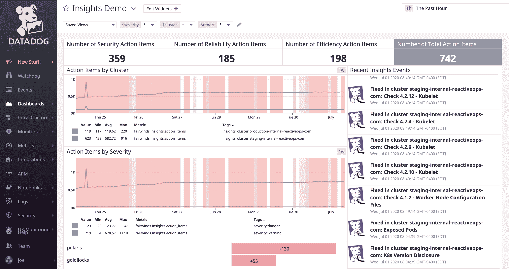

# 数据狗市场中的 Kubernetes 配置验证

> 原文：<https://www.fairwinds.com/blog/kubernetes-configuration-validation-in-datadog-marketplace>

 今天，Datadog 宣布了其新的 Marketplace，这是一个第三方应用程序开发平台，为客户提供从 Datadog 的合作伙伴网络访问各种工具、集成和服务的机会。

我们很高兴成为今天 Datadog Marketplace 发布会的一部分！[fair winds Insights](https://www.fairwinds.com/insights)现已上市，允许用户主动监控他们的 Kubernetes 和容器配置，并获得提高安全性、效率和可靠性的建议。Fairwinds Insights 的发现和建议集成在 Datadog 中，使 DevOps 团队能够更高效地管理 Kubernetes 和应用程序容器。

我们是 Fairwinds 的 Datadog 的忠实粉丝，在我们的许多 Kubernetes 托管服务中使用它来确保可观察性和发现未知未知的能力。我们还有一个开源项目， [Astro](https://github.com/fairwindsops/astro) ，这是一个 Kubernetes 操作器，它可以根据定义的模式监视集群中的对象，并根据这种状态管理 Datadog 监视器。这种集成让更多的 Datadog 客户受益于提高的安全性、降低的成本和节省的时间。

## **关于 Fairwinds 的见解**

Fairwinds Insights 是一个单一配置验证平台中的 5 个以上开源工具，全部与您使用的工具集成在一起。它结合了可信的开源工具、工具链集成和基于数百个成功的 Kubernetes 部署的 SRE 专业知识。

> 使用 Fairwinds Insights，在一个平台中免费获得 Kubernetes 安全性、成本分配和规避、合规性和护栏。

## **如何帮助**

Fairwinds Insights 为三类 Kubernetes 配置问题提供了统一的多集群视图，并围绕安全性、效率和可靠性确定了补救措施的优先级。Fairwinds Insights 使得通过单个 helm 安装部署多个开源工具变得很容易。这种一次性安装有助于工程师避免安装和配置每个工具的定制工作。

## **数据狗市场**

Datadog Marketplace 现已面向 Datadog 应用内的所有 Datadog 客户开放，在承诺购买之前，任何应用均可免费试用两周。你可以在[市场](https://app.datadoghq.com/marketplace/app/fairwinds-insights/overview)试试 Fairwinds Insights。

