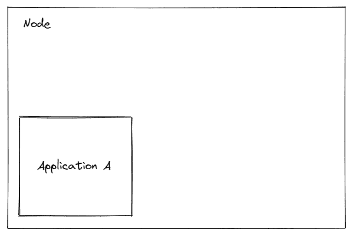
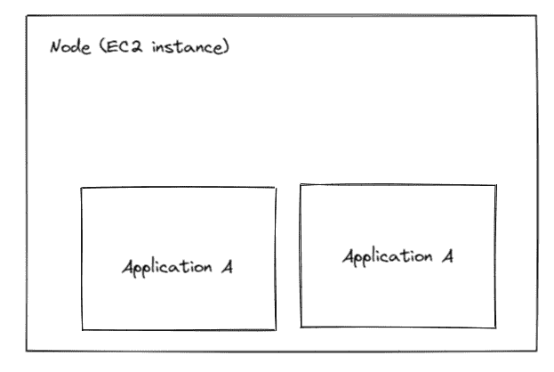
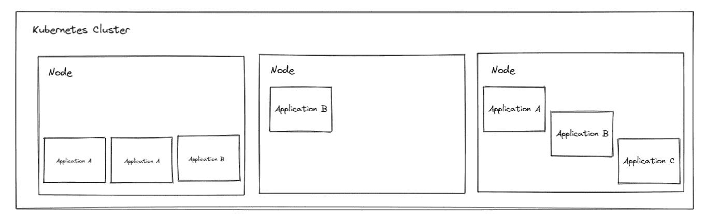

# Kubernetes 成本分配:Fairwinds Insights 的更新

> 原文：<https://www.fairwinds.com/blog/kubernetes-cost-allocation-updates-to-fairwinds-insights>

 Kubernetes 工作负载成本分配很难。为了说明这一点，让我们简单地看一下这个问题。

### **例 1**

在第一个示例中，您在单个计算实例上运行应用程序 A。理解应用程序 A 的成本是非常简单的，因为我们知道运行它的节点的成本。

### **例 2**

在下一个示例中，您在单个计算实例上运行应用程序 A 的容器化版本。同样，计算实例的成本也很简单，即运行应用程序 a 的成本。

### **例 3**

一旦您的许多应用程序被包含，并且您正在运行 Kubernetes 集群，您将在不同的节点上运行不同的工作负载(应用程序)实例。在本例中，您将在一个节点上运行应用程序 A 和 B，在另一个节点上运行应用程序 B，在最后一个节点上运行应用程序 A、B 和 c 的实例。此外，Kubernetes 调度的动态特性意味着容器化工作负载的运行位置随时可能发生变化。

所有这些变化意味着在 Kubernetes 中很难按工作负载分解成本。即使你做了，也不会保持一致。随着 Kubernetes 环境的增长，集群数量和节点数量都在增加，确定成本只会变得更加困难。

## 传统云工具不懂 Kubernetes

随着 Kubernetes 在组织内的使用范围扩大，如果工作负载没有按照正确的资源请求和限制进行适当配置，开支可能会失控。考虑一下 Fairwinds 博客文章 中 [概述的“吵闹的邻居”问题。因此，必须监控支出以避免浪费资源，尤其是在成本节约措施日益重要的市场中。](https://www.fairwinds.com/blog/5-problems-with-kubernetes-cost-estimation-strategies)

虽然存在云成本监控工具(并且有一个庞大的行业围绕着它)，但这些传统工具无法识别 Kubernetes 的多层、动态环境以及它们所运行的工作负载和节点之间的细微差别。

大多数开发运维团队缺乏对集群中实际发生的事情、正确配置的内容以及是否过度配置的了解。如果您的组织采用了 FinOps 模型，其中财务团队与开发人员和开发人员一起工作，许多人甚至可能缺乏诊断 Kubernetes 成本管理问题的知识。

## 增强的 Kubernetes 工作负载成本分配精确定位云支出

由于 Kubernetes 很复杂，团队缺乏对支出的可见性，Fairwinds 花费了大量时间来增强我们的 Kubernetes 治理软件 Insights 中的成本功能。

平台工程团队需要做两件事的能力:

1.  在与业务相关的环境中分配和显示成本

2.  创建工程反馈循环，以实现 [服务所有权](https://www.fairwinds.com/cloud-native-service-ownership) 和成本规避的文化

Fairwinds Insights 的增强功能允许平台工程经理使用实际的云支出和工作负载使用情况来了解跨多个集群、聚合和自定义时间段发生的历史成本。

> Fairwinds Insights 可供免费使用。你可以在 这里 [报名。](https://www.fairwinds.com/coming-soon)

与传统的成本分配解决方案不同，Fairwinds Insights 包括策略执行功能，因此平台工程师可以自动执行成本分配所需的元数据标准。

## Kubernetes 工作负载成本分配的用例

最新功能的一些使用案例包括:

*   **累积工作负载成本报告**:根据使用情况查看历史工作负载成本，以提供预定义时间段内发生的成本摘要:前一天、前一周或前一月。

*   **跨团队的精确成本分配:**将累积的历史工作量分配给不同的团队。成本通常按工作负载和命名空间划分。使用成本分配功能，按**节点**、**共享**(例如，一组公共系统名称空间，如 kube-system)和**空闲**容量，对各个团队和分解成本进行“计费”。

*   **报告跨多个集群的名称空间的开销:**报告跨多个集群的名称空间的总开销。例如，要了解 my-app 命名空间在整个企业中的总成本，需要获得该命名空间在临时集群和生产集群中的总成本。

这一最新增强解决了这些使用案例以及更多问题。该软件的用户可以对 Kubernetes 采用 FinOps 方法，并受益于:

*   多集群:简化工作流程通过利用 Fairwinds 的可扩展 SaaS 架构，在一个位置计算和汇总所有集群的成本数据

*   多聚合分配:在多个维度上分配成本，比如集群、名称空间、种类等。

*   合理调整建议:通过调整 CPU 和内存请求来确定成本节约

*   历史报告:跨自定义时间段报告成本，数据保留期长达 13 个月

*   云计费集成:集成您的 AWS 成本和使用报告(CUR ),使用您的实际云支出进行准确的成本分配

要了解有关 Fairwinds Insights 的更多信息，请致电我们的团队。

