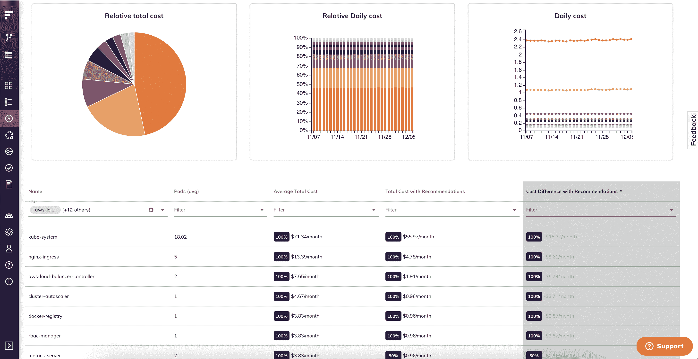

# 精确的 Kubernetes 成本监控和管理

> 原文：<https://www.fairwinds.com/blog/kubernetes-cost-monitoring>

 ### 了解云的成本以及云消费的所有子集正成为 DevOps 领导者越来越多的要求。事实上，FinOps 已经成为组织寻求在商定的指标下联合财务和工程团队的关键词。

Kubernetes 属于“子集”范畴。但是 Kubernetes 的成本监控很难。这是一个不断变化的环境和工作负载，需要大量配置。不幸的是，由于这个原因，Kubernetes 的成本监控做得不好的团队并不多。此外，很难理解应用程序实际消耗了哪些资源，以及是应用程序还是应用程序的配置方式过度消耗了云资源。

## 为什么要在 Kubernetes 中衡量成本？

对于那些采用了容器和 Kubernetes 的组织来说，成本监控很快成为平台工程领导和财务团队的黑洞。关于支出的最大问题是:

*   成本分配:我要花多少钱？该成本应该如何在团队、应用程序和业务单元之间划分？

*   **服务所有权**:我的团队是否能够监控其应用的成本并做出改变以降低成本？

*   **合理调整资源**:我的应用程序是否过度调配，使用了过多的计算或内存？

Kubernetes 的分配、优化和管理是理解和了解相关成本。

### **Kubernetes 成本监控的挑战**

对许多人来说，Kubernetes 成本监控的挑战始于其配置方式:

*   开发人员是否设置了正确的 CPU 和内存？
*   什么应用程序的成本最高，为什么？
*   能否按 Kubernetes 分解云成本，然后逐步细化？

作为一家快速发展的初创公司，我们需要一种方法来更好地了解我们微服务的成本，尤其是当客户开始采用 Fairwinds Insights 的各种功能时。第一步实际上还没有测量成本；相反，我们开发了开源工具 [Goldilocks](//www.fairwinds.com/goldilocks) ，以确保我们的工作负载配置了正确的 CPU 和内存分配。这一步对于保证我们不会向最常用的微服务过度或不足地调配资源至关重要。

一旦我们设置了我们的请求和限制，我们发现我们的传统云成本工具没有按照 Kubernetes 工作负载、名称空间或标签进行细分。这种认识使得我们很难了解哪些微服务或功能在推动集群中的大部分资源利用率，以及这些功能是否对我们有利。

在我们的客户和社区对话中，我们意识到我们并不孤单。我们在 Fairwinds Insights 中开发了 Kubernetes 成本分配功能，允许我们为为我们的集群供电的节点配置每小时混合价格。有了这些信息，并使用 Prometheus 指标跟踪实际的 pod 和资源利用率，我们就能够生成工作负载的相对成本。这一举措帮助我们跟踪了我们的云支出，同时还确定了哪些功能会影响成本。

平台工程团队，尤其是那些已经接受了 [Kubernetes 服务所有权](https://www.fairwinds.com/kubernetes-service-ownership-whitepaper)的团队，也被问及单个团队和产品的成本。这些请求最终来自财务主管，他们需要了解运行不同产品的边际成本。服务所有者还可以使用这些信息来做出自己的资源利用决策，并找到节省资源和成本的方法。

## **在一个地方监控和管理您所有的 Kubernetes 费用**

当 Kubernetes 用作多租户/共享计算环境时，准确的 Kubernetes 成本分配变得越来越复杂。不同的团队可能使用不同的节点类型，并且工作负载不断变化，这使得节点的每小时价格成为一个移动的目标。

我们很高兴地宣布，Fairwinds Insights 现在支持 [AWS 计费集成](https://www.fairwinds.com/news/fairwinds-insights-adds-kubernetes-cost-allocation-quality-of-service-control)，允许团队使用他们的真实云账单来按工作负载、名称空间或标签计算成本。有了标签，平台工程团队可以通过多个业务维度“切割”精确的工作负载成本，满足服务所有者和财务的需求，而无需质疑底层节点定价假设。

对使用 Fairwinds Insights 感兴趣吗？免费提供！点击此处了解更多信息。

