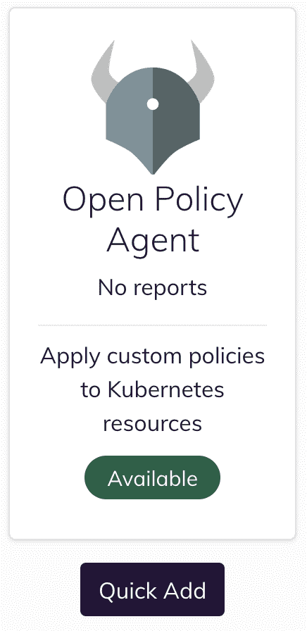
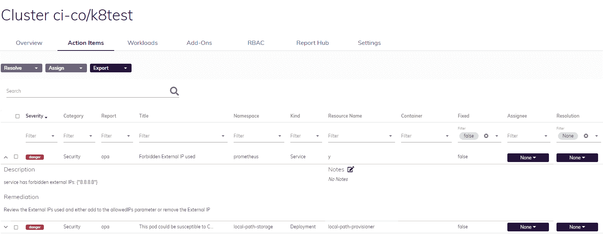

# Kubernetes CVE-2020-8554:识别您是否受到影响的说明

> 原文：<https://www.fairwinds.com/blog/kubernetes-cve-2020-8554-instructions-identify-impacted>

 一个新的中等严重程度的 CVE 被发现(CVE-2020-8554)影响多租户库伯内特星团。如果潜在的攻击者已经可以创建或编辑服务和 pod，那么他们可能能够拦截来自集群中其他 pod(或节点)的流量。关于 CVE 的公告解释说:

能够创建 ClusterIP 服务并设置 spec.externalIPs 字段的攻击者可以拦截到该 IP 的流量。能够修补负载平衡器服务的状态(这被视为特权操作，通常不应授予用户)的攻击者可以将 status.loadBalancer.ingress.ip 设置为类似效果。

这个问题是一个设计缺陷，如果不进行面向用户的更改，就无法缓解。"

与任何 CVE 一样，第一步是确定您是否受到影响。为了帮助 Kubernetes 用户，我们使用我们的配置验证软件[fair winds Insights](https://insights.fairwinds.com/auth/register/)(免费使用 30 天)和 [OPA](https://github.com/open-policy-agent/gatekeeper) 创建了识别 CVE-2020-8554 的说明。按照这些说明，您不需要以前使用过 OPA。此外，通过使用 Insights 准入控制器，您实际上可以防止这种 CVE 被引入到新部署中。

Fairwinds Insights 是一个策略驱动的平台，可强制执行自定义策略，如识别集群中的 CVE，通过在 CI/CD 阶段或作为准入控制器的开放策略代理(OPA)集成，自动部署护栏和安全最佳实践。

## 在集群中识别 CVE-2020-8554 的说明

### 注册 Fairwinds Insights

如果你是 Fairwinds Insights 的新手，你需要注册并安装代理——遵循[入门指南](/fairwinds-insights-get-started)。

### 安装 Insights-cli

遵循 Insights CLI 安装 [指令](https://github.com/FairwindsOps/insights-cli#installation) 。

*   如果在 mac 上，运行 `brew install FairwindsOps/tap/insights`

*   如果不是在 Mac 上，或者没有自制软件，从 [版本](https://github.com/FairwindsOps/insights-cli/releases) 页面下载二进制文件，并将其添加到您的路径中

### 复制示例策略

下载 [洞见-插件](https://github.com/FairwindsOps/insights-plugins) 资源库。在该存储库内的路径 `plugins/opa/examples` 中，您将找到所有用于 Fairwinds Insights 的模板化 OPA 策略。将 `plugins/opa/examples/lb-vuln-cve-2020-8554` 复制到你的本地目录。

查看 [Fairwinds Insights 文档](https://insights.docs.fairwinds.com/reports/opa/)了解有关 OPA 政策的更多信息。

### 找到您的管理令牌

登录[fair winds Insights](https://insights.fairwinds.com/)，选择您的组织，然后点击菜单栏中的设置。向下滚动到认证令牌部分，并单击 `Show Tokens` 按钮。复制标题为 `admin` 的令牌，打开命令提示符，粘贴到: `export FAIRWINDS_TOKEN= <token you copied>`

### 运行命令

从您复制策略的目录中，运行以下命令: `insights policy sync --organization <Insights org name>`

### 安装 OPA 报告

登录并导航至您想要检查的集群。 从那里开始，遵循以下步骤:

1.  导航至报告中心菜单
2.  添加开放策略代理(OPA)报告

3.  您将在屏幕的右上角看到一个“准备重新安装”链接。单击此链接获取可用于重新安装 Fairwinds Insights 代理的 helm 命令。

大约一分钟后，您应该会在 Fairwinds Insights 的行动项目表中看到任何受影响的资源。

借助 Fairwinds Insights，您将能够识别并防止 CVE-2020-8554 成为您团队的问题。您可以永远免费使用 Fairwinds Insights。拿过来[这里](/coming-soon)。

