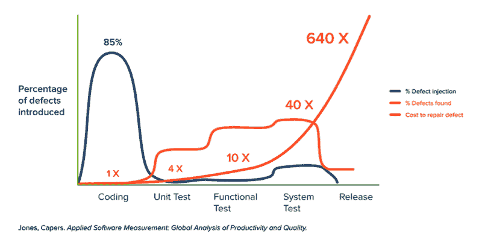

# Kubernetes DevOps 技巧 7:开发与生产中的维修成本

> 原文：<https://www.fairwinds.com/blog/kubernetes-devops-tip-7-cost-of-repair-in-development-vs.-production>

 Kubernetes 的主要好处之一是该平台能够提高开发速度。通过使用微服务和容器，开发进行得更快。这都是好消息，而且肯定是巨大的好处。但是当你增加开发速度时，一个主要的缺点出现了:修复缺陷的成本。

下面的 Capers Jones 图显示了在开发生命周期的每个阶段引入的缺陷的百分比。更重要的是，它展示了修复所述缺陷的成本如何从编码时的 1 倍增加到生产中的 640 倍以上。

## **修复 Kubernetes 的错误配置可能会很昂贵**

正如解决代码问题代价高昂一样，Kubernetes 的错误配置也是如此。当启动集群以支持应用程序时，只需要完成并运行一些配置。您需要:

*   避免以 root 用户身份运行容器，以确保 Kubernetes 的安全性
*   设置合适的 CPU 和内存来控制云成本
*   设置活动和就绪探测器，以确保正确的自动缩放

大多数公司在运行 Kubernetes 时都没有考虑到配置最佳实践，这造成了安全性和可靠性问题，增加了技术债务，而且修复起来可能非常昂贵。

## **修复 Kubernetes 错误配置集群的成本**

[Kubernetes 配置基准](https://www.fairwinds.com/kubernetes-config-benchmark-report) 报告给出了每个集群和工作负载的平均结果:

*   每个集群的平均 Kubernetes 错误配置数- 328
*   每个 Kubernetes 集群的平均工作负载数- 110
*   每个工作负载的平均调查结果数- 3

现在考虑一下基于 DevOps 工程师成本的这些数字:

*   DevOps 工程师每小时收费 100 美元
*   编码阶段的修复成本(5 分钟)-8.33 美元
*   修复工作负载的成本 Kubernetes 在 Git 拉取请求时的错误配置——24.85 美元
*   修复生产中工作负载配置错误的成本-15，903.03 美元。

## 让我们再读一遍:15903 美元！！！！！！

在考虑如何配置 Kubernetes 时，您必须考虑在生产前环境中正确配置。您需要首先确保错误配置不会渗透到生产中。

## **如何及早识别 Kubernetes 错误配置**

Fairwinds 使组织能够更早地转移配置验证，从而将修复成本降低高达 640 倍。我们通过为您的集群提供连续和自动扫描来获得 Kubernetes 最佳实践。我们的解决方案可以扫描您的开发环境，提醒开发人员错误配置，并向他们展示如何修复问题——这是一项 5 分钟的任务，成本为 8.33 美元！

Fairwinds Insights 准入控制器将拒绝任何 Kubernetes 资源进入您的集群，如果它们不符合您的组织的政策。再次帮助您将生产环境的维修成本从 15，000 美元降至 8-25 美元。

不要因为没有正确配置而失去 Kubernetes 的好处。Fairwinds Insights 可供免费使用。你可以在这里报名。

