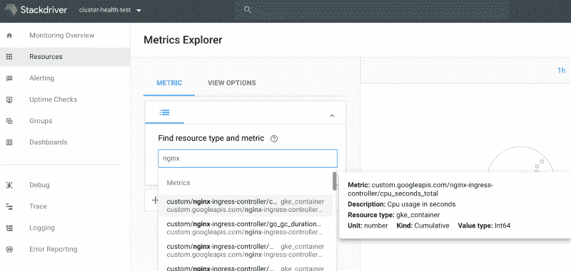

# Kubernetes HPA 使用自定义和外部指标进行自动扩展——使用 GKE 和堆栈驱动指标

> 原文：<https://www.fairwinds.com/blog/kubernetes-hpa-autoscaling-with-custom-and-external-metrics-using-gke-and-stackdriver-metrics>

 Kubernetes 部署自动扩展更令人兴奋，因为 HorizontalPodAutoscaler 可以根据自定义和外部指标进行扩展，而不是像以前那样简单地扩展 CPU 和内存。

在这篇文章中，我将回顾 HPA 是如何工作的，自定义和外部指标 API 是什么，然后看一个例子，在这个例子中我配置了 Kubernetes deployment 基于外部 Nginx 指标自动扩展应用程序。

#### **背景**

**[**卧式吊舱自动缩放器如何工作**](https://kubernetes.io/docs/tasks/run-application/horizontal-pod-autoscale/#how-does-the-horizontal-pod-autoscaler-work)**

 **HPA 被实现为控制回路。这个循环每 30 秒向 metrics api 发出一个请求，以获取当前 pod 指标的统计信息。然后，它会计算当前 pod 指标是否超过其任何目标值。如果是这样，它会增加部署对象的数量。我认为这篇关于自动缩放器的自动缩放算法的文档非常值得一读。

实际上，HPA 控制器从三个不同的 API 获得指标:`metrics.k8s.io`、`custom.metrics.k8s.io`和`external.metrics.k8s.io`、**。Kubernetes 很棒，因为你可以扩展它的 API，这就是这些度量 API 的设计方式。资源指标，即`metrics.k8s.io` API，是由[指标服务器](https://github.com/kubernetes-incubator/metrics-server)实现的。对于自定义和外部指标，API 由第三方供应商实施，或者您可以自己编写。目前我所知道的 [prometheus 适配器](https://github.com/directxman12/k8s-prometheus-adapter)和 [custom](https://github.com/kubernetes/metrics/blob/master/IMPLEMENTATIONS.md#custom-metrics-api) 和 [stackdriver 适配器](https://github.com/GoogleCloudPlatform/k8s-stackdriver/tree/master/custom-metrics-stackdriver-adapter)都实现了自定义和外部度量 API。详情请查看主题上的这些 k8s 文档。**

#### 基于外部指标的扩展示例

下面是我创建的一个例子，它使用来自 Stackdriver 的指标来扩展在 [GKE 集群](https://cloud.google.com/kubernetes-engine/)上运行的 Kubernetes 部署。然而，我没有使用 Stackdriver 默认拥有的指标，而是将外部指标从 Nginx 指标传送到 Stackdriver，然后使用这些指标来扩展我的应用程序。下面我描述了我实现这个目标的步骤。[本回购](https://github.com/JessicaGreben/example-external-custom-metrics)对此有示例代码。

设置步骤:

*   创建 GKE 集群(> 1.10 版)
*   启用 Stackdriver 监控(创建 stackdriver 帐户)

我的目标是添加一个水平 pod 自动缩放器，它将根据 HPA 从 Stackdriver 获得的 Nginx 外部指标来缩放我的部署。

**以下是我为此采取的高级步骤:**

*   确认度量服务器正在 Kubernetes 集群中运行。
*   部署实现定制和外部度量 API 的外部度量服务器。
*   部署一个 nginx 入口控制器，带有一个 [sidecar pod](https://github.com/GoogleCloudPlatform/k8s-stackdriver/tree/master/prometheus-to-sd) ，它将从 Nginx 中抓取普罗米修斯格式的指标，并将它们发送到 stackdriver。
*   使用基于 nginx 指标扩展部署的 [HPA](https://kubernetes.io/docs/tasks/run-application/horizontal-pod-autoscale/) 部署我的应用程序。

参考资料:

以下是相同步骤的更详细版本:

*   1.确保度量服务器正在 Kubernetes 集群中运行。在 GKE，默认情况下会启动公制服务器。否则，可以按照[公制服务器自述文件](https://github.com/kubernetes-incubator/metrics-server#deployment)上的信息或使用[公制服务器导航图](https://github.com/helm/charts/tree/master/stable/metrics-server)启动公制服务。

```
# check if the metric server is deployed (or heapster if before v1.11)
$ kubectl get deploy --all-namespaces
[...deleted...]      
kube-system   metrics-server-v0.2.1                 1         1 
kube-system   heapster-v1.5.3                       1         1
# make a request to the metrics api to show that its available
$ kubectl get --raw "/apis/metrics.k8s.io/" | jq
{
  "kind": "APIGroup",
  "apiVersion": "v1",
  "name": "metrics.k8s.io",
  "versions": [
    {
      "groupVersion": "metrics.k8s.io/v1beta1",
      "version": "v1beta1"
    }
  ],
  "preferredVersion": {
    "groupVersion": "metrics.k8s.io/v1beta1",
    "version": "v1beta1"
  },
  "serverAddressByClientCIDRs": null
}
```

您可以看到外部指标 API 和自定义指标 API 还不可用。

```
$ kubectl get --raw "/apis/custom.metrics.k8s.io/v1beta1" | jq
Error from server (NotFound): the server could not find the requested resource
$ kubectl get --raw "/apis/external.metrics.k8s.io/v1beta1"
Error from server (NotFound): the server could not find the requested resource
```

让我们解决这个问题。

按照 [google docs](https://cloud.google.com/kubernetes-engine/docs/tutorials/external-metrics-autoscaling) 中的步骤，我部署了 stackdriver 适配器:

```
$ kubectl create clusterrolebinding cluster-admin-binding \ 
 --clusterrole cluster-admin \
 --user "$(gcloud config get-value avvount)"
clusterrolebinding.rbac.authorization.k8s.io/cluster-admin-binding created

$ kubectl create -f
https://raw.githubusercontent.com/GoogleCloudPlatform/k8s-stackdriver/master/custom-metrics-stackdriver-adapter/deploy/production/adapter.yaml

```

```
# confirm it deployed happily
$ kubectl get po --all-namespaces
custom-metrics custom-metrics-stackdriver-adapter-c4d98dc54-xq8bj 1/1 Running 0 51s
```

检查 Stackdriver 部署是否成功，以及自定义和外部指标 API 现在是否可用:

```
# confirm it deployed happily
$ kubectl get po --all-namespaces
custom-metrics custom-metrics-stackdriver-adapter-c4d98dc54-xq8bj 1/1 Running 0 51s
```

```
# check to see if custom/external metrics api is up now
$ kubectl get --raw "/apis/external.metrics.k8s.io/v1beta1" | jq
{
 "kind": "APIResourceList",
 "apiVersion": "v1",
 "groupVersion": "external.metrics.k8s.io/v1beta1",
 "resources": []
}
```

```
$ kubectl get --raw "/apis/custom.metrics.k8s.io/v1beta1" | jq
{
 "kind": "APIResourceList",
 "apiVersion": "v1",
 "groupVersion": "custom.metrics.k8s.io/v1beta1",
 "resources": [
 {
 "name": "*/agent.googleapis.com|agent|api_request_count",
 "singularName": "",
 "namespaced": true,
 "kind": "MetricValueList",
 "verbs": [
 "get"
 ]
 },
[...lots more metrics...]
 {
 "name": "*/vpn.googleapis.com|tunnel_established",
 "singularName": "",
 "namespaced": true,
 "kind": "MetricValueList",
 "verbs": [
 "get"
 ]
 }
 ]
}
```

有这么多自定义指标可供使用，这真是太酷了。但是，我想使用 Nginx metrics 中的一个外部指标。因此，我需要让 nginx 安装程序将其指标发送给 stackdriver，这样这些指标也将可用。

*   3.我用[官方掌舵图](https://github.com/helm/charts/tree/master/stable/nginx-ingress)部署了 Nginx 入口控制器。然后配置 Nginx 入口控制器将其指标发送给 stackdriver。幸运的是，nginx 入口控制器在端口`10254`已经有了一个路由`/metrics`，它以普罗米修斯格式公开了一堆指标([这里是一个示例](https://gist.github.com/JessicaGreben/b496fb802556646731df1f8c49e99e54) `curl`请求 Nginx 指标端点查看公开的指标列表)。

此外，stackdriver 支持以普罗米修斯格式上传额外的指标。为了做到这一点，我使用 Nginx 入口控制器部署部署了[Prometheus-to-stack driver](https://github.com/GoogleCloudPlatform/k8s-stackdriver/tree/master/prometheus-to-sd)sidecar。这个 sidecar 抓取度量，并把它们发送到 stackdriver。

[使用这个如何创建 sidecar 的例子](https://github.com/GoogleCloudPlatform/k8s-stackdriver/blob/master/prometheus-to-sd/kubernetes/prometheus-to-sd-kube-state-metrics.yaml#L26)，我将这个`prometheus-to-sd`容器添加到 nginx-ingress-controller 部署中，用指标的端口和路由配置`— source`:

```
 - name: prometheus-to-sd
  image: gcr.io/google-containers/prometheus-to-sd:v0.2.1
  ports:
    - name: profiler
      containerPort: 6060
  command:
    - /monitor
    - --stackdriver-prefix=custom.googleapis.com
    - --source=nginx-ingress-controller:http://localhost:10254/metrics
    - --pod-id=$(POD_NAME)
    - --namespace-id=$(POD_NAMESPACE)
  env:
    - name: POD_NAME
      valueFrom:
        fieldRef:
          fieldPath: metadata.name
    - name: POD_NAMESPACE
      valueFrom:
        fieldRef:
          fieldPath: metadata.namespace 
```

现在，我可以通过导航到 Stackdriver 指标仪表板来检查 Stackdriver 中是否有 nginx 外部指标:



我还可以检查 nginx 指标现在在 kubernetes 外部指标 api 端点上是否可用。比如我可以检索`nginx_connections_total`的值。

```
$ kubectl get --raw "/apis/external.metrics.k8s.io/v1beta1/namespaces/default/custom.googleapis.com|nginx-ingress-controller|nginx_connections_total" | jq
```

```
{
 "kind": "ExternalMetricValueList",
 "apiVersion": "external.metrics.k8s.io/v1beta1",
 "metadata": {
     "selfLink": "/apis/external.metrics.k8s.io/v1beta1/namespaces/default/custom.googleapis.com%7Cnginx-ingress-controller%7Cnginx_connections_total"
     },
 "items": [
[...removed...]
     {
     "metricName": "custom.googleapis.com|nginx-ingress-controller|nginx_connections_total",
     "metricLabels": {
         "metric.labels.ingress_class": "nginx",
         "metric.labels.namespace": "",
         "metric.labels.state": "active",
         "resource.labels.cluster_name": "example-custom-metrics",
         "resource.labels.container_name": "",
         "resource.labels.instance_id": "gke-example-custom-metri-default-pool-43d79fe3-08rp.c.cluster-health-test.internal",
         "resource.labels.namespace_id": "default",
         "resource.labels.pod_id": "nginx-nginx-ingress-controller-df8dd967f-fvcx9",
         "resource.labels.project_id": "cluster-health-test",
         "resource.labels.zone": "us-central1-a",
         "resource.type": "gke_container"
     },
     "timestamp": "2018-07-22T21:22:48Z",
     "value": "0"
 },
```

```
[...removed...]
 ]
}
```

*   4.[这是我部署的一个样本 nodejs 应用的示例掌舵图](https://github.com/JessicaGreben/example-external-custom-metrics/tree/master/charts/example-nodejs-app)。现在可以使用外部和自定义指标了，我可以创建水平 pod autoscaler 来根据任何 nginx 指标扩展我的示例 nodejs 应用程序。例如，假设当有多个活动连接到 nginx 时，我想扩展应用程序。我可以创建一个 HPA，当指标`nginx_connections_total`增加超过目标值 1 时，它将增加部署`example-nodejs-app`的副本数量。

```
# hpa.yaml
```

```
apiVersion: autoscaling/v2beta1
kind: HorizontalPodAutoscaler
metadata:
 name: example-hpa-external-metrics
spec:
 minReplicas: 1
 maxReplicas: 5
 metrics:
 - type: External
     external:
         metricName:  custom.googleapis.com|nginx-ingress-internal-controller|nginx_connections_total
         targetValue: 1
     scaleTargetRef:
         apiVersion: apps/v1
         kind: Deployment
         name: example-nodejs-app
```

HPA 显示当前有一个到 nginx 的连接，所以副本计数是 1。如果 nginx 连接增加，pod 副本也会增加。虽然 nginx 连接数的扩展可能不是扩展的最佳指标，但这是一个很好的例子，说明了所有这些是如何工作的。

```
$ kubectl describe hpa example-hpa-external-metrics
```

```
Name: example-hpa-external-metrics
Namespace: default
Reference: Deployment/example-nodejs-app
Metrics:
"custom.googleapis.com|nginx-ingress_controller|nginx_connections_total" 
(target value): 1/ 1
Min replicas: 1
Max replicas: 5
Deployment pods: 1 current / 1 desired
Conditions:
 Type Status Reason Message
 ---- ------ ------ -------
 AbleToScale True ReadyForNewScale the last scale time was sufficiently old as to warrant a new scale
```

```
 ScalingActive True ValidMetricFound the HPA was able to successfully calculate a replica count from external metric custom.googleapis.com|nginx-ingress-controller|nginx_connections_total(nil)

 ScalingLimited False DesiredWithinRange the desired count is within the acceptable range
```

```
Events: <none>
```

**资源:**

[](https://cta-redirect.hubspot.com/cta/redirect/2184645/4f92c7e1-1646-4985-9a0a-b1091903dddb)**