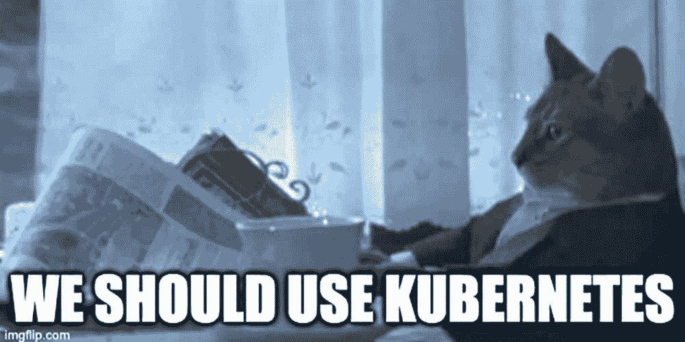

# Kubernetes 是新的。新是可怕的。

> 原文：<https://www.fairwinds.com/blog/kubernetes-is-new.-new-is-scary>

 ## Kubernetes 还是新的。新是可怕的。

我以前说过，我相信我还会再说一遍，对于其他用户来说，迁移到 Kubernetes 与第一次迁移到 Linux 非常相似。一旦你习惯了 Linux，你会觉得它很神奇(特别是对于开发和服务器)，但是如果你只知道 Windows，它确实是一个全新的范例。

我记得当 Live CDs 成为一件事的时候，你可以把一张 CD 放在一个驱动器里，在一个新的 Linux 发行版上踢轮胎。它改变了一切，你可以看到一个发行版在你当前的计算机上运行得有多好，而不需要经历一个完整的安装过程(对我来说，这总是从重新分区我的硬盘开始)。

今天你可以通过像 GKE、AKS、EKS 这样的工具或者像 Rancher 这样的第三方发行版用 Kubernetes 踢轮胎。站起来 Kubernetes 不再是困难的部分。

有了像 [Fairwinds KubeStart](https://www.fairwinds.com/kubestart) 这样的选项，您可以获得一个配置了最佳实践的集群，并且所有的附加组件都已经包含在您的集群中，因此您可以使用一个实际工作的生产就绪环境。它就像一张现场 CD，但是鼠标、键盘、屏幕和打印机实际上是开箱即用的。

寻找一个完整的 Kubernetes 治理平台？Fairwinds Insights 是免费的。今天就开始吧。

新是可怕的。但是一旦你适应了，新也可以变得很棒。去某个地方踢踢轮胎，感受一下这个新世界是如何运作的，你可能会喜欢你所看到的。

