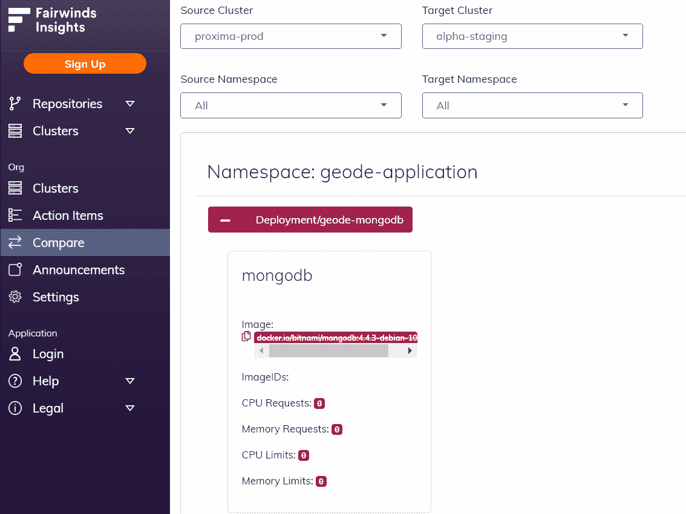
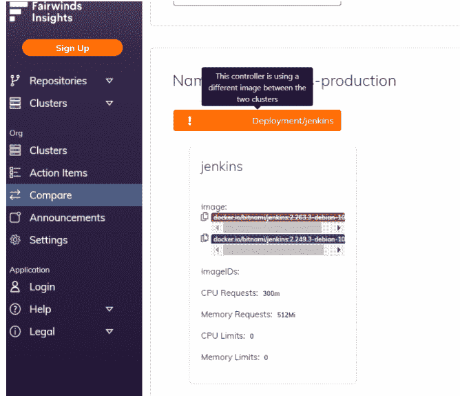
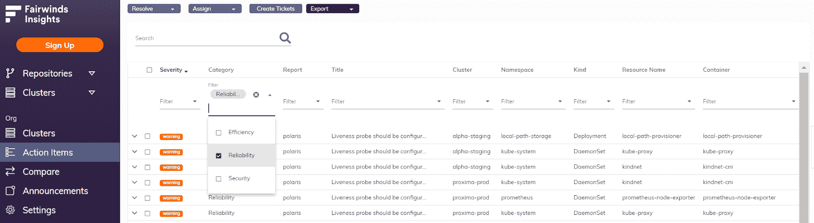
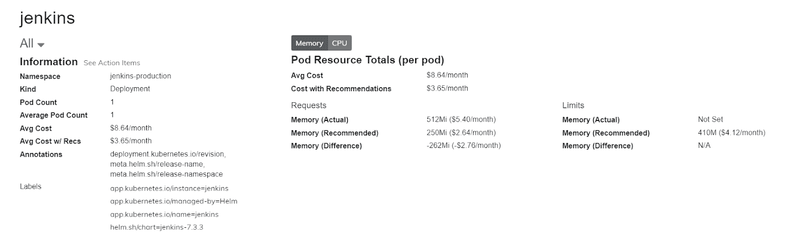
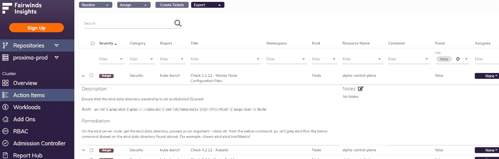

# Kubernetes 多集群可见性:为什么以及如何获得它

> 原文：<https://www.fairwinds.com/blog/kubernetes-multi-cluster-visibility-why-how-to-get-it>

 如果您正在使用 Kubernetes 管理一个工程师团队，您如何知道您的集群中到底发生了什么？这是一个我们经常听到的问题。

这是一个不经常解决的问题，但它会导致时间和金钱的浪费以及应用程序的损坏。

## **Kubernetes 可靠性**

我们谈了很多关于 [活性探测器](https://www.fairwinds.com/blog/how-to-identify-missing-readiness-probes-in-kubernetes) 的重要性。对于大多数工程师来说，他们不会主动设置这些，直到有真正的停机时间(即使那样也可能不是优先事项！).

在我之前的公司，有一天一个应用程序宕机了。开发者只是认为 Kubernetes 坏了，但我们不知道实际发生了什么。几个小时后，我们意识到容器内部的某些东西崩溃了，但这并没有导致整个应用程序崩溃，因为主进程没有死亡，所以 Kubernetes 没有尝试重新启动它。如果设置了活性探测，这种情况就不会发生。虽然工程师可能看不到在没有设置活跃度探测器的情况下修复配置的需要，但是如果您正在管理一个团队，简单地创建一个规定设置活跃度探测器的书面策略不会让您远离麻烦。

在另一个例子中，我从一个同事那里收到一条愤怒的消息，说一个应用程序在本地运行良好，但当放入 Kubernetes 时，性能从半秒响应变成了 20 秒。问题是这个人没有设置任何资源请求，而 pod 运行的节点恰好有一个吵闹的邻居。一旦在 pod 上设置了 CPU 请求，应用程序的性能就固定了。即使您有一个策略，告诉工程师设置资源请求，也很难跟踪谁在遵循它。

工程领导者需要了解哪些集群设置了活性探测器，哪些集群没有设置资源请求，以及哪些集群需要(以及如何)修复。

## Kubernetes 效率(我们指的是成本！)

任何公司都浪费不起钱。过度配置集群是非常普遍的。当请求设置得太高时，你将会在不使用的内存或 CPU 上烧钱。我在过去见过这样的例子，过度配置的容器每月在单个工作负载上浪费高达 100 美元。如果这种情况发生在 30 个工作负载上，浪费 3，000 美元很容易发生。我哥哥非常喜欢这样一句话:“注意盎司，体重自然会增加。”大多数集群可能没有浪费那么多资源的工作负载，但是到处都可以进行足够小的更改，累积起来就很多了。

获得多集群对工作负载支出的可见性很困难…非常困难。事实上，即使查看一个工作负载中的一个集群也很困难。因此，提供证据证明你在 Kubernetes 省钱或不浪费钱似乎是不可能的。

管理人员需要了解可以在哪里调整请求以节省资金。它需要能够跨您的所有工作负载。

## **Kubernetes 安全**

我们终于安全了。虽然市场上有大量解决方案可以帮助您识别存在漏洞的映像，但查看一个或所有集群的安全警报通常意味着运行许多不同的工具。即使您将这些工具组合在一起，也可能没有结果的仪表板视图。您需要花时间扫描每个集群，汇总结果，然后解决问题。当集群存在潜在的安全风险时，这需要做大量的工作。

在这里，工程领导需要能够看到他们的集群的安全状态，这样他们才知道他们真正需要担心的是什么。

## 【Kubernetes 配置验证软件的可见性

我是开发 Kubernetes 配置验证软件 [Fairwinds Insights](/insights) 的团队成员之一。在加入 Fairwinds 之前，我负责管理 Kubernetes 的基础设施。我亲身经历过配置设置不当的问题，也经历过对 Kubernetes 中发生的事情缺乏了解。

Fairwinds Insights 通过将来自不同集群的数据整合在一起，为那些负责管理多个团队和多个集群的人解决了这些挑战。

> Fairwinds Insights 可供免费使用。你可以[在这里](/coming-soon)报名。

## **聚类比较**

Insights 提供了比较功能。如果您正在管理团队，您可以进入控制面板，比较您的试运行和生产环境之间的不同之处。您可以查看是否有不同的映像，是否存在 CPU 和内存请求，以及是否设置了限制。您还可以确保从准备阶段到生产阶段，集群是彼此的完美镜像。

控制面板让您在一个地方就能看到多个集群。如果您没有这些，您的团队将需要:

*   在命令行中，登录到每个集群

*   运行 kubectl get all

*   然后观察这两个列表，或者通过 diff 工具运行这些列表

这将只是一个小的工作量！真的，真的，真的很痛苦。

## **行动项目**

接下来，在仪表板中，您可以查看组织中所有集群的行动项目，并根据您的关注点(可靠性、效率或安全性)进行筛选。

## **可靠性**

在这里，您可以查看哪些集群缺少活动或就绪性探测、映像拉取策略，以及哪些集群的内存请求过低会导致停机。管理人员获得了这种整体视图，同时仍然能够深入了解每个集群。修复配置意味着避免停机，提高性能。

## **效率**

我前面的例子给出了一些大概的数字，而 Fairwinds Insights 给出了精确的数字。借助 Insights，您可以了解自己的实际使用情况，并根据历史数据查看有关使用情况的建议。

当您获得整个集群效率的可见性时，您可以节省资金或向您的经理证明 Kubernetes 正在经济高效地运行。

## **安全**

Fairwinds Insights 还会持续监控您的集群，并让您了解所有集群的安全状况。在“行动项目”中，您将看到按严重程度分类的安全警报——危险或警告。另外，当您深入研究每个行动项目时，我们会提供如何解决问题的信息。您将能够比较哪些集群比其他集群更安全，并证明合规性。

## **多集群可见性**

Fairwinds Insights 是一个帮助您更好地运行 Kubernetes 的工具，您将实际了解您的集群内部正在发生什么。

