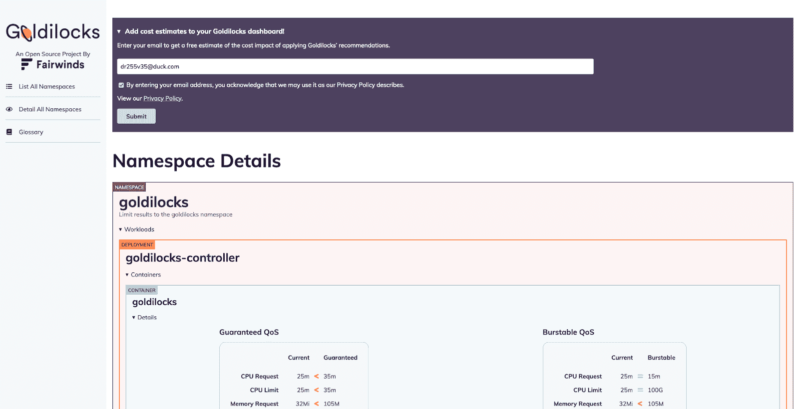
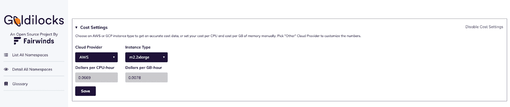
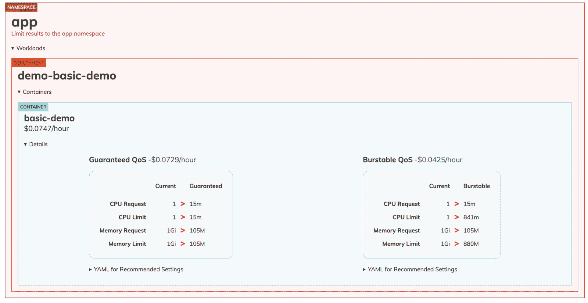

# Kubernetes 资源使用:用 Goldilocks 开源软件估算工作负载成本

> 原文：<https://www.fairwinds.com/blog/kubernetes-resource-usage-estimate-workload-cost-with-goldilocks-open-source>

 如果你正在寻找关于如何设置 Kubernetes 资源限制和请求的帮助，你来对地方了。Goldilocks 是一个开源工具，通过设置适当的 CPU/内存来帮助用户优化资源。这有助于工程师避免大量的试错猜测。这些变化有助于您了解工作负载是调配不足还是调配过量，并相应地设置预算。

观看视频 [Kubernetes 成本管理与金发女孩](https://www.youtube.com/watch?v=6bGd4GkAoTM)

## 新报告可用:估计工作量成本

Goldilocks 开源用户现在可以升级到 [最新版本](https://github.com/FairwindsOps/goldilocks) (v4.5.0)以访问新功能，该功能有助于估计工作负载的成本以及应用我们的建议的成本影响。

Goldilocks 为您做了所有耗时的工作，而不是通过查看云账单来了解费率、输入 CPU 时间或内存并计算支出。用户可以节省时间，更准确地配置 Kubernetes 工作负载，从而影响云消费。

## 它是如何工作的

更新 Goldilocks 后，用户可以选择输入电子邮件地址来解锁成本估算。

输入您的电子邮件地址后，您将通过电子邮件收到一个 API 令牌，它将被添加到控制面板中。注意:在不同电脑上工作的任何人都需要输入他们的电子邮件地址，即使他们正在查看同一个仪表板。

一旦输入 API 键，提示将被一个`Cost Settings`对话框所取代。

用户可以选择 AWS 或 GCP 例程类型，或者手动设置它们的成本。当用户向下滚动时，他们会看到每个工作负载都标注了成本数据。Goldilocks 会自动计算 1g 内存和 CPU 每小时的成本。

这可以与每个工作负载相关联，并获得增加或减少 CPU 或内存的建议。

在上面的例子中，您可以看到运行这个演示应用程序的成本是 0.0747 美元/小时。Goldilocks 实际上建议改变 CPU 和内存，这将有助于降低 0.0729 美元/小时的成本。这些数字可能看起来很小，但它们可以在许多豆荚和很长一段时间内累积起来。随着用户在 Kubernetes 中运行更大的工作负载，这些建议变得更加重要。

对于运行少量 Kubernetes 集群的团队来说，Goldilocks 是一个很好的选择。当需要更深入的 Kubernetes 成本可见性和优化时，用户应该查看我们的 Kubernetes 治理平台 Fairwinds Insights。

> 您可以永远免费使用 Fairwinds Insights。 [拿到这里](https://www.fairwinds.com/coming-soon) 。

Insights 提供了跨多个集群的 Kubernetes 成本的集中视图，提供了跨团队的一致性和一致性，以及消除云成本浪费的能力。

### 资源:

