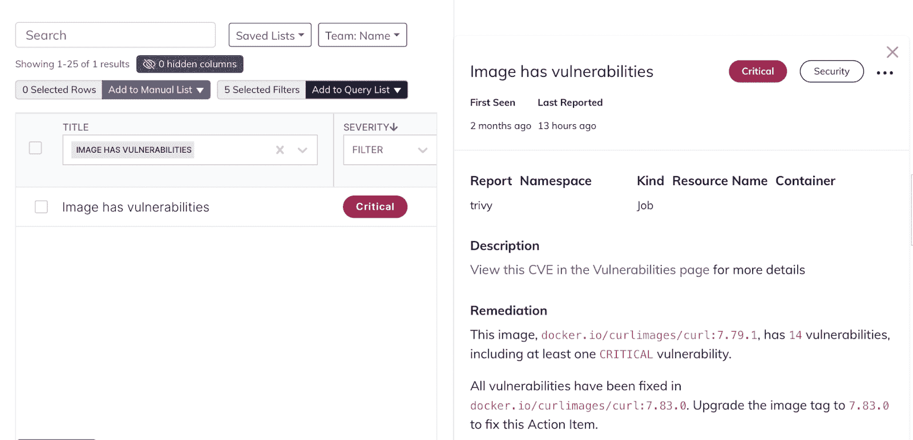

# Kubernetes 漏洞管理:保持第三方图像最新

> 原文：<https://www.fairwinds.com/blog/kubernetes-vulnerability-management-third-party-images-up-to-date>

 Kubernetes 生态系统建立在大量开源技术的基础上。Kubernetes 本身是最大的开源项目之一，围绕该项目，工具和集群插件社区呈指数级增长，以扩展功能并支持各种关键任务用例。

Kubernetes 集群拥有十几个或更多运行关键基础设施服务的第三方插件是很常见的，比如入口、DNS、证书管理、RBAC 等等。虽然这些附加组件往往功能强大且维护良好，但它们也引入了需要监控的漏洞。(就其核心而言，附加组件实际上只是容器映像，这些映像可以包含具有已知漏洞的库和依赖项)。

> 上周，Fairwinds 团队在 KubeCon EU 讨论了我们帮助公司解决的其他安全、成本和 Kubernetes 护栏问题。我们已经宣布对我们的平台, [Fairwinds Insights](//www.fairwinds.com/insights) 进行更新，这有助于通过额外的左移安全增强功能来统一 DevSecOps。新闻中包括提供第三方映像升级建议的新功能。

## 第三方集装箱风险

问题范围相当广。Fairwinds 的 [Kubernetes 配置基准测试报告](/news/fairwinds-releases-kubernetes-configuration-benchmark-report)指出，三分之一(33%)的组织至少有一半的工作负载在过时的掌舵图下运行，60%的组织在生产环境中拥有存在漏洞的映像。舵图是部署附加组件的常用方式，过时的舵图可能会带来未打补丁的漏洞。

那么，当使用第三方插件或容器映像时，您可以合理地做些什么来更好地保护您的集群呢？由于您不维护这些项目，升级您的附加组件和容器映像往往是减少您可能面临的漏洞数量的最佳方式。维护良好的第三方加载项可能会定期推出安全补丁，因此将这些加载项集成到您的 Kubernetes 基础架构中是关键。

为了简化这一过程，Fairwinds 增加了为我们的 Kubernetes 治理平台扫描的第三方图像推荐升级路径的功能。Fairwinds Insights 将查看映像存储库，确定该容器映像可用的较新标签，并推荐一个版本升级到比集群中当前运行的版本漏洞更少的版本。

这项功能为开发人员和安全工程师节省了大量时间。在使用此功能之前，工程师需要识别风险最高的容器，手动检查映像存储库以查看是否有更新的版本，手动扫描最新版本以了解漏洞状况，然后决定是否应该升级映像。

Fairwinds Insights 通过自动化所有这些工作来加快修复时间，为工程师提供直接的建议，包括要升级到的标签，以及减少的漏洞数量(以及最高严重性的漏洞)。

确保您的组织获得对 Kubernetes 环境的持续扫描和运行时监控。您可以永远免费使用 Fairwinds Insights。[拿到这里。](/coming-soon)

