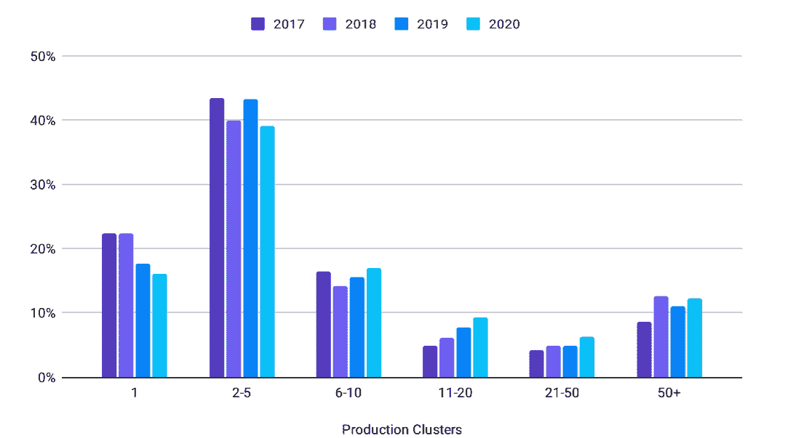

# 一致地管理开放策略代理(OPA)

> 原文：<https://www.fairwinds.com/blog/manage-open-policy-agent-opa-consistently>

 上周，CNCF 宣布开放策略代理(OPA)的毕业，这是一个开源的通用策略引擎，能够在整个堆栈中实施统一的上下文感知策略。这是一个超级令人兴奋的项目，它帮助任何负责团队、合规性和安全性的人在 Kubernetes 中应用它。

而且正在被利用！在一项针对 150 多家组织的 OPA 用户调查 中，91%的组织表示他们在从 QA 到生产的 OPA 采用阶段使用 OPA。超过一半的人表示他们至少在两种情况下使用 OPA。OPA 最常见的用例是配置授权(比如 Kubernetes 准入控制)和 API 授权。

## **在 Kubernetes 中实施政策**

OPA 的势头证明，我们需要对 Kubernetes 集群中发生的事情进行更多的控制和了解。因此，虽然 OPA 在 Kubernetes 策略执行方面提供了大量的功能，但它也需要技术知识和时间来跨多个团队和多集群应用策略。

最新的 [CNCF 调查](https://www.cncf.io/wp-content/uploads/2020/11/CNCF_Survey_Report_2020.pdf) 显示，大多数人在生产中运行 2-5 个集群。然而，有更多的团队在运行。

如果您负责管理 10 个或 20 个集群，您如何确保您的 OPA 策略在所有集群中保持一致？你需要多少时间和资源以及你愿意接受的人为错误来管理这个令人头痛的问题？

## **持续管理 OPA**

当 OPA 得到一致应用时，通过允许您围绕用户访问、子网出口流量许可、工作负载部署、可下载的注册表二进制文件或基于一天中的时间的系统访问设置定制策略，OPA 将使您的应用和 Kubernetes 基础设施受益。您将能够创建和实施对您的业务非常重要的策略。

仍然需要的是一种一致地实施 OPA 的方法，尤其是如果您正在管理一个团队或者需要证明合规性/安全性的话。

这就是 Fairwinds Insights 要解决的问题。我们在 Fairwinds Insights 的每个部分都增加了对 OPA 策略的支持，包括 CI/CD 管道、准入控制器和集群内代理。

[fair winds Insights](//www.fairwinds.com/insights)是一款针对安全性、效率和可靠性检查来检查集群配置的软件。它将许多开源项目的智能，包括 OPA、Polaris、Goldilocks、Trivy 等等，结合到一个集中的仪表板中。如果你负责确保 Kubernetes 的配置是正确和一致的，你将能够在任何时间点看到什么需要修复。

> 使用 Fairwinds Insights，在一个平台中免费获得 Kubernetes 安全性、成本分配和规避、合规性和护栏。

当与 OPA 一起使用时，Fairwinds Insights 可帮助您确保在所有集群中应用相同的策略，并且如果您希望某些策略仅应用于某些工作负载(例如，仅在 prod 集群上运行)，则可提供一定的灵活性。它还允许您在 CI/CD、准入控制和集群内扫描中运行相同的策略，因此您可以在整个开发和部署过程中一致地应用策略。

Insights 可以采用相同的 OPA 策略，并将它们联合到所有三个上下文，以及您想要的任意多个集群。您将受益于跨集群一致地自动化、管理和执行 Kubernetes 策略的能力。

您可以阅读更多内容并查看一些截图，了解如何使用 Fairwinds Insights 管理 [OPA 政策。](https://www.fairwinds.com/blog/managing-opa-policies-with-fairwinds-insights)

