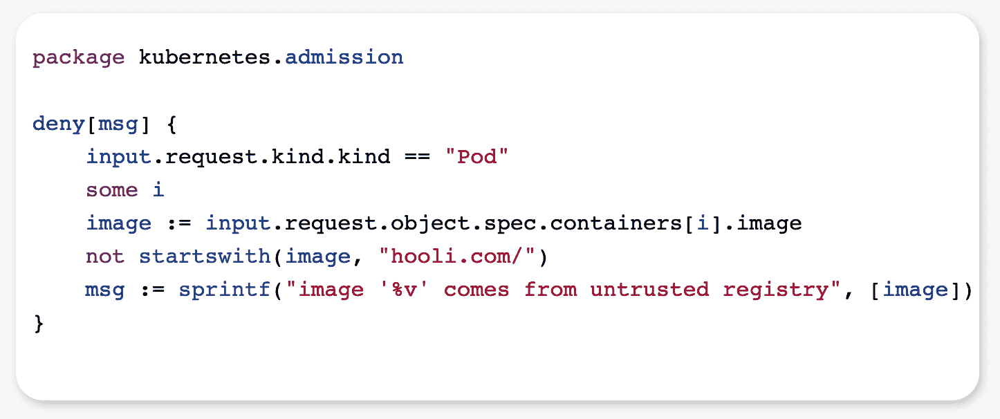
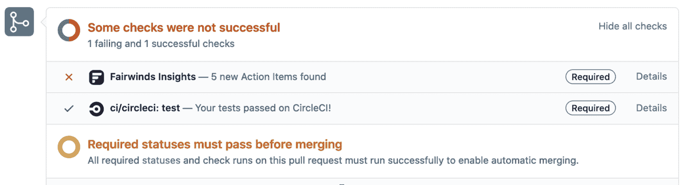
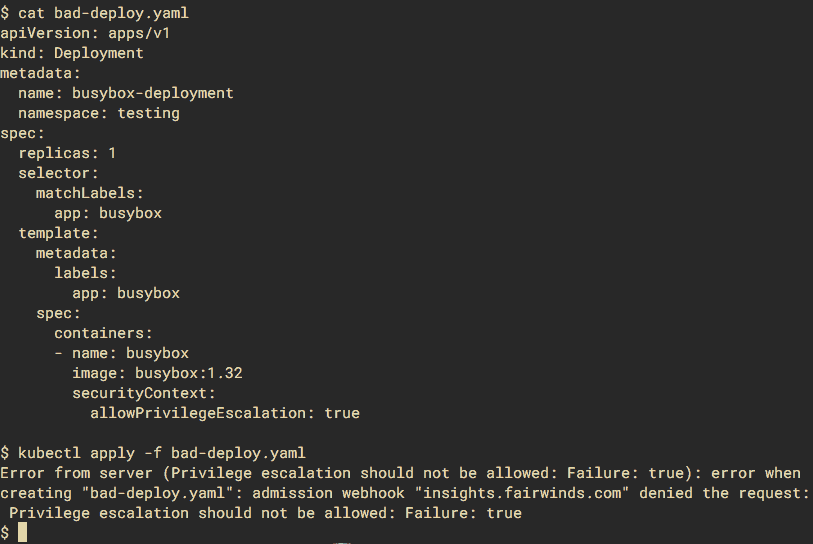
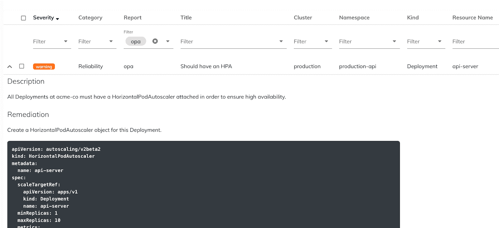

# 利用 Fairwinds Insights 管理 OPA 政策

> 原文：<https://www.fairwinds.com/blog/managing-opa-policies-with-fairwinds-insights>

 在 Fairwinds，我们已经在几十个组织中管理了数百个 Kubernetes 集群。在我们保持客户环境安全、高效和可靠运行的努力中，我们发现利用各种开源审计工具有很多好处，如 Trivy(用于容器扫描)和 kube-hunter(用于网络嗅探)，以及我们自己的贡献，如 Polaris(用于配置验证)和 Goldilocks(用于审计资源请求和限制)。我们建立了 [Fairwinds Insights](/insights) 作为一种管理、跟踪和分类这些工具的所有不同发现的方式，这是一个很大的帮助。

但是这些工具通常是通用的——它们检查运行 Kubernetes 的每个人应该关心的事情。例如，Polaris 对“最佳实践”进行了一系列检查，比如确保你已经为每个工作负载设置了内存限制。

许多组织有更具体的要求。例如，他们可能:

*   非常注意安全，希望每个容器都放弃所有 Linux 功能

*   对 Docker 注册表中断保持敏感，并希望确保从内部注册表中提取每个映像

*   有一个他们想要实施的内部命名方案

*   希望每个工作负载都有特定的标签，如成本中心代码

*   需要每个部署都连接一个垂直或水平的 pod-autoscaler

虽然组织可以使用 [Polaris 的自定义检查语法](https://www.fairwinds.com/blog/opa-alternative-polaris-stepped-approach-to-kubernetes-policy-enforcement) 来执行这些策略，但 Kubernetes 社区已经确定了一个用于创建配置策略的强大的开放标准:开放策略代理，或 OPA。我们很高兴地宣布，我们已经为 Fairwinds Insights 的每个部分添加了对 OPA 策略的支持，包括 CI/CD 管道、准入控制器和集群内代理。

通过将 Fairwinds Insights 和 OPA 结合使用，组织可以主动将其 Kubernetes 集群与最佳实践和内部策略保持一致。此外，在开发和部署流程的每个步骤中运行 OPA 的能力有助于在问题进入集群之前尽早发现问题，从而更容易地在开发和运营之间进行交接。

## **什么是 OPA？**

OPA 是一个验证结构化数据的框架。它促使用户编写策略即代码，扩展了社区对基础设施即代码的成功推动。虽然 OPA 可以验证任何类型的结构化数据，包括 Terraform、HTTP 请求和 often 文件，但它最常被认为是与 Kubernetes 清单结合使用。

负责 [开放策略代理](https://www.openpolicyagent.org/) 的人维护着一整套用于配置验证的工具，但核心技术是一种被称为减压阀的特定领域语言。

一开始，减压阀可能有点令人生畏，因为它的语法不像典型的编程语言，但就像任何优秀的特定领域语言(DSL)一样，一旦你掌握了它，它就会变得非常强大。 [这篇文章](https://medium.com/@mathurvarun98/how-to-write-great-rego-policies-dc6117679c9f) 对如何在减压阀开始思考提供了一个很好的概述。

## **OPA 和 Fairwinds Insights**

我们通过三种主要方式将 OPA 集成到 Fairwinds Insights 中:

*   作为 CI/CD 挂钩，作为代码评审过程的一部分，审计基础设施即代码

*   作为准入控制器(又名验证 Webhook)，它将阻止有问题的资源进入集群

*   作为集群内代理，重复扫描有问题的资源

更好的是，Insights 可以采用相同的 OPA 策略，并将它们联合到所有三个上下文，以及您想要的任意多个集群！

> 对使用 Fairwinds Insights 感兴趣吗？免费提供！点击此处了解更多信息。

### **持续集成**

OPA 并不总是必须在集群中运行——它也可以在签入您的基础设施即代码库中的 YAML 上运行。这是在过程早期检测问题的好方法，因为工程师仍然在微调他们的代码。

如果您只是通过集群内代理和准入控制器运行 OPA，而没有利用持续集成特性，您可能会让一些开发人员感到沮丧。他们将他们的变更合并到主分支中，却发现部署过程已经中断，因为接纳控制器拒绝了他们的变更。或者，几周后，一名操作工程师来敲门，因为集群内代理发现了一些由他们的更改引起的新操作项。但是如果团队将相同的 OPA 策略合并到他们的 CI 过程中，他们将被阻止合并他们的变更，直到问题被修复。

### **入场控制器**

在 Kubernetes 中，准入控制器(或验证 Webhook)监听 Kubernetes API 以发现进入集群的新资源。每当用户、bot 或集群中的操作者想要创建或更新资源时，准入控制器就有机会首先检查它。如果资源违反了准入控制器的策略，它可以拒绝 API 请求，并将任何详细信息报告给调用者。

这是一个实施强硬政策的好地方。例如，如果您希望确保集群中的*没有*工作负载从 quay.io 和 Docker Hub 中提取映像，准入控制是实施该策略的绝佳场所。当然，如果需要，管理员可以对特定的资源和名称空间进行豁免。

### **集群内代理**

Fairwinds Insights 可以在正在运行的 Kubernetes 集群内将 OPA 作为 CronJob 运行。在这种情况下，代理将在集群中搜索与您的策略匹配的任何资源，并将在 Fairwinds Insights 仪表板中创建一个操作项。

对于每个 OPA 策略，您可以在 Insights UI 中自定义以下字段:

*   严重

*   种类

*   标题

*   描述

*   补救

这是开始使用 OPA 的一个很好的非侵入性方法。您可以让策略在现有资源上被动运行，看看它们可能会产生什么影响，而不是强制实施您尚未调优的策略。这也是运行“最好有”策略的好方法——这些策略不一定会阻止部署，但是您仍然希望关注它们。

## 为什么不坚持开源呢？

开放策略代理团队为在各种环境下运行减压阀策略提供了一些很棒的开源解决方案，比如 Gatekeeper(他们的准入控制器)和 Conftest(用于检查 YAML 文件的 CLI)。但是像 Fairwinds Insights 这样的 SaaS 平台可以为大规模管理 OPA 提供更加无缝、统一的体验。

一个主要优势是能够将您的 OPA 策略联合到您的机群中的每个集群。有了开源工具，你需要将每一个新策略应用到每一个集群上。如果您有几个集群，这可能不是太大的压力，但对于有几十到几百个集群的组织来说，这可能会成为一场噩梦。您如何确定他们都在运行每个策略的最新版本？借助 Fairwinds Insights，您只需通过 API 上传您的策略，它就会自动分发到您车队中的每个集群。

另一个优势是能够在不同的上下文中运行相同的策略。OPA 套件中不同的开源工具期望不同的输入格式，因此很难在 CI 中重用您在准入控制中使用的相同策略。但是 Fairwinds Insights 将其 OPA 集成设计为在所有环境中保持一致，因此如果您的 CI 检查通过，您可以确保准入控制员不会抱怨。

## 下一步是什么？

我们不断对 Insights 平台进行迭代，以提供新功能，对于如何在未来几个月改善我们的 OPA 集成，我们已经有了一些很好的想法，特别是在仪表板和警报方面。

我对 Fairwinds Insights 整合 OPA 的方向感到非常兴奋。它重申了我们对开放标准和 Kubernetes 社区的承诺，并极大地扩展了我们产品的功能。当与 Fairwinds Insights 结合使用时，OPA 将使集群管理员确信他们的内部策略在整个开发和部署过程中都得到了执行。

## **资源**

