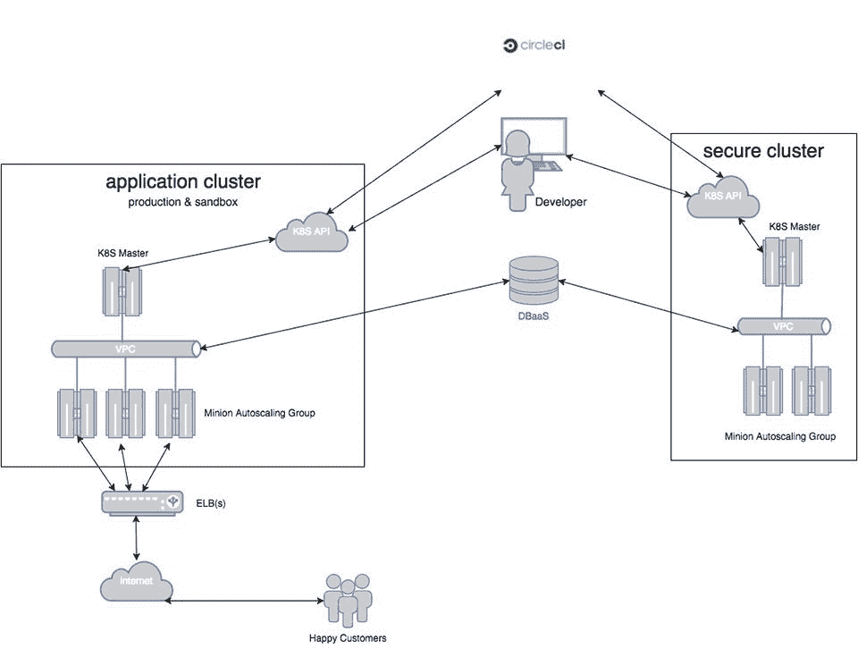

# 在 AWS 上从 Heroku 迁徙到 Kubernetes

> 原文：<https://www.fairwinds.com/blog/migrating-from-heroku-to-kubernetes-on-aws>

 利用平台即服务(PaaS)是快速构建、创新和部署新产品或服务的好方法。通过利用 PaaS 供应商的服务器、负载平衡、应用程序扩展和第三方集成，您的工程团队可以专注于构建面向客户的功能，为您的*业务增加价值。*

 *然而，有一点是，许多组织已经无法满足其一刀切的平台即服务的需求。一些常见的原因包括:

1.  表演
2.  成本效率
3.  控制
4.  可靠性
5.  平台限制

我们最近在  [AWS](https://aws.amazon.com/) 上为一个这样的客户端完成了从[Heroku](https://www.heroku.com/)到[Kubernetes](https://kubernetes.io/)的迁移。

该客户经历了惊人的增长，并在真正的 PaaS 中遇到了一些限制和性能问题。此外，他们需要运行与其正常应用程序工作负载完全隔离的敏感工作负载，而 PaaS 提供商无法满足这一需求。

他们之前的架构将 Heroku 用于面向客户端的网站和 API，并在领先的托管服务提供商上使用单独的实例来处理他们的安全交易。必须管理两个基础架构堆栈以及独立的日志记录、监控和部署管道，这减缓了他们的开发过程。

最后，他们正在将几个整体应用程序分解成一组微服务。这些微服务将增加代码重用并降低应用程序的复杂性。我们的客户知道微服务将复杂性从应用转移到基础设施，并希望实施能够提供关键功能，如服务发现、流量路由和秘密管理。

## 目标

除了依赖我们完全托管的开发运维即服务之外，我们客户的技术要求是拥有一个现代化的云架构，包括:

*   使用 AWS 等弹性云平台整合基础设施
*   支持微服务架构的编排系统
*   两个独立的集群:生产/暂存和安全
*   集中式应用程序日志记录、指标和警报
*   应用 CI/CD 管道
*   与生产紧密匹配的本地开发环境

在对现有基础设施和遗留应用程序以及他们的 CTO 对下一代应用程序的愿景进行彻底评估后，我们的团队提出了一个基于部署到 Amazon Web Services 的开源[Kubernetes](http://kubernetes.io/)容器编排引擎的解决方案。

## 库伯内特的现代建筑

如果你以前没有听说过 Kubernetes，停止阅读，去访问  [项目网站](http://kubernetes.io/)。

然后阅读  [为什么 Kubernetes 可以加冕集装箱管理之王](http://www.techrepublic.com/article/why-kubernetes-could-be-crowned-king-of-container-management/)。而  [Google Kubernetes 则是开源软件的热门](http://blogs.wsj.com/cio/2015/11/24/google-kubernetes-is-an-open-source-software-hit/)。

回来了？这些流行语不是谎言。

总结一下:

> “Kubernetes 是一个用于自动化部署、扩展和管理容器化应用的开源系统。”

从应用程序开发人员的角度来看，Kubernetes 提供了一种健壮的机制来轻松部署应用程序(就像您使用 PaaS 一样)，而没有实际 PaaS 的约束和供应商限制。这正是我们的客户所寻求的，并且是一个完美的功能匹配。

开箱即用，Kubernetes 为现代云架构提供了许多基本特性:

*   [AWS](https://aws.amazon.com/)[Azure](https://azure.microsoft.com/en-us/)的部署方法
*   容器调度和编排
*   服务发现和负载平衡
*   机密和配置管理
*   自动滚动部署(和回滚！)
*   水平应用程序自动缩放
*   应用程序日志收集

但是，Kubernetes 有几项电池以外的操作功能:

*   一致的 AWS 部署
*   构建环境(CI/CD)
*   [码头](https://www.docker.com/) 注册
*   监控和警报
*   外部日志记录

## 生产就绪部署

我们在使用工具和 SaaS 平台处理 Kubernetes 没有的功能方面已经有了丰富的经验。我们根据该客户已经在其他地方使用的服务，以及哪些服务在特性和功能方面提供了最佳价值，为他们提出了我们的建议。

完成的部署包括:

*   亚马逊网络服务
*   应用程序日志记录使用[logspout](https://github.com/gliderlabs/logspout)&[paper trail](https://papertrailapp.com/)
*   使用[Datadog](https://www.datadog.com/)T5[PagerDuty](https://www.pagerduty.com/)进行应用和容器监控和报警

    *   Datadog 有一个很棒的工具，可以为您的 Kubernetes 集群生成 DaemonSet
    *   对于这个特殊的客户，我们正在处理二级传呼机的职责。 
*   使用  [CircleCI](https://www.circleci.com/) 进行持续集成和持续部署
    *   PRs 的构建/测试，主部署到“准备阶段”，  [GitHub](https://github.com/circleci) 发货到生产
*   管理集群生命周期的工具集
    *   集群创建、删除、状态备份和导入
*   [Quay.io 的](https://quay.io/) 优秀 Docker 注册表
    *   集成漏洞扫描与  [克莱尔](https://github.com/coreos/clair)
    *   可定制的 RBAC 访问，包括 Kubernetes & CircleCI 的“机器人”帐户。
*   本地开发工作流使用  [minikube](https://github.com/kubernetes/minikube)

## 图片中的星团

我们的客户已经试运行他们的新基础设施几个月了，并且已经开始生产过渡。通过与他们的工程团队合作，我们已经实现了向 Kubernetes 基础设施部署新微服务的流程自动化。过去，开发人员需要几个小时甚至一天才能侵入他们的旧基础设施，现在只需要不到 20 分钟——而且该平台提供了完成这项工作的所有功能  *右*。

## 未来的工作

随着我们扩大他们的生产工作负载，我们发现了一些新的需求，并将其纳入到 [Fairwinds](/) DevOps 即服务产品中:

*   ChatOps 管理 Kubernetes 集群和应用程序部署生命周期的状态
*   改进的 Kubernetes 部署系统，包括 HA etcd 和 master
*   增强型秘密管理系统
*   预先配置的 Kibana，用于内置于 Kubernetes 的 ElasticSearch-Logstash 系统*