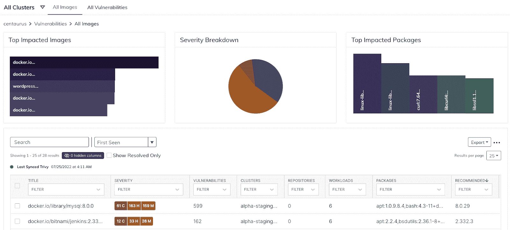
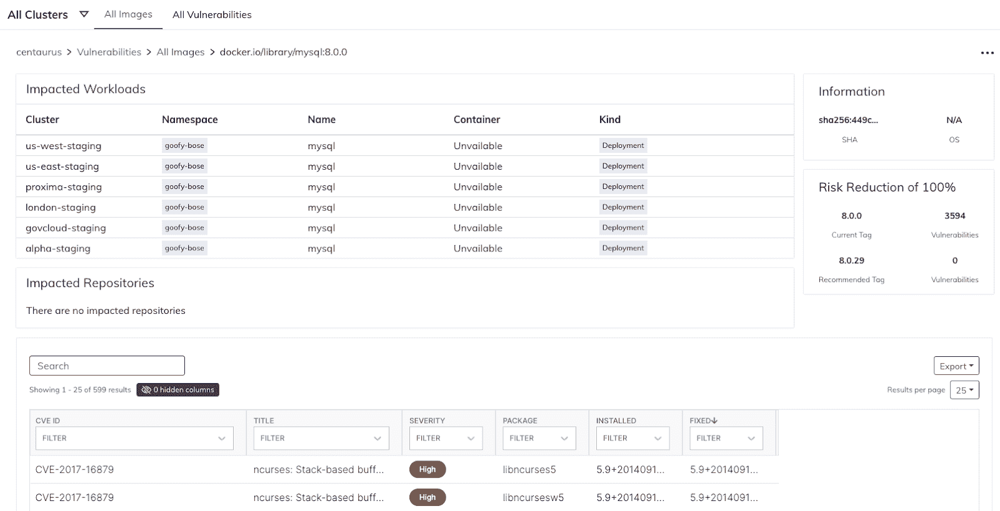
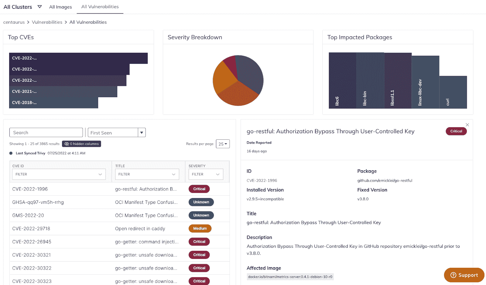

# 利用漏洞浏览器降低 Kubernetes 的风险

> 原文：<https://www.fairwinds.com/blog/mitigate-kubernetes-risk-with-vulnerabilities-explorer>

 对于 DevOps 安全负责人来说，了解 Kubernetes 集群中存在哪些漏洞至关重要，但这只是问题的一部分。一旦确定了风险，就需要一个行动计划来降低风险。根据红帽公司的 2022 年 Kubernetes 安全状况报告 ，43%的组织认为 DevOps 是对 Kubernetes 安全最负责的角色。随着公司转向使用更多的云原生技术，开发运维成为保护应用的最重要因素之一。

优先级是漏洞管理的一个重要部分。清点正在运行的映像并了解它们的相对风险状况正迅速成为一种基本期望。除此之外，开发运维团队还面临其他问题，例如:

1.  这是第一方还是第三方的形象？

2.  这个形象是哪个团队负责的？

3.  是否有漏洞更少的新版映像？

4.  我们需要升级映像中的任何包吗？

5.  下次我们如何在这些问题进入生产之前发现它们？

## **Fairwinds 增加漏洞浏览器以降低 Kubernetes 的风险**

[fair winds Insights](//www.fairwinds.com/insights)为漏洞浏览器添加了新的功能和设计，使团队能够轻松了解高层次的风险，并解决影响最大的问题。(观看下面的视频游览)。

> 您可以永远免费使用 Fairwinds Insights。 [拿到这里](https://www.fairwinds.com/coming-soon) 。

Insights 可识别顶级 CVE、风险最高的工作负载和最易受攻击的容器包。团队还可以选择按图像或漏洞查看数据，从而灵活地关注最相关的上下文。漏洞浏览器通过向 [自动升级建议](https://www.fairwinds.com/blog/kubernetes-vulnerability-management-third-party-images-up-to-date) 提供预计的漏洞减少计数，进一步支持节省时间。

### 图像概述

### 受影响工作负载的详细信息和风险降低建议

### 查看漏洞并确定影响 

借助 Fairwinds Insights，DevOps 领导者可以加快 DevSecOps 的采用，并使团队能够修复他们所拥有的映像的漏洞，最终缩短修复时间并加快上市速度。