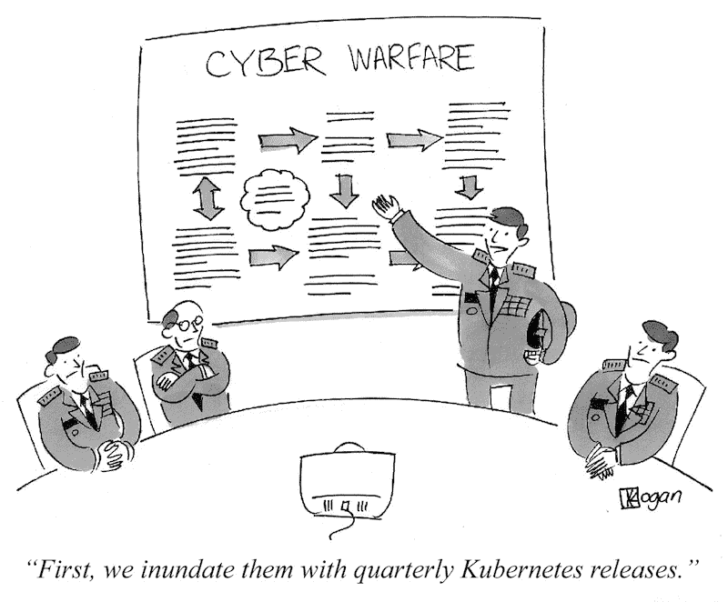
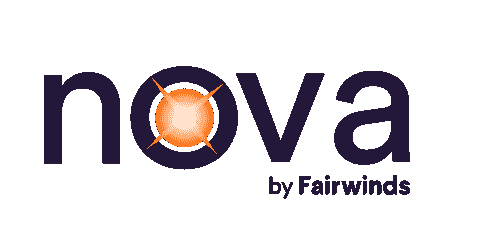

# Nova 开源工具——监控新版本

> 原文：<https://www.fairwinds.com/blog/nova-monitor-helm-for-new-releases>

 在运行生产 Kubernetes 集群时，最重要(也是最繁重)的任务之一是保持所有内容都是最新的。Kubernetes 本身削减了季度发布，这很快就失去了支持——如果您无法升级，您可能会面临安全漏洞和错误的功能。幸运的是，每季度一次的节奏至少让这些发布变得可预测:你甚至可以每三个月提醒一次。



来源:[https://gravitational.com/blog/kubernetes-release-cycle/](https://gravitational.com/blog/kubernetes-release-cycle/)

但是在 Kubernetes 之上，你可能有半打的附加组件在你的集群中运行，很可能通过 Helm 安装了 [。nginx-ingress、cert-manager 和 linkerd 等辅助组件通常对运行生产级集群至关重要。对于 PostgreSQL 或 Wordpress 等常见应用程序，您甚至可以使用 k8s 特定的部署。这些工具都有自己的发布节奏，一些更新可能会附带重要的安全补丁。](https://helm.sh/)

安装一个新的补丁通常并不困难——通常它只是意味着重新运行一个 `helm install,` 命令，或者更新你的 [基础设施即代码](https://www.fairwinds.com/blog/why-infrastructure-as-code-kubernetes) 库中的一行代码。但是你怎么知道*什么时候*该更新了呢？与 Kubernetes 本身不同，掌舵图的更新难以监控和预测。

## **观察并报告**



进入 [Nova](https://github.com/FairwindsOps/Nova/) ，Fairwinds 的开源工具。

> Nova 是一个命令行界面，用于交叉检查集群中运行的最新版本的舵图。[点击发微博](https://ctt.ac/8q0Af)

Nova 是一个命令行界面，用于交叉检查集群中运行的最新版本的舵图。Nova 会让您知道您运行的图表是否过期或被弃用，因此您可以确保您始终了解更新。

```
Release Name      Installed    Latest     Old     Deprecated
cert-manager      v0.11.0      v0.15.2    true    false
insights-agent    0.21.1       0.21.1     false   false
grafana           2.1.3        3.1.1      true    false
metrics-server    2.8.8        2.11.1     true    false
nginx-ingress     1.25.0       1.40.3     true    false 
```

这很容易看出你在任何已安装的舵图上落后多少。在上面的例子中，我们已经获得了最新版本的 `insights-agent,` ，但是对于一些核心基础设施还有一些小的更新，包括 `cert-manager,` `nginx-ingress,` 和`metrics-server.``grafana`也有了新的主要版本，所以我们可能会错过一些很酷的新功能！

## **挑战**

这是一个比预期更难的问题。

第一个问题是同时支持头盔 2 和头盔 3。Helm 2 使用 ConfigMaps 存储图表元数据，这非常容易解析。但是圣盔 3 使用了秘密，以及一些拜占庭式的编码实践。在来自[Pluto 团队](https://www.fairwinds.com/blog/kubernetes-easily-find-deprecated-api-versions-with-pluto) 的一些帮助下，我们构建了对两个版本的支持，以及从两个版本自动检测图表的能力。您可以通过指定 `--helm-version=auto.` 来使用该功能

更具挑战性的是将安装的图表与上游源进行匹配。不幸的是，Helm 没有在图表元数据中存储关于上游存储库的信息，这使得精确匹配变得不可能。我们所要做的只是名称，它可能会在不同的存储库中重复。比如很多 [的位图](https://github.com/bitnami/charts/) 最近从 [核心图回购](https://github.com/helm/charts/) 中迁移出来，但是保留了相同的名称。

为了找到匹配，我们必须在*所有已知的*库中查找具有匹配名称的图表，然后使用类似图表的 `version, home, description,` 和 `maintainers` 的试探法来找到一个好的匹配。到目前为止，这种策略有 100%的成功率，但感觉有点像黑客。如果你知道一个更好的解决方案来找到一个已安装的舵图的上游存储库，请告诉我们！

## **付诸实践**

Nova 为任何希望保持图表最新的人节省了大量的时间和精力。运营商现在可以运行一个 CLI 来检测集群中运行的旧版本，而不必监控每个图表的更新。但是您仍然需要记住运行 CLI！

当管理数百个集群时，忘记在特定集群上运行 Nova、误读输出或未能根据结果采取行动的可能性几乎是确定无疑的。此外，一些组织*需要*在给定工具的旧版本上(特别是， `cert-manager` 已经定期引入突破性的变化)。所以我们需要一种方法来大规模操作 Nova。

最简单的方法就是使用 [费尔温斯洞察](https://www.fairwinds.com/insights) 。Insights 可以定期自动运行 Nova(以及其他 Kubernetes 审计工具)，默认情况下每小时运行一次，并使用结果创建 [行动项目](https://insights.docs.fairwinds.com/features/action-items/) 。这些行动项目作为更新你的舵轮图的提醒，并且可以通过管道传送到 Slack、Datadog 或你的工程师居住的任何地方。

> 对使用 Fairwinds Insights 感兴趣吗？免费提供！ [在此了解更多](https://www.fairwinds.com/coming-soon) 。

在内部，我们还维护了一个 YAML 文件，其中包含一组标准，即我们希望客户运行的每个附加组件的特定版本。我们使用 Nova 来确保 YAML 文件保持最新版本，并使我们的基础设施即代码符合这些标准。

# **下一步是什么**

自动检查舵图的更新解决了我们 Fairwinds 以及整个 Kubernetes 社区的一个大问题。但是生态系统发展迅速，我们需要掌握更多的软件和基础设施。我们希望构建自动化检查的其他内容有:

*   受管理的 Kubernetes 提供商(如 GKE、EKS 和 AKS)支持 k8s 版本
*   码头标签(至少在使用 semver 标签的地方)
*   Docker 基本图像

这些检查是否适合 Nova，或者是否将证明创建一个单独的项目是合理的，还有待观察。

在任何领域，保持最新版本是一个大而可怕的问题。我们希望 Nova 能够帮助 Kubernetes 社区保持集群的可靠性和安全性。

[](https://cta-redirect.hubspot.com/cta/redirect/2184645/d2b9e53c-d330-4668-b630-7fae9ad73f61)