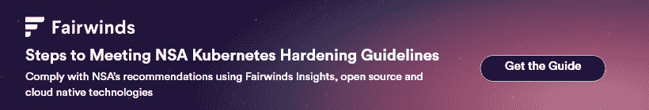

# NSA Kubernetes 强化指南:审计日志和威胁检测概述

> 原文：<https://www.fairwinds.com/blog/nsa-kubernetes-hardening-guide-audit-logging-and-threat-detection-overview>

 在我们的 NSA Kubernetes 强化指南系列中，我们已经了解了 [pod 安全](https://www.fairwinds.com/blog/three-ways-fairwinds-insights-can-root-out-poor-pod-security)、[网络访问](https://www.fairwinds.com/blog/nsa-hardening-guide-locking-down-network-access-with-fairwinds-insights)和[认证和授权](https://www.fairwinds.com/blog/nsa-hardening-guide-how-can-fairwinds-insights-strengthen-your-authentication-authorization-practices)。今天，我们来看看审计日志和威胁检测部分，并提供一些关于合规性的建议。

[NSA Kubernetes 强化指南](https://media.defense.gov/2021/Aug/03/2002820425/-1/-1/0/CTR_Kubernetes_Hardening_Guidance_1.1_20220315.PDF)概述了一种强大的深度防御方法，以最大限度地降低违规的可能性，并确保如果攻击者渗透到您的集群，爆炸半径将尽可能小。审计日志和威胁检测是 Kubernetes 安全性的重要组成部分。

## Kubernetes 审计日志记录和威胁检测

### 启用审核日志记录

> 审计日志捕获集群中的归属活动。有效的日志解决方案和日志审查是必要的，这不仅是为了确保服务按预期运行和配置，也是为了确保系统的安全性。

Kubernetes 审计日志在完全启用时会生成大量信息。最起码，您应该启用审计日志，并确保它们存储在一个可以在紧急情况下查看的地方。当其他更容易理解的遥测技术出现故障时，审计日志可以帮助您找到安全漏洞或中断的根源。

### 保存日志以确保可用性，并聚合集群外部的日志

> 应该在环境的所有级别执行日志记录，包括主机、应用程序、容器、容器引擎、映像注册表、api 服务器和云(如果适用)。捕获后，这些日志应全部聚合到一个服务中，以便为安全审计员、网络维护者和事件响应者提供整个环境中所采取措施的完整视图。

我们建议将所有审计、节点和应用程序日志以及任何其他相关日志发送给第三方服务，如 [Datadog](https://www.datadoghq.com/) 。这一举措有助于确保日志在发生攻击或中断时仍然存在。它还用于整理不同来源的日志，因此可以通过单一控制台调查事件。

Kubernetes 治理平台 Fairwinds Insights 可以将事件和指标导出到 Datadog，允许您用与 Kubernetes 环境变化相关的附加信息来注释图表和增强日志。

### 在整个环境中配置日志记录

> 在 Kubernetes 中运行应用程序的系统管理员应该为他们的环境建立一个有效的日志记录和监控系统。仅仅记录 Kubernetes 事件不足以提供系统上发生的动作的全貌。应在环境的所有级别执行日志记录，包括主机、应用程序、容器、容器引擎、映像注册表、api 服务器和云(如果适用)。

确保您完全了解堆栈的每个级别对于集群的安全性和可靠性至关重要。这可能很难手动配置。

我们建议利用第三方软件(如 Datadog)来聚合日志，并将它们保存到外部环境中。Datadog 代理通过运行 DaemonSet(在集群中的每个节点上放置一个 Pod)自动从集群中的每个工作负载获取节点和应用程序日志。

NSA 还建议在审计模式下利用 seccomp 进行一些低级别的日志记录，以记录主机节点上的系统调用。我们推荐使用 [Falco](https://falco.org/) ，这是一个云原生运行时安全开源项目，它增加了匹配特定系统调用集(包括网络流量模式)以标记可疑行为的额外好处。Falco 提供了大量的内置模式，组织可以定义更多的模式。

Fairwinds Insights 可用于接收 Falco 调查结果，并在可疑事件发生时发送警报。

### 实施针对组织的日志监控和警报系统

> Kubernetes 本身不支持警报；但是，一些具有警报功能的监控工具与 Kubernetes 兼容。如果 Kubernetes 管理员选择配置一个警报工具在 Kubernetes 环境中工作，管理员可以使用几个指标来监控和配置警报。

日志本身可以很好地用于审计目的，但是如果没有设置监控和警报，它的用处是有限的。

一些组织依赖开源解决方案，通常是 Prometheus 和 Grafana 的组合。虽然这种解决方案在某些情况下已经足够好了，但是自托管您的监控和警报很困难，并且容易出现级联故障。

我们建议结合使用 Datadog 和[page duty](http://www.pagerduty.com/)来配置监控和警报。Datadog 可以基于原始指标和日志内容创建微调的警报，并可以向 PagerDuty、Slack 或您的工程师可能希望获得警报的任何其他地方发送警报。PagerDuty 可以帮助您管理工程师之间的寻呼机轮换，因此您可以避免单点故障并防止精疲力竭。

Fairwinds Insights 还具有内置警报功能，并与 Datadog 和 Pagerduty 进行本机连接，因此您可以就环境中出现的任何安全性、可靠性或效率问题发出警报。

* * *

Kubernetes 治理和安全平台 Fairwinds Insights 可以帮助完成 NSA 的许多最重要的指导方针。利用 Fairwinds Insights，结合其他同类最佳的商业和开源软件，可以帮助组织遵守 NSA 的建议。Fairwinds Insights 可供免费使用。你可以[在这里](/coming-soon)报名。

