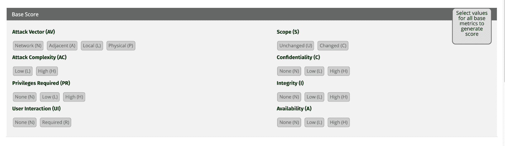

# 开源漏洞扫描

> 原文：<https://www.fairwinds.com/blog/open-source-vulnerability-scanning>

 开源漏洞扫描器用于检测软件应用程序中的开源组件。一些扫描器被称为软件组合分析(SCA)工具，它基本上是一个自动化的过程，可以识别任何代码库中存在的所有开源组件，无论是开源还是商业应用程序。

这篇文章探讨了:

*   开源漏洞扫描的工作原理
*   开源组件中的漏洞
*   使用开源漏洞扫描器的好处
*   如果您使用 Kubernetes，为什么需要漏洞扫描器
*   开源漏洞扫描的推荐工具

## 开源漏洞扫描是如何工作的？

软件组合分析是一个开源漏洞扫描解决方案，它执行评估安全性、开源许可证合规性和代码质量的分析。通过检查包管理器、清单文件、源代码、二进制文件、容器图像和其他类型的文件来识别开源组件，这些工具创建应用程序中所有开源组件的列表(有时称为开源材料清单)。然后，开放源代码漏洞扫描解决方案将已识别的开放源代码列表与各种数据库进行比较，例如来自国家标准和技术研究所(NIST)的数据库、[国家漏洞数据库](https://nvd.nist.gov/) (NVD)。NVD 是美国政府基于标准的漏洞管理数据的存储库，它包括安全清单参考、安全相关软件缺陷、错误配置、产品名称和影响度量的数据库。

## 开源组件中的漏洞

NVD 使用通用漏洞评分系统(CVSS)，这是一个开放式框架，用于交流软件漏洞的特征和严重性。通用漏洞和暴露(CVE)系统为众所周知的信息安全漏洞分配唯一的通用标识符，CVE 由 CVE 编码机构(CNA)分配。CVE 号码分配有三种主要类型:

1.  作为编辑和主要 CNA 的 [Mitre 公司](https://en.wikipedia.org/wiki/Mitre_Corporation)
2.  一些 CNA 为他们自己的产品分配 CVE 号码，例如微软、甲骨文、惠普、红帽等等
3.  第三方协调人，如[认证协调中心](https://en.wikipedia.org/wiki/CERT_Coordination_Center)，可以为其他 CNA 未涵盖的产品分配 CVE 号码

CVEs 确保对漏洞有一致的描述，信息技术和网络安全专业人员依靠 CVE 记录来优先处理和解决漏洞。CVE 为任何特定的漏洞或暴露提供了一个标准化的标识符，这有助于您使用多个来源来评估有关问题的信息，并且 CVSS 基于各种因素来分配分数。

**

*来源:* [*常见漏洞评分系统 3.1 版计算器*](https://www.first.org/cvss/calculator/3.1#CVSS:3.1/AV:N/AC:H/PR:H/UI:N/S:U/C:L/I:N/A:H)

这些分数基于可利用性和影响的基本指标；他们称之为时间度量组，包括漏洞代码成熟度、补救级别和报告置信度；以及环境度量组，它包括修改的基本度量以及机密性、完整性和可用性要求。当然，CVSS 分数不是唯一的考虑因素。您还需要考虑该漏洞可能对应用程序[机密性、完整性、可用性](https://whatis.techtarget.com/definition/Confidentiality-integrity-and-availability-CIA) (CIA)造成的影响，以及攻击者利用该漏洞的难度。

已知的开源漏洞很受攻击者的欢迎，因为通常存在已知的漏洞，这使得黑帽黑客能够尝试对多个目标进行攻击。他们需要的只是找到一些没有修补漏洞的漏洞，允许不必要的访问进入您的系统。

## 使用开源漏洞扫描器的好处

今天，开源软件是大多数应用程序的重要组成部分。今天的开发人员使用开源有很多原因:

*   开源鼓励合作
*   开源允许您重用公共代码，因此您可以专注于自己的优势
*   开源允许其他人采用你的项目并在其上构建
*   开源鼓励创新

包括 Fairwinds 在内的一些公司使用开源来提供 Kubernetes 支持，并帮助社区构建正确的 Kubernetes 架构和部署环境。我们的[北极星](/polaris)提供运行检查，以找到错误配置并帮助解决它们，而 [RBAC 经理](https://github.com/FairwindsOps/rbac-manager)帮助角色管理和授权。开源项目和解决方案提供了大量的价值，但也存在一些风险。开源漏洞扫描器通过在您的代码库中找到开源代码，并将其与开源漏洞数据库进行比较，以确定您的代码中是否有任何易受攻击的组件，从而帮助组织降低风险。了解您的开源漏洞有助于您保持应用程序的安全，这是组织面临不断变化的风险时的一个重要考虑因素。

## 如果您使用 Kubernetes，为什么需要漏洞扫描器

使用漏洞扫描器扫描开源漏洞对于任何组织来说都是必不可少的，对于采用 Kubernetes 的组织来说当然也是必要的。大多数应用软件依赖于开源包、库和其他第三方组件，运行在 Kubernetes 上的应用程序也不例外。为了提高 Kubernetes 应用程序的安全性，您需要考虑漏洞扫描，包括扫描容器图像以发现开源漏洞。

[在软件开发生命周期的早期自动扫描](/insights)并持续扫描您的容器和 Kubernetes 有助于您发现风险并确定风险优先级，以及在发现漏洞时进行补救。如果没有持续扫描，您的组织就会面临风险，因为新的简历会定期被发现和披露。网络攻击者不断寻找窃取数据、篡改部署和造成伤害的方法。

Kubernetes 是容器编排的事实上的标准，它本身是一个开源项目。Kubernetes 是云原生运动的核心，云应用的增加意味着这一趋势可能会继续。Linux 容器是任何 Kubernetes 部署中不可或缺的一部分，因此扫描这些容器中的开源安全漏洞对于维护安全环境至关重要。容器映像有多种来源，比如 Docker Hub 和其他公共存储库，并且基于不同的 Linux 发行版，比如 Ubuntu、Amazon Linux、Debian 和 Alpine。选择正确的漏洞扫描解决方案意味着选择一个参考 NVD 和特定于发行版的安全公告、支持您组织中使用的软件包管理器，并为您的应用程序中使用的任何特定于语言的依赖项和库提供语言支持的解决方案。自动化和集成的漏洞扫描可确保您及时了解所有漏洞，无论您的应用程序是否已部署。

## 漏洞扫描的推荐工具

有几种可用的漏洞评估或漏洞扫描工具，包括商业的、免费的和开源的解决方案。无论您选择哪种工具，都要确保您获得了从开发到部署跟踪代码中的开源代码所需的信息。了解更多关于一些可用选项的信息:

### 黑鸭子

Synopsys 的[黑鸭软件组成分析](https://www.synopsys.com/software-integrity/security-testing/software-composition-analysis.html)为应用程序和容器创建精确的物料清单(BOM)，通过依赖关系分析、代码打印分析、二进制分析和代码片段分析来检测开源。这种类型的漏洞评估还允许您为开源使用、安全风险和许可证合规性定义策略，并自动执行策略和 DevOps 集成。

### 蛛形纲动物

Arachni 是一个免费的 web 应用安全扫描器框架，用 Ruby 开发。它的源代码是公开的，可供审查。Arachni 支持所有主要的操作系统:微软 Windows、Mac OS X 和 Linux。它通过便携包分发，并为现代 web 应用技术提供漏洞检测。Arachni 对大多数用例都是免费的，包括扫描开源项目。

### 锚

[Anchore Engine](https://github.com/anchore/anchore-engine) 是一款开源 Docker 容器策略合规性和静态分析解决方案。它自动对容器中的代码进行图像检查、分析和评估。Anchor 还为每个映像提供策略评估，与容器注册表和 CI/CD 工具集成，并发现容器中的已知漏洞。

### OpenVAS

[OpenVAS](https://www.openvas.org/) 是一款开放式漏洞评估扫描器，提供未认证和认证测试、高级和低级互联网和工业协议、针对大规模扫描的性能调优，以及实现任何类型漏洞测试的内部编程语言。

### Trivy

[Trivy](https://github.com/aquasecurity/trivy) 是来自 [Aqua Security](https://www.aquasec.com/) 的开源漏洞评估工具，可以检测开源软件中的漏洞。Triivy 还提供了对风险的简短解释，这有助于开发人员决定他们想要使用哪些组件。Trivy 将漏洞扫描并入集成开发环境(IDE)。开源贡献者继续为 Trivy 创建集成和附加组件，包括用于提取漏洞度量的 Prometheus exporter，以及用于将 Trivy 安装到 Kubernetes 集群中的 Helm chart。 [Fairwinds Insights](/insights) 将 Trivy 集成到其平台中，以支持整个开发生命周期中的开源扫描。

## 扫描开源漏洞

无论您使用何种工具来保护您的软件，进行漏洞评估以扫描开源漏洞都是保护您的应用程序的重要步骤。开源漏洞会给 Kubernetes 环境带来巨大的风险，在整个开发生命周期中使用漏洞评估工具扫描漏洞可以帮助您尽早发现风险，并快速修复新发现的漏洞。Fairwinds Insights 与您的 CI/CD 渠道紧密集成，帮助您的开发团队更轻松地防止错误配置和修复漏洞。

> 寻找一个完整的 Kubernetes 治理平台？Fairwinds Insights 是免费的。 [今天就开始](https://www.fairwinds.com/coming-soon) 。

了解 [Fairwinds](/insights) 如何帮助您自信地部署在 Kubernetes 环境中运行的应用和服务，内置的漏洞评估工具可帮助您快速找到开源漏洞和错误配置问题。

