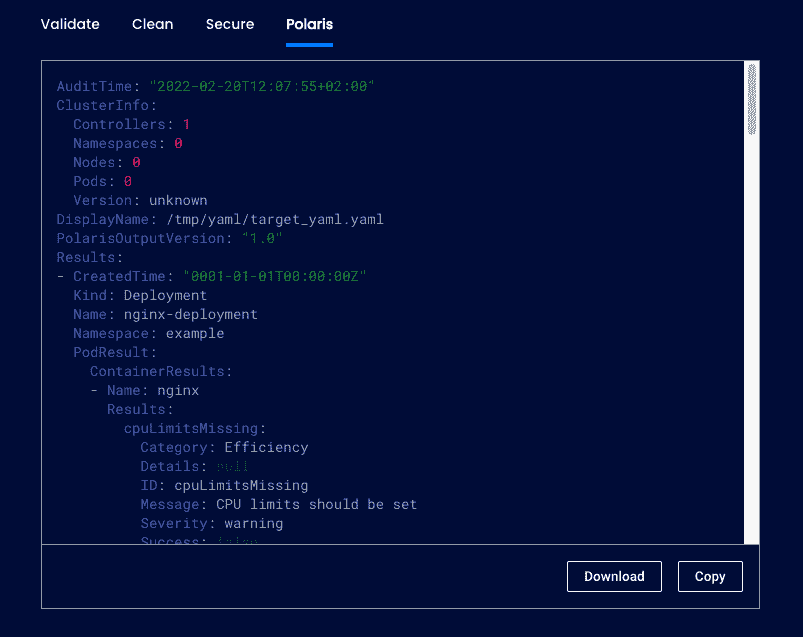

# 北极星，开源配置验证，现在在 ValidKube

> 原文：<https://www.fairwinds.com/blog/polaris-open-source-configuration-validation-now-in-validkube>

 Fairwinds 的开源项目 [北极星](https://polaris.docs.fairwinds.com/) ，帮助用户配置工作负载，确保遵循 Kubernetes 的最佳实践。为开源和 Kubernetes 社区做贡献是 Fairwinds 的核心价值观。这是我们感到兴奋的原因之一，我们在 Komodor 的朋友现在已经将北极星整合到 [ValidKube](https://github.com/komodorio/validkube) 中。

ValidKube 结合了最好的开源工具，有助于确保 Kubernetes YAML 的最佳实践、卫生和安全。用户可以验证 Kubernetes 配置文件，清除清单中的混乱，扫描漏洞，现在使用 Polaris，检查 YAML 中的最佳实践和潜在安全问题。

Polaris 运行一系列检查来审计 YAML 清单并识别配置问题，如果您使用它来审计 ValidKube 中的 YAML，就会发生这种情况。

在 ValidKube 之外，Polaris 可以作为仪表板、准入控制器或命令行工具运行。准入控制器可以设置为拒绝未通过特定标准的工作负载。

如果你有兴趣了解更多，你可以注册加入 Fairwinds 的开源用户组。下一次会议是在本周三，2022 年 3 月 30 日。 [注册](https://www.fairwinds.com/open-source-software-user-group) 接收邀请。

