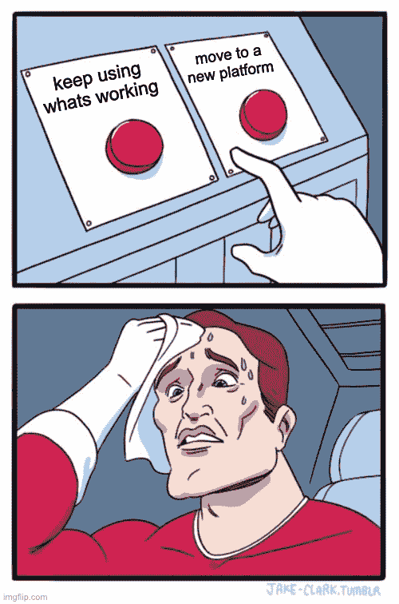

# 重新平台化很吓人。值得吗？

> 原文：<https://www.fairwinds.com/blog/re-platforming-is-scary.-is-it-worth-it>

 ## **重新平台化很可怕。值得吗？**

如果你是一个技术领导者，除非有很高的投资回报率，否则你不会想重新搭建平台。我们看到人们搬到 Kubernetes 的两个主要原因是:

1.  他们使用平台即服务，而平台即服务已经变得过于昂贵。
2.  他们需要 Kubernetes 提供的灵活性和精细控制。

如果您的成本较低，并且您对粒度控制的需求较低，请保持现状。如果您的基础架构完全符合您的需求，那么就没有理由为了移动而移动。

但是，如果您现在想要重新构建平台，因为您预计会出现大规模增长，您希望您的支出非常接近您的使用量，或者您知道您有技术需求需要在粒度级别上解决，那么 Kubernetes 就是您的平台。

## **采用 Kubernetes 是对未来的保障。**

随着 Kubernetes 应用的增加，支持它的工具也会增加。未来 5-10 年内，云的一切都将建立在 Kubernetes 之上，无论这对于用户来说是否模糊不清。

Kubernetes 是未来。你可以上船而不必害怕。如果您需要帮助和进一步的安心——fair winds 拥有专业知识、软件和支持来帮助您安心地进入 Kubernetes 生产。

