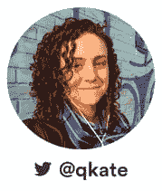
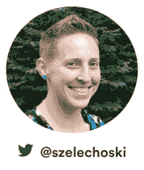
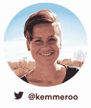

# 为您的工程团队提供远程工作提示和技巧:小组讨论

> 原文：<https://www.fairwinds.com/blog/remote-work-tips-and-tricks-for-your-engineering-team-panel-discussion>

## **发言人:**

 **凯特·塔加特(他们/他们)**
工程经理，Stripe  凯特管理过各种团队，从共处一地到部分和完全远程，甚至分布在不同的大洲。Kate 的技术经验涵盖从电网弹性到金融科技到基础设施和监控软件的多个领域。 **Brandon Jung(他/他)******
VP Alliances，GitLab |董事会 Linux Foundation

在加入 GitLab 之前，Brandon 创立并构建了谷歌云生态系统，其中包括 Red Hat、Docker、Cloudera、Pivotal 和 Tableau 等各种技术公司，以及拥有深厚云专业知识的公司，如 Cloud Technology Partners、Agosto、CI & T、埃森哲和麦肯锡。在工作之外的时间里，Brandon 可以和他的妻子和三个孩子在科罗拉多州丹佛市享受户外活动的乐趣，并作为 Linux 基金会的董事会成员支持开源软件的发展。他是一个相当邪恶的高尔夫球手，并对全球人道主义努力怀有真正的热情。 

** Sarah Zelechoski(她/她)** fair winds 工程副总裁

Sarah 在开发运营和基础设施方面的独特背景使她能够过渡到 Kubernetes 生态系统。如今，她的团队通过结合开源技术、自动化、最佳实践和专业知识，帮助企业构建和维护可靠、可扩展且安全的 Kubernetes 集群。 

**Swarna Podila (她/她)** Cloud Foundry Foundation 社区高级总监

Swarna 在 Cloud Foundry Foundation 领导社区工作，促进协作，倡导友善。她将人置于技术之上，专注于发现和放大云铸造社区中人们不为人知的故事和鲜为人知的创新。

**Kristina Kemmer(她/她)**
工程总监 Zapier

Kristina 是一名工程领导者，15 年来一直致力于建立和授权团队为客户创造价值。她目前在 Zapier 领导产品工程团队开发消费产品。她与妻子、三个女儿和两条狗住在西阿尔瓦达。