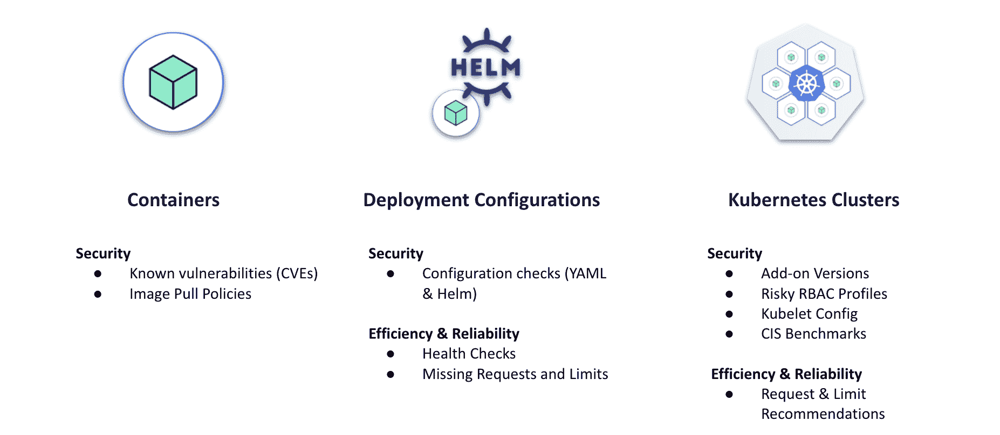

# 关于安全高效运行 Kubernetes 的五大问题

> 原文：<https://www.fairwinds.com/blog/running-kubernetes-securely-efficiently>

 由于 Kubernetes 仍然相对较新，组织内通常没有太多的专业知识。这意味着在许多组织中，有许多关于实施、保护和优化 Kubernetes 的问题。最近，我们举办了一场网络研讨会，讨论如何[安全高效地运行 K8s](https://www.fairwinds.com/blog/k8s-clinic-how-to-run-kubernetes-securely-and-efficiently)，我们在最后回答了一些很棒的问题。通常，我们在网上研讨会中收到的问题也是许多其他人遇到的问题，所以我们在这里分享我们在网上研讨会中遇到的五大问题。

## 1)在 Kubernetes 中有什么好的工具来估计或测量合理的资源限制吗？

我们实际上有一个开源项目叫做 [Goldilocks](https://github.com/FairwindsOps/goldilocks) 来帮助解决这个问题，这个项目可以在 GitHub 上找到。如果您想获得正确的资源建议，Goldilocks 会根据您设置的资源限制和请求来监控您的实际应用程序内存和 CPU 使用情况。然后它会推荐更接近你实际使用的东西。通过在推荐模式下使用 Kubernetes vertical-pod-scaler(VPA ),我们能够在每个应用程序上看到资源请求的建议。Goldilocks 为名称空间中的每个部署创建一个 VPA，然后向它们查询信息。

在 Fairwinds，我们还将 Goldilocks 整合到 [Fairwinds Insights](https://www.fairwinds.com/insights) 中。我们在 Insights 中的产品也使用 [Prometheus](https://prometheus.io/) 来生成更细粒度的资源使用数据，这对于峰值工作负载特别有帮助。Goldilocks 和其他更简单的解决方案适用于内存和 CPU 使用率非常一致的工作负载，但对于不太容易预测的工作负载，使用 Insights 提供的细粒度数据会很有帮助。

## 2)有没有一个推荐的发行版可以用于容器映像，这个发行版的已知 CVE 最少？

这是一个非常好的问题。一般的经验法则是菜越小越好。举例来说，我不推荐使用 Ubuntu 作为你的基本图像。[阿尔卑斯山](https://hub.docker.com/_/alpine)通常是我们内部的形象。该映像中的内容足以让您完成最基本的任务。它有一个外壳和一个包管理器，允许你添加包，如 curl 或类似的，如果你需要在你的容器里。

最好的办法，也是我们尽可能做到的，是从头开始构建您的图像。如果你没有任何类型的基础发行版，你需要在容器中添加你可能需要的所有东西。这可能会有点痛苦，因为你需要在很多基础包上加层。好处是当你从头开始构建时，真的没有任何额外的东西，所以它们就像你构建 Docker 映像一样被削减了。图像中的内容越少，您可能遇到的 cv 就越少。

## 3)演示中提到的一些安全风险是否由服务提供商或托管服务预先处理？

我们在网上研讨会中谈到的[安全问题不是由像谷歌 Kubernetes 引擎(](https://www.fairwinds.com/kube-clinic-how-to-run-kubernetes-securely-and-efficiently) [GKE](https://cloud.google.com/kubernetes-engine) )这样的服务提供商处理的。

我们主要关注前两栏，容器漏洞和部署配置。GKE，[亚马逊弹性 Kubernetes 服务](https://aws.amazon.com/eks/?whats-new-cards.sort-by=item.additionalFields.postDateTime&whats-new-cards.sort-order=desc&eks-blogs.sort-by=item.additionalFields.createdDate&eks-blogs.sort-order=desc)(亚马逊 EKS)，以及 [Azure Kubernetes 服务](https://azure.microsoft.com/en-us/services/kubernetes-service/) (AKS)在右手栏确实可以帮你解决安全风险。他们负责 Kubernetes API 本身的许多配置，并可以帮助 Kubernetes 的基本配置，以确保您以安全的方式做事。默认情况下，他们内置了许多安全功能，但是在该专栏中，他们不会帮助您解决其他一些问题，包括有风险的基于角色的访问控制(RBAC)配置文件。当你在 GKE 上运行时，你仍然要对 RBAC 负责，你仍然要对附加组件负责，包括 [NGINX 入口](https://kubernetes.github.io/ingress-nginx/)和证书管理。因此，是的，他们确实涵盖了一些风险，但除了这些提供商提供的现成内容之外，您还需要做很多事情。

## Insights 是否适用于无法从公共互联网访问的空气间隙集群？

目前，我们需要某种允许列表来允许集群向 Fairwinds Insights 报告。我们有[一个自托管版本](https://www.fairwinds.com/news/fairwinds-insights-self-hosted-version-now-available)，您可以在内部安装。我们可以和你合作，让它在有空气间隙的环境中工作。我们的大多数客户在软件即服务环境中使用 Fairwinds Insights，但是自托管的内部环境可以帮助您满足其中一些要求。

## 5)您对入口控制器的 TLS 切换和使用服务网格的 MTLS 有何看法？

这里有一个权衡，实际上是在简单性和安全性之间。如果您使用 MTLS 构建一个服务网格，您将获得额外的安全级别和额外的控制级别，以控制哪些应用程序可以相互通信。Kubernetes 的开箱即用配置允许集群中的每个工作负载与其他每个工作负载进行对话，而有一个服务网格可以让您稍微减少这种情况。这也可能让您的开发团队感到头疼，因为它会影响与正确的服务对话的能力。他们必须配置这些东西。

这取决于您组织对安全风险的偏好，以及您组织的[成熟度](https://www.fairwinds.com/kubernetes-maturity-model)。如果你刚刚开始使用 Kubernetes，并且你是一个小的创业公司，你可能只需要一个“香草”入口就可以了。如果您在企业中使用 Kubernetes，我建议走服务网格路线，特别是如果您有一个多租户集群。当你有许多团队去同一个集群时，他们不需要互相交流，在那里用 MTLS 获得一个服务网将对你有帮助。

## 安全高效地运行 Kubernetes

随着应用程序开发流程的左移，开发人员需要支持来为组织做出正确的决策，以便安全高效地运行 Kubernetes。如果您缺乏内部专业知识，并且您仍然要跟上 Kubernetes 最佳实践的速度，那么这将是一个挑战。我们这里有[网上研讨会](https://www.fairwinds.com/blog/k8s-clinic-how-to-run-kubernetes-securely-and-efficiently)的概述，希望观众提出的这些问题能帮助回答你一直想知道的一些问题。如果您还有其他问题，[请联系](https://www.fairwinds.com/contact-us)！

****