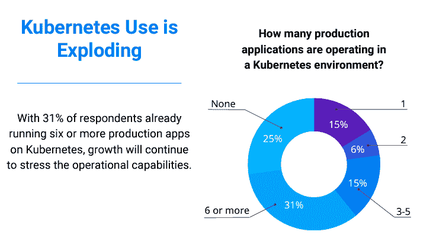
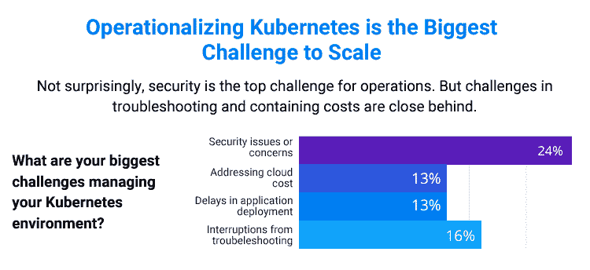
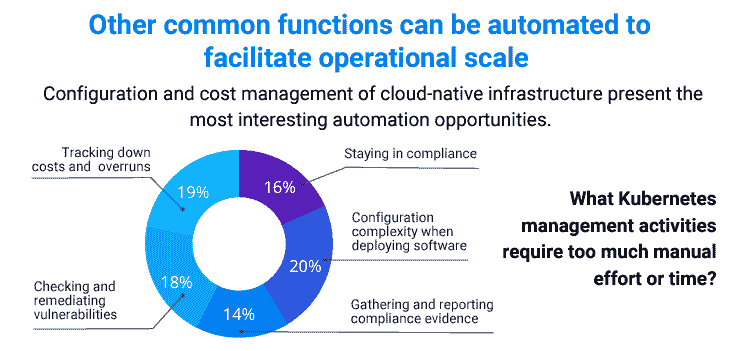

# 如何扩展 Kubernetes，而不忽略安全性和卓越运营

> 原文：<https://www.fairwinds.com/blog/scale-kubernetes-without-leaving-security-and-operational-excellence-behind>

 Techstrong Research 在 2022 年对其社区进行了民意调查，向 DevOps、云原生网络安全以及数字化转型读者和观众询问了他们的 Kubernetes 环境。我们最近邀请了 Techstrong Group 首席战略官兼 Techstrong Research 总经理 Mike Rothman 来讨论这些结果。有一点非常清楚:Kubernetes 的使用正在激增。只有 25%的受访者没有在 Kubernetes 环境中运行任何生产应用程序，但更多人(31%)在生产环境中运行六个或更多应用程序。

虽然 Kubernetes 的采用是不可否认的，但公司规模在我们看到的数据中起着重要作用。例如，小公司可能总共没有六个应用程序(部署在 Kubernetes 中或不部署)，而较大的组织可能有更多。随着明年 K8s 采用率的增加，类似这样的报告可能会变得更加精细，因此我们可以按公司规模跟踪采用情况，并显示关于有多少应用或服务正在生产中运行的更详细信息。

## 采用 Kubernetes 很难做对

在过去八年左右的时间里，我们已经看到 K8s 的采用稳步增长(最初发布的是 2014 年 9 月 9 日)，许多组织已经开始缓慢地行动，首先是测试 Kubernetes，并学习如何将其投入运营以将其引入他们的环境。与此同时，其他公司已经完全接受了它。在这段时间里，社区成长了，Kubernetes 成长了，在 [开源工具](https://www.fairwinds.com/open-source-software) 方面也有了很多进步。所有这些都有助于 Kubernetes 和 Kube 生态系统的成熟，这使得在生产 K8s 环境中更容易获得更多的团队和应用程序，并帮助开发团队更快地发货。但是，从两三个应用程序迁移到两百个应用程序迁移到云会带来新的挑战。

## 实施 Kubernetes

虽然许多团队已经能够在 Kube 中可靠一致地运行单个容器，但当组织试图在明年将数百个应用和服务迁移到 K8s 时，管理起来会变得更加困难。最大的挑战之一是实现一致性基线。 [策略实施](https://www.fairwinds.com/enforce-kubernetes-policy) 已经成为组织采取更规范的方法来实现一致性和最佳实践的一种方式，而不是为每个团队创建一次性环境并手动调整每个设置。

Kubernetes 提供了很大的灵活性和许多选项，默认设置不一定是最安全、最可靠或最经济的。为了加速采用，它有助于消除一些复杂性并自动实施最佳实践，同时还确保它与您的 CI/CD 集成，以帮助开发人员在需要的地方获得他们需要的信息。

[Techstrong Research](https://techstrongresearch.com/)的 [PulseMeter 报告](https://www.fairwinds.com/scaling-kubernetes-with-compromising-reg) 显示了团队在寻求运营 Kubernetes 时遇到的最大挑战。不出所料，24%的人认为最大的挑战与安全问题和担忧有关。在这个复杂的环境中，开发和运营团队担心配置错误和安全漏洞是可以理解的。

在 Kubernetes 中，故障排除也是一个严峻的挑战——开发人员通常不是 Kubernetes 专家，因此他们求助于平台工程师作为 Kubernetes 帮助台。故障排除通常非常耗时，并且会对其他关键工作造成大量干扰，从而降低所有工作的速度。另外两大挑战相互关联:应用程序部署的延迟和解决云成本。这很有趣，因为安全问题和故障排除都会导致部署延迟。

另一方面，云成本是我认为组织在未来一年将更加关注的一个问题。我认为有几个原因:

1.  今年的经济很难预测，许多组织都在寻找更多控制成本的方法

2.  不足或不存在是导致组织超支的原因，根据 CNCF 的 [FinOps for Kubernetes 报告](https://www.cncf.io/wp-content/uploads/2021/06/FINOPS_Kubernetes_Report.pdf)

3.  快速增加的采用率很容易导致失控的云支出

根据 CNCF 的报告，68%的受访者认为 2022 年 Kubernetes 的成本会增加。调查显示，大多数人可以通过 Kubernetes 更积极、更细致的成本监控策略来减少开支。一种 [FinOps 方法](https://www.fairwinds.com/blog/how-to-implement-finops-and-increase-your-kubernetes-cost-avoidance) ，这是一种识别与组织内各个孤岛的云支出相关的单位成本的实践，可以帮助组织了解其支出并实施 Kubernetes 成本规避策略。

## 自动化促进经营规模

在 Kubernetes 中，配置是一个严峻的挑战，因为查看单个 YAML 文件并找到配置问题很容易。当您处于像 Kubernetes 这样的复杂分布式环境中时，它位于云提供商及其配置之上，需要考虑的不仅仅是一个文件。需要注意的挑战有很多:错误配置、已知漏洞、过期的 Docker 映像、异常活动、 [基于角色的访问控制](https://rbac-lookup.docs.fairwinds.com/) 、法规遵从性以及可靠的应用和服务。

简单地手动完成所有这些在规模上是不可能的。您需要在开发、安全和运营部门之间创建一个共享框架，以实现这种可见性，并推动对不同类型调查结果的所有权。为您的组织创建策略并自动执行策略可以帮助您创建与各个团队的反馈循环，以便他们可以快速了解问题所在，了解如何修复它们，并知道哪些问题存在最大的风险。这将帮助您更快地移动和部署更多的应用程序，同时在 Kubernetes 环境中保持高水平的可见性。

TechPulse 调查的受访者几乎同样关注这五个问题，并担心他们需要多少手动工作或时间:

*   部署软件时的配置复杂性(20%)

*   追踪成本和超支(19%)

*   检查和修复漏洞(18%)

*   保持合规(16%)

*   收集和报告合规证据(14%)

## 通过安全和卓越运营加速 Kubernetes 的采用

虽然仍然有很多关于采用的宣传，但 Kubernetes 仍然是一项新兴技术。许多组织正在增加采用率，并在来年将越来越多的工作负载投入生产。随着这种采用的增加，认真实施 Kubernetes 和其他云原生技术的组织需要研究和实施云原生解决方案，这些解决方案提供护栏来帮助开发人员快速部署应用和服务，而不必担心无意中发布易受攻击的代码、不满足监管合规性要求或增加不必要的云支出。

观看 DevOps.com 网络研讨会: [扩展 Kubernetes 而不影响安全性和卓越运营](https://webinars.devops.com/scaling-kubernetes-without-compromising-security-and-operational-excellence)

