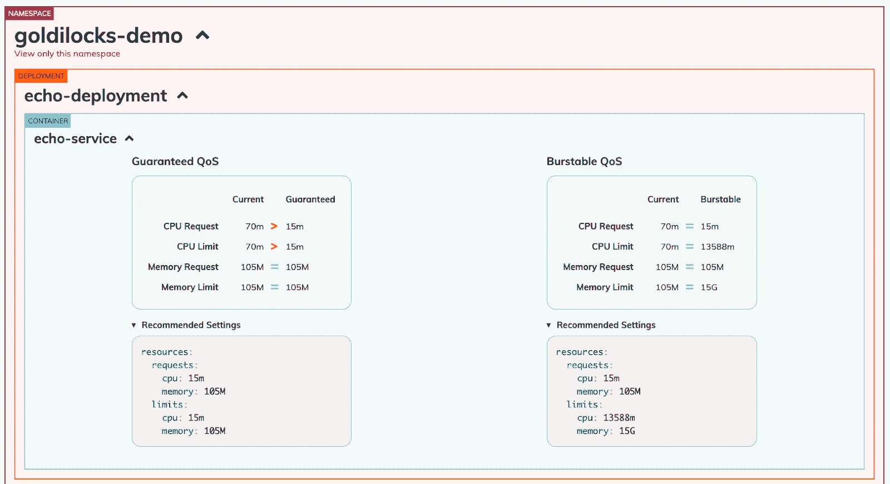
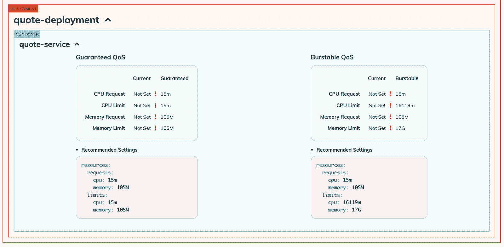
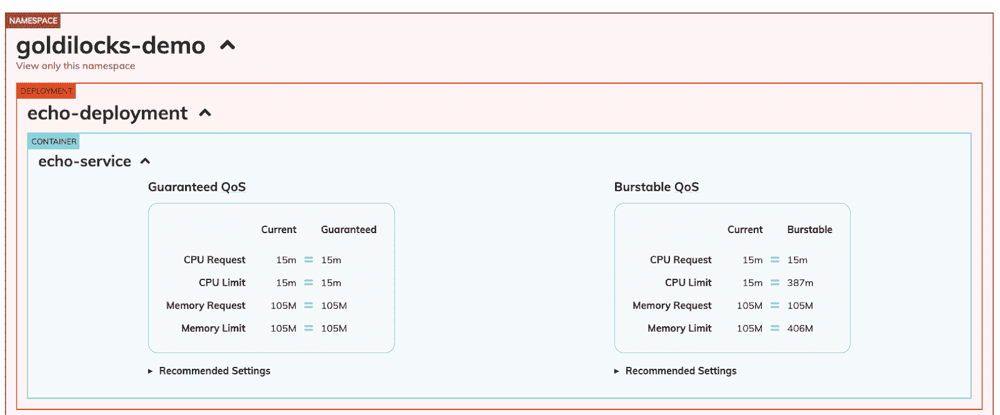
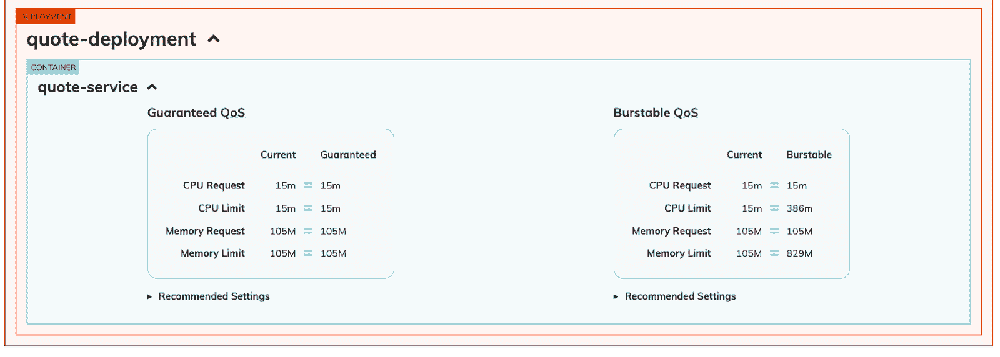

# K8s 教程:使用 Goldilocks 设置和调整 Kubernetes 工作负载

> 原文：<https://www.fairwinds.com/blog/setting-rightsizing-kubernetes-workloads>

 优化 Kubernetes 集群的一个标准建议是确保在每个容器上设置 [CPU 和内存请求和限制](https://kubernetes.io/docs/concepts/configuration/manage-resources-containers/) 。这看起来很简单，但是您如何知道选择哪些值呢？

Fairwinds Goldilocks 是一个开源实用程序，可以帮助您确定资源请求和限制的起点。像 Goldilocks 和 Three Bears 一样，这个工具可以帮助您确保在集群中为容器提供的空间不要太多，也不要太少，从而为您节省资金并防止潜在的应用程序中断。

在本教程中，我们将向您展示如何安装 Goldilocks 并利用它的建议。

## 先决条件

*   [kubectl](https://kubernetes.io/docs/tasks/tools/)
*   [舵](https://helm.sh/docs/intro/install/)
*   度量-服务器
*   垂直 Pod 自动缩放器
*   goldilocks-demo 命名空间中的 pod

## 安装先决条件

Goldilocks 要求您安装 metrics-server 和垂直 Pod Autoscaler。这些说明将指导您如何使用 Helm(Kubernetes 的软件包管理系统)安装 metrics-server 和 Vertical Pod Autoscaler。可以使用 Kubernetes yaml 清单来安装这些工作负载，您可以在 [度量-服务器文档](https://github.com/kubernetes-sigs/metrics-server#installation) 和 [VPA 文档](https://github.com/kubernetes/autoscaler/tree/master/vertical-pod-autoscaler#install-command) 中找到如何安装的指导。

### 安装度量标准-服务器

将 metrics-server 图表存储库添加到本地可用的 Helm 图表中:

```
helm repo add metrics-server https://kubernetes-sigs.github.io/metrics-server/
```

接下来，在新的 vpa 名称空间中创建一个名为 my-metrics-server 的 Helm 版本:

```
helm install my-metrics-server metrics-server/metrics-server --namespace vpa --create-namespace
```

### 安装 vpn

将顺风-稳定海图库添加到您本地可用的舵图中:

```
helm repo add fairwinds-stable https://charts.fairwinds.com/stable
```

接下来，在 vpa 命名空间中创建名为 my-vpa 的 Helm 版本:

```
helm install -n vpa --create-namespace my-vpa fairwinds-stable/vpa
```

#### 谷歌 Kubernetes 引擎(GKE)用户注意:

VPA 在 [自动驾驶集群](https://cloud.google.com/kubernetes-engine/docs/concepts/autopilot-overview) 中默认启用，但在标准集群中必须手动启用。您可以像这样启用它:

```
 gcloud container clusters update [CLUSTER-NAME] --enable-vertical-pod-autoscaling {--region [REGION-NAME] | --zone [ZONE-NAME]} 
```

## 配置金发女孩

现在你已经设置好了先决条件，是时候使用 Helm 安装 Goldilocks 了。可以使用 Kubernetes 清单安装 Goldilocks，你可以在 [Goldilocks docs](https://goldilocks.docs.fairwinds.com/installation/#installation-2) 中找到如何安装的说明。

### 安装金发女孩

创建一个名为 my-goldilocks 的头盔版本:

```
 helm install -n goldilocks --create-namespace my-goldilocks fairwinds-stable/goldilocks 
```

### 标记金发女孩将监视的名称空间

在本例中，我们希望监控 goldilocks-demo 名称空间中的任何部署。我们必须标记名称空间，以便 Goldilocks 可以为名称空间中的每个部署创建一个 VPA，然后查询它们的信息。

```
kubectl label ns goldilocks-demo goldilocks.fairwinds.com/enabled=true
```

### 打开金发女孩仪表板

端口转发金发女孩服务:

```
kubectl -n goldilocks port-forward svc/my-goldilocks-dashboard 8080:80
```

打开浏览器到[http://localhost:8080](http://localhost:8080/)查看仪表盘。您可能需要几分钟才能看到金发女孩的推荐。刷新浏览器可能会有所帮助。

## 检查金发女孩的发现

在这个例子中，我们在 goldilocks-demo 名称空间中有两个部署，每个部署都有一个相应的容器，echo-service 和 quote-service。



*查看 Goldilocks 仪表盘分析和 echo-service 建议。*

Goldilocks 向我们展示了对于有保证的服务质量*，echo-service 容器当前具有过高的 CPU 请求和限制，但是内存请求和限制刚刚好。在分析的下面是一个 yaml 片段，其中包含 CPU 和内存请求和限制的推荐值，您可以将其复制并粘贴到您的部署清单中。



*查看 Goldilocks 仪表盘分析和报价服务建议。*

对于报价部署容器，Goldilocks 向我们展示了没有设置 CPU 或内存请求或限制。这是很危险的，因为容器可能会占用一个节点上的所有资源，挤走其他 pods，使工作节点对 Kubernetes 控制平面不可用。建议的资源设置在分析下方。

## 更新您的集装箱请求和限额

复制并粘贴建议的资源请求和限制后，您应该更新您的部署并刷新 Goldilocks 仪表板。您将看到 Goldilocks 指出您当前的 CPU 和内存请求和限制符合建议。祝贺您使您的资源请求恰到好处！



*echo 服务的 Goldilocks 仪表板分析视图，其中当前资源请求符合建议。*

  *当前资源请求符合建议的报价服务的 Goldilocks 仪表板分析视图。*

您的 pod 存在的时间越长，VPA 收集的数据就越多，所以一定要随时查看 Goldilocks 仪表板，因为建议可能会发生变化。

## 大规模应用金发女孩的优势

如果你有多个集群和用户，并希望大规模应用金发女孩的优势，Fairwinds 提供了一个名为 Insights 的平台。用户可以跨集群一致地集中管理 Goldilocks，以确保有效地设置 CPU 和内存请求和限制。Fairwinds Insights 通过提供[Kubernetes](https://www.fairwinds.com/kubernetes-cost-optimization)的成本优化建议而更进一步。

对使用 Fairwinds Insights 感兴趣吗？免费提供！ [在此了解更多](https://www.fairwinds.com/coming-soon) 。

## 资源

[](https://cta-redirect.hubspot.com/cta/redirect/2184645/34aa4987-a1f9-438a-a145-d7d82d5c479a)

*“QoS(服务质量)等级是基于其资源请求和限制分配给 pod 的名称。Kubernetes 使用 QoS 等级来决定调度和驱逐 pod。  [Kubernetes 文档:为 Pods 配置服务质量](https://kubernetes.io/docs/tasks/configure-pod-container/quality-service-pod/)