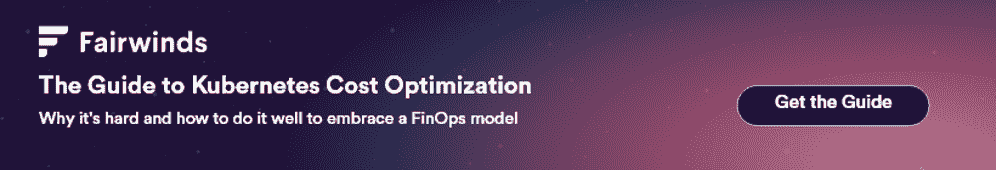

# 12 大 Kubernetes 资源:学习并保持更新

> 原文：<https://www.fairwinds.com/blog/top-12-kubernetes-resources>

 云原生社区的蓬勃发展与 Kubernetes 有很大关系。作为一个开源社区，成员们致力于该主题的教育和支持。

无论您的目标是从整体上了解更多的技术，了解最新的新闻，还是贡献您作为从业者的智慧，都有大量的机会访问内容并参与其中。但是并不是每个人都在相同的地方以相同的方式学习。

被所有的选择淹没了？我们提供了 12 大 Kubernetes 资源的完整列表，以帮助您的旅程。无论是开车回家时听的播客，还是让你开怀大笑的社交媒体帖子，甚至是将 Kubernetes 离线带入现实世界，我们都可以满足你的需求。

## 听

来自 Google 的每周播客，介绍来自 Kubernetes 社区的嘉宾观点，以及该领域的新闻和更新。

对于那些对高级策略感兴趣的人，本播客由 Kubernetes 社区(DoKC)上的数据指导，“一个由好奇且经验丰富的操作员和工程师组成的开放管理和自组织的团体，他们关心在 Kubernetes 上运行数据密集型工作负载。”奖金，每周有 2-3 个播客发布。

这个标题可爱的播客邀请了各种各样的嘉宾来关注 Kubernetes，但也邀请了创建和使用它的人。

拥有 35，000 名成员的 Software Engineering 是整个社交音频应用程序中最大的技术小组之一，每周三下午 5 点加入并收听现场对话，如最近的“Kubernetes 与 CALICO 联网”！

## 看

虽然有很多专门针对 Kubernetes 教育的在线课程，但本课程免费向用户提供 Kubernetes 基础知识。已经有 56，362 名学生利用了这一优势，你也可以利用这一优势。

如果你已经在 GitHub 呆了大半天了，为什么还要离开呢？和我们这里的列表一样，这个 Kubernetes 培训材料的汇编由 Ramit Surana 定期更新和添加，有几十个针对初学者和专家的深入文档的链接。

不认为 Instagram 是 Kubernetes 知识的来源？再想想- @CloudComputingHub 最近报道了一些概念，比如亚马逊 ECS 的容器和编排工具的好处，这些都在 DevSecOps、SRE 和云的焦点主题下。

Kubernetes Twitter 是一个非常活跃的空间——尽管这里可以包括无数其他人,@ learnk8s(Kubernetes 咨询和教育公司 learn k8s 的 Twitter 账号，不到 280 个字符)，Kelsey Hightower (Google 的多产工程师、开发者倡导者和演讲者，通常专注于 OSS 和 Kube)和编译主题云计算(一个关于云计算和相关技术的公司、评论员和趋势故事的大杂烩)值得您关注。

## 从事

结合实用建议、提问/开始讨论的机会以及大量幽默，这些子主题持续活跃，每天都有来自(合计)31.25 万订户的数十条帖子。

这些 Discord 服务器，每个都有 1000 多名成员，定期活跃在围绕最佳实践、Kubernetes 新闻和连接从业者的讨论中，无论是专业还是个人。

像许多 Slack workspaces 一样，这里有几乎所有事情的频道——在 CNCF 的#events 频道关注即将到来的会议；在 DevOpsChat 的#介绍中与 DevOps、SRE、云、平台、工程和更多空间的同事联系；并在我们的 OSS 社区中讨论 Fairwinds OSS 项目。

厌倦了看屏幕？不要担心——如果你正在寻找一群行业同事、有类似兴趣的技术人员，或者任何其他同样关注 Kubernetes & technology 的人，MeetUp 在世界各地都有活动。Cloud Native London 每月聚会一次，而 DevOps NYC & Kubernetes Boston 在过去一年举办了多次在线活动后，正在慢慢过渡回现场活动-看看您附近的团体吧！

* * *

如果您对 Kubernetes 在安全性、成本优化和护栏方面来之不易的专业知识感兴趣，您还可以查看 Fairwinds 资源库，我们在其中提供了多种类型的内容，包括:

