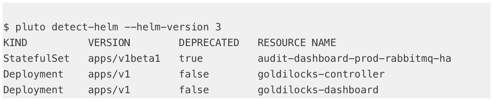

# 欢迎来到冥王星，开源开发的起点

> 原文：<https://www.fairwinds.com/blog/welcome-to-pluto-the-starting-place-for-open-source-development>

 来自冥王星的你好，开源价值大的小行星。冥王星曾经被认为是宇宙中一个全尺寸的球体，当它不再符合现代标准时，在 2006 年被降级为矮行星。事实证明，Kubernetes APIs 并没有太大的不同——它们也会随着旧代码在代码库中失去价值而变得过时，通常是因为它已经被新代码所取代。

[Pluto，Fairwinds 开源项目](/open-source-software)，以废弃的星球命名，因为它可以帮助用户轻松地在他们的代码库和 Helm 版本中找到破旧的 Kubernetes API 版本。

## 等等，Kubernetes 的弃用政策是什么？

众所周知，Kubernetes 的采用允许用户大规模受益于容器技术。让容器如此流行的是它们提供资源抽象和隔离的能力。这意味着一个独立的容器映像足以让您在系统上运行应用程序，而无需安装任何额外的包。

不要与 2013 年推出的开源容器化平台 docker 混淆，Kubernetes 有助于管理这样的工作负载和微服务。随着越来越多的集装箱被部署，对 Kubernetes 维护的要求也在增加。对于每个新版本，对服务或操作的任何升级都必须在生产环境中兼容和安全。这意味着最新版本发布后，必须进行测试和修补。

作为一个拥有许多组件和贡献者的大型开源系统，Kubernetes 自然会随着时间的推移而发展。因为 Kubernetes 是 API 驱动的，API 逐渐演变以反映对问题空间的理解的变化。有时某些特性需要被删除，包括 API、标志甚至整个特性。为了避免破坏现有用户，Kubernetes 对计划删除的系统部分采用折旧政策。

Kubernetes 的给定版本可以支持任意数量的 API 组和版本。以下是管理 API 元素弃用的三个主要规则:

1.  API 元素只能通过增加 API 组的版本来删除。
2.  API 项目必须能够在给定版本的 API 版本之间往返而不丢失数据——除了某些版本中不存在的整个 REST 资源。
3.  给定轨道中的 API 版本可能不被弃用，直到类似稳定的新 API 版本被发布。

## 告诉我更多关于这些 API 版本的信息...

除非从业者明确地使用仅在较新版本中可用的特性，否则他们必须能够升级到 Kubernetes 的新版本，并回滚到以前的版本，而不会对新的 API 版本做任何改动或遭受破坏。因此，Kubernetes API 版本控制方案对于开发人员来说是一个非常好的工具，因为它允许 Kubernetes 团队向 alpha 和 beta API 路径发布新特性，并在经过测试和验证后将它们升级到稳定路径。旧版本被弃用并最终被删除。

这个过程引发了一些关于 Kubernetes 升级的讨论，最引人注目的是 1.16 版本，其中删除了部署资源的多个过时版本。为什么？因为找到所有已经部署了不推荐使用的 API 版本的地方是很痛苦的。这就是访问冥王星可以解决问题的地方。

## 冥王星解决什么问题？

作为一个通过 Fairwinds 建立的开源实用程序， [Pluto](https://github.com/FairwindsOps/Pluto) 帮助用户轻松识别他们的代码库和 Helm 版本中不赞成使用的 Kubernetes API 版本。随着 Kubernetes APIs 的发展，它们会定期重组或升级。当这种情况发生时，旧的 API 被认为是过时的，并最终被删除。Kubernetes API 服务器是灵活的，将提供关于给定资源类型的相同信息，而不管请求中指定的 API 版本。此功能使得无法区分实际部署到服务器的是哪个版本，从而导致升级过程中出现问题。

当有大量应用程序部署到 Kubernetes 集群时，集群升级可能会中断部署过程——可能会影响数百个存储库。创建 Pluto 是为了提前提供这些信息，因此可以在升级发生之前解决部署过程。

Pluto 可以用来扫描各种来源的废弃 API 版本，包括平面清单文件，甚至可以在使用 Helm 进行部署时直接与集群进行交互。

尽管 Helm 2 已被弃用，但下面是一个使用 Helm 3 部署应用程序的集群示例:

Pluto 表示“audit-dashboard-prod-rabbit MQ-ha Stateful set”是通过 Helm 用一个不推荐的 API 部署的。现在，在部署之前定位和修复图表存储库变得容易多了。Pluto 将被更新，以包括 Kubernetes 的未来版本和对资源 API 的任何弃用。我们正在努力增加功能，所以请公开问题，加入 [Fairwinds Slack 频道](https://fairwindscommunity.slack.com/?redir=%2Fmessages%2Fpluto)并投稿！

## 我如何获得 Fairwinds 的见解？

如果您有兴趣在多个集群中运行 Pluto，随着时间的推移跟踪结果，与 Slack、Datadog 和吉拉集成，或者解锁其他功能，请查看 [Fairwinds Insights](https://www.fairwinds.com/insights) ，这是一个用于在 Kubernetes 集群中审计和执行策略的平台。免费提供！[在此了解更多信息。](/coming-soon)

