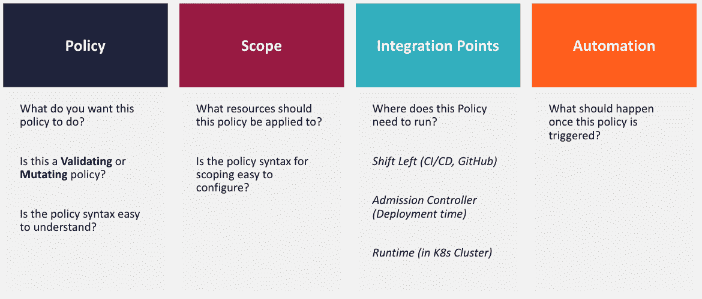
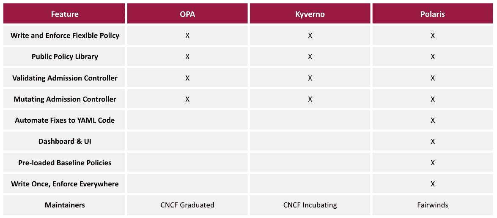

# 什么是开源 Kubernetes 策略引擎？为什么你需要一个&如何挑选

> 原文：<https://www.fairwinds.com/blog/what-are-open-source-kubernetes-policy-engines>

 Kubernetes 政策背后的想法是，如果您为您的开发团队安装护栏，确保他们遵守 [Kubernetes 最佳实践](https://www.fairwinds.com/blog/intro-kubernetes-best-practices) ，您将会更加成功。创建策略可以帮助你确保你的开发人员没有在 [Kubernetes](https://kubernetes.io/) 中做任何非常不安全、低效或不可靠的事情。一旦您决定了您的策略，您可能希望查看开源 Kubernetes 策略引擎，以确保您的开发人员根据您组织的标准部署所有东西。

开源策略引擎允许您在整个组织的高层次上 [执行您的所有策略](https://www.fairwinds.com/enforce-kubernetes-policy) 。策略引擎可以在被动模式下运行，在这种模式下，您可以审核您的环境或作为代码审核您的基础架构，以查看您的合规性。您可以看到您采用了多少这样的策略，以及哪些团队不合规。您还可以以更主动的模式运行策略引擎，这样您就可以阻止不符合特定级别的预定义要求的内容。

Kubernetes 上下文中的策略引擎关注应用程序配置。它可以做得更多，但这是关键的使用案例。随着 [基础设施作为代码](https://www.fairwinds.com/blog/why-infrastructure-as-code-scanning-matters-for-kubernetes-configuration) 的出现，以及开发人员对运营的影响越来越大，配置已经成为开发过程的核心部分，尤其是在让应用程序在 Kubernetes 上运行的时候。策略引擎在配置清单上运行，无论是在 YAML、赫尔姆还是 Terraform 中。

## 为什么需要策略引擎？

组织正在利用云和容器，以便他们可以更快地进入市场，更快地交付应用和服务；Kubernetes 使得在云中运行和管理容器变得很容易。策略引擎非常重要，因为它使得管理如何部署到 Kubernetes 和一致地执行策略变得更加容易。

### 多个团队遵循不同的实践

部署到 Kubernetes 的团队通常是应用程序团队和开发团队，他们的主要工作是编写代码和特性。一个 [策略引擎](https://github.com/FairwindsOps/polaris) 帮助您确保那些团队能够可靠且一致地交付。它可以建立一个反馈循环，告诉开发人员如何改进他们的应用程序配置。它还可以识别当前配置中可能导致负面业务影响的问题，例如潜在的停机时间。例如，如果您没有以某种方式配置 Kubernetes，来自策略引擎的信息可能指示需要一个 [活跃度或就绪性探测器](https://www.fairwinds.com/blog/how-to-identify-missing-readiness-probes-in-kubernetes) 或标记一个 [符合性](https://www.fairwinds.com/blog/how-fairwinds-insights-compliance-self-assessment-now-simplifies-soc-2) 问题。

最重要的是，策略引擎可以通过确保 Kubernetes 环境不被分割、每个应用程序在生产环境中不是唯一配置的，来支持快速移动和更快交付应用程序的目标。它使您的团队能够可靠地运行他们的应用程序，而不会带来不必要的风险。

### 您的所有集群需要保持一致，以降低维护成本

Kubernetes 是一个复杂的生态系统，有很多东西需要学习。你不能指望每个开发人员都是 K8s 专家，或者每个开发团队都有 Kubernetes 专家。当您迁移过去只有一个或两个集群的部署时，您需要一些 [护栏](https://www.fairwinds.com/kubernetes-guardrails-explained-reg) 来帮助开发团队确保他们发布的代码不会导致不可靠的应用程序、不安全的部署或成本超支。

## Kubernetes 的多租户部署需要对共享资源进行治理

从 Kubernetes 的概念验证阶段发展到扩展到[多租户 Kubernetes](https://kubernetes.io/docs/concepts/security/multi-tenancy/) 战略的公司可能正在向一个环境发展，在这个环境中，他们有多个应用程序或多个团队部署在一个集群上。确保集群中的共享资源在各个应用团队配置其工作负载时不会受到负面影响需要[治理](https://thenewstack.io/kubernetes-compliance-governance-and-guardrails/)。您需要确保您已经实施了适当的策略，以便集群正常运行，并且一个团队不会影响另一个团队。

由于不同的团队和不同的公司追求多租户战略，您可能还会发现您的各个团队在 Kubernetes 中处于不同的 [成熟度水平。一个团队可能遵循不同于另一个团队的实践。有时这是因为配置在团队之间被复制和粘贴，这可能意味着团队在不同的工作负载之间传播许多错误。策略引擎可以帮助您从“拉”请求阶段一直到生产阶段防止这些问题。](https://www.fairwinds.com/kubernetes-maturity-model)

## 在开源策略引擎中寻找什么

最重要的是找到一个策略引擎，它可以随着您的组织对 Kubernetes 部署的成熟而成长。以下是你应该记住的三个基本要求:

1.  它必须易于采用，尤其是在开始阶段。

2.  寻找一个语法简单的引擎，或者一些可以立即实施的现成策略。

3.  寻找支持定制策略的策略引擎；您不希望在六个月内超出您的策略引擎。

有各种不同类型的策略引擎，没有一个对所有组织都是完美的。

设计一个好的策略引擎和一个在整个组织中部署这些策略的好策略需要做很多工作。首先要考虑的是你要评价什么。是否存在安全问题、责任问题、一致性问题、成本问题？需要是 [SOC2 兼容](https://us.aicpa.org/interestareas/frc/assuranceadvisoryservices/aicpasoc2report)还是 [PCI-DSS](https://www.pcisecuritystandards.org/) 兼容？您可能有针对这些用例的特定策略。

看看哪些策略引擎附带了您需要的内置策略。哪些将支持您想要应用的策略？一旦你对你想要应用的政策有了很好的认识，弄清楚在哪里和什么时候应用*就显得尤为重要。*

 **   您是否有需要在生产环境中应用但不需要在开发和试运行环境中应用的策略？

*   您是否希望将这些策略作为代码应用于基础设施，而不是在每个生产环境中强制实施？

*   这些策略需要应用于系统级工作负载还是应用程序级工作负载？

*   您是否有仅适用于资源组的策略？例如，应用团队与集群附加组件。

### 策略引擎集成&自动化

您还需要考虑在[集成点方面您需要什么。](https://insights.docs.fairwinds.com/technical-details/self-hosted/integrations/) 集成点在开发过程中尽早给开发者和 DevOps 工程师提供与政策问题相关的反馈。一个优秀的策略引擎解决方案将从拉请求一直集成到运行时和准入控制。您甚至可以使用策略引擎来更改文件或将配置从一种配置更改为另一种配置。

最后，你要考虑自动化。一旦策略违规或策略被触发，您希望如何处理？一旦这些策略中的一个被触发，您可能想要向 Slack 发送一个警报，打开一个吉拉票证，或者打开一个[page duty](https://www.fairwinds.com/pagerduty)警报，如果它是一个关键漏洞。您的策略引擎的集成点和自动化可以让您的工程师很容易地找到他们已经注意到的地方，并确保他们可以看到什么时候出现问题并采取行动。

## 开源策略引擎选项

有一些著名的开源策略引擎可用，比如 Polaris、OPA 和 Kyverno。这三个项目都让 Kubernetes 用户更容易理解政策。它们都是维护良好的项目，选择哪一个取决于用例以及您的组织。

### 开源策略引擎对比

在您考虑的任何策略引擎中，确保它可以编写自定义策略。找一个有公共策略库的，因为你不想从头开始写每一个策略。每一个主要的引擎要么已经内置了一些策略，要么已经有一个社区编写并向 GitHub 推送策略，所以你可以将它们放入你的环境中。

寻找一个支持 [准入控制](https://polaris.docs.fairwinds.com/admission-controller/) 概念的策略引擎。您不想要一个只显示符合和不符合策略的引擎，而是一个可以在允许时阻止甚至可以在允许时改变它们以符合您的策略的引擎。一个**变异准入控制器**，它可以修改资源以确保它们符合您的策略，是一个很好的附加特性。

[北极星](https://www.fairwinds.com/polaris) 让你轻松了解集群安装中的问题。它提供了一个仪表板，多个团队可以通过它查看未解决的问题。它还允许您尽可能向左移动，并自动修复底层 YAML 代码。很少有人意识到有一些通用的策略和实践需要在每个组织中强制执行，并根据业务需求进行调整。Polaris 预载了每个人都会犯错误的基准策略和最佳实践，从而使 Kubernetes 部署变得可靠、安全且经济高效。北极星是[fair winds Insights](https://www.fairwinds.com/insights)平台的一部分，该平台为较小的集群提供了一个免费层。

[【开放策略代理(OPA)](https://www.openpolicyagent.org/) 是一个不专属于 Kubernetes 的广义策略引擎；它可用于 Kubernetes、Envoy、Terraform、Kafka、SQL 和 Linux。它为云原生环境提供基于策略的控制。OPA 有一个声明性的策略语言，，你需要用它来写策略。OPA 是一个已经毕业的[云本地计算基金会(CNCF)](https://www.cncf.io/) 项目。OPA 包含在 Fairwinds Insights 平台中，因为它是人们喜欢利用的标准。

[Kyverno](https://kyverno.io/) 是 Kubernetes 特有的；它在 CNCF 是一个孵化项目。在 Kyverno，策略作为 Kubernetes 资源进行管理。这意味着您可以使用 kubectl、git 和 kustomize 等工具来管理策略。

## 从开源 Kubernetes 策略引擎开始

组织需要一个易于使用的策略引擎，一个可以快速启动并运行的引擎，一个可以在 Kubernetes 成熟的不同阶段应用的引擎。为您的组织选择策略引擎时，请寻找可以在左移环境中运行的策略，以便您可以在开发的最早阶段扫描策略。策略引擎可以帮助您的组织应用并符合 Kubernetes 的最佳实践，因此您的部署是安全、经济和可靠的。

观看网上技术交流讲座“[Kubernetes 的最佳开源策略引擎](https://webinars.devops.com/best-open-source-policy-engines-for-kubernetes) ”以了解有关不同策略引擎、您可能想要开始使用的策略等更多信息。

*