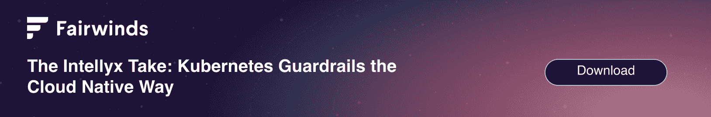

# 什么是 Kubernetes 治理？

> 原文：<https://www.fairwinds.com/blog/what-is-kubernetes-governance>

 Kubernetes 治理是组织用来定义如何管理和维护 Kubernetes 的一套政策和程序，它是企业如何规模化生产的重要组成部分。Kubernetes 治理包括管理 Kubernetes 资源、调度、升级和基于角色的访问控制。它还包括关于 Kubernetes 的决策过程，比如如何管理安全问题、错误修复和特性请求。

Kubernetes 提供了一个可移植的开源平台，使组织能够管理容器化的工作负载和服务。它提高了各种规模的公司交付可伸缩和可扩展的云原生应用程序的能力，以及开发团队承担 [Kubernetes 服务所有权](https://www.fairwinds.com/cloud-native-service-ownership) 的能力。使用 Kubernetes，内部团队可以更容易地开发系统和部署应用程序和服务。虽然 Kubernetes 提供了许多重要的好处，但它也为开发、运营和安全团队引入了新技术和不同的复杂性。随着 Kubernetes 部署的规模和范围的增长，缺乏治理框架会导致问题。管理单个 Kubernetes 集群是一个不可忽视的学习曲线，但是一旦一个组织开始管理多个集群，特别是跨不同云提供商的混合云或多个云，这将成为一个更大的挑战。一些挑战包括:

*   缺乏对 Kubernetes 集群活动和增长的了解

*   管理组织内的多个软件版本并进行故障排除

*   在多个团队和环境中定义用户角色、职责和权限变得很难跟踪

*   识别角色违规、执行合规检查和评估治理风险非常耗时

*   管理政策和程序很难跨团队实施

Kubernetes 治理确保您的组织创建流程、明确任务并设置优先级，以成功实施和运行 Kubernetes。Kubernetes 治理计划帮助您确保这个复杂的环境满足您组织的政策要求，遵循最佳实践，并满足您所在行业的法规要求。

## 为什么 Kubernetes 治理如此重要？

Kubernetes 治理框架为组织提供了许多好处，包括帮助确保 Kubernetes 环境的安全性、合规性和优化性。它有助于组织遵循最佳实践并遵守公司政策和法规。它还创造了一个团队可以轻松协作和管理工作负载的环境。这有助于确保环境稳定、安全和高效。

### Kubernetes 的一致性

大规模运行 Kubernetes 基础设施几乎保证了广泛的组件和配置，以及您的组织中具有稍微不同的基础设施需求的多个团队。Kubernetes 提供了许多使用命令行和用户界面来启动和配置组件的功能。多个人和团队调整单个组件以满足这些需求不可避免地导致缺乏一致性，这使得 Kubernetes 更加难以管理。

#### *配置漂移*

[配置漂移](https://www.fairwinds.com/blog/configuration-drift-kubernetes) 是指在一个基础设施中运行 Kubernetes 集群时，随着时间的推移，配置会变得越来越不同，这通常是因为对单个集群进行了手动更改和更新。最终，这种差异存在于存储在 git 中的内容和运行在生产环境中的内容之间。有时，开发团队可能会从其他团队“复制和粘贴”示例配置，这样他们就可以快速启动并运行。然而，这也可能导致团队继承不好的实践。配置偏差不仅意味着底层配置的差异，还可能意味着应用于工作负载的不同标准。

如果您设置了一个流程来确保一致的自动化资源调配，那么您的集群在创建时将是一致的。不幸的是，由于开发团队、运营团队或 DevOps 团队对配置参数的更新，在该集群或其他集群上进行资源调配后可能会发生更改。当您的组织运行大量手动部署的集群并且现在配置不一致时，Docker 容器和 Kubernetes 集群之间的配置将不可避免地存在差异。这些差异可能难以识别和纠正。与配置漂移相关的一些负面结果包括:

*   [**安全漏洞:**](https://www.fairwinds.com/kubernetes-security) 错误配置可能导致权限提升、易受攻击的映像、来自不受信任的存储库的映像或以 root 或特权身份运行的容器

*   [**低效的资源利用:**](https://www.fairwinds.com/kubernetes-cost-optimization) 当工作负载过度调配或过时的工作负载未得到审查和纠正时，成本可能会慢慢增加。

*   [**停机和可靠性风险:**](/blog/kubernetes-best-practices-reliability) 应用或服务扩展不足或扩展过于频繁可能导致停机或降低可靠性。

#### *运营成本*

手动跟踪配置漂移和修复错误配置是一项具有挑战性、易出错且持续进行的任务。这增加了运营团队的成本，因为跟踪和解决问题需要花费大量时间。配置漂移可能会导致更多的不一致性，这会对升级过程产生负面影响，因为每个升级路径都需要进行独特的研究，以确保升级后一切仍然正常。这会增加流程的时间，浪费时间和运营资源。一致的基础架构可以帮助您一次性研究升级和修补方案，然后将其应用于多个环境。

### Kubernetes 服务所有权

在 Kubernetes 和软件开发领域，服务所有权被定义为开发团队在整个服务生命周期中负责支持他们交付的产品和服务的方式。这种服务所有权模型让开发团队能够更好地控制他们的软件和服务在生产环境中的运行方式。它还允许运营团队将更多的精力放在维护和改进核心基础设施上，而不是跟踪错误和优化应用程序。

#### *启用自助服务*

在自助服务模式中，DevOps 和基础设施领导者允许许多用户跨许多不同的 Kubernetes 集群进行开发和部署。随着越来越多的团队将 Kubernetes 部署到生产环境中，DevOps 团队越来越难以手动编写或审查部署到集群中的每个 Dockerfile 和 Kubernetes 清单。创建一组 Kubernetes guardrails 并自动执行它们允许开发人员自助服务，并防止意外引入安全风险、低效的云资源使用和应用程序性能问题。

#### *赋能开发者行动*

使用这些防护栏并在平台级别实施这些策略，可以在整个组织中应用一致性，让开发人员放心，他们不会无意中部署可能会将他们的公司甚至工作置于风险之中的应用程序或服务。开发团队也有权构建应用程序和服务，并运行集群，而不必担心破坏其他东西。这样，他们可以更专注于编写和部署，而不是担心出错。

 *服务所有者负责开发、运输和拥有他们的服务，这比他们过去能够承担的责任多得多。他们现在必须确保应用程序可靠且性能良好，提供新功能，修补代码中的错误和漏洞，解决 Docker 容器中的错误配置，维护文档等等。正确的开源工具(通常在 GitHub 上可用)可以支持这些服务所有者承担新的责任，并确保更具成本效益和更安全的应用程序和服务。

#### *飞船应用程序更快*

服务所有权还允许所有者通过支持自助服务和使开发人员能够比以往更快地开发、测试和部署应用程序，从而更快地交付应用程序。当 DevOps 团队围绕谁拥有应用程序不同部分的服务所有权并对这些所有者有足够的了解时，他们可以监控 Kubernetes 集群中发生的事情，并洞察谁在修补哪个漏洞，在哪里，什么时候，而不是想知道谁负责采取行动。

### 提高 Kubernetes 的安全性

Kubernetes 治理模型通过建立一种策略来提高 Kubernetes 的安全性，以确保对 Kubernetes 环境的更大可见性，更好地理解可能导致安全性和合规性风险的错误配置，并减少漏洞管理所需的时间。Kubernetes 安全性有几个重要的方面必须纳入到任何 Kubernetes 治理模型中。

#### *Kubernetes 默认不安全*

许多 Kubernetes 工作负载设置实际上是“默认不安全的”——它们授予应用程序权限来做它可能需要或可能不需要的事情。这里的权衡意味着开发人员可以快速启动并运行应用程序，但没有安全最佳实践。例如，默认情况下，每个容器都安装有一个可写的根文件系统。这可以为攻击者提供替换系统二进制文件或修改配置所需的权限。Kubernetes 确实提供了许多内置的安全特性，比如 Kubernetes 基于角色的访问控制()、 网络策略，以及准入控制器。Kubernetes 治理必须考虑这些默认配置，并为 Kubernetes 部署包含安全第一的思想。对于任何采用 Kubernetes 的组织来说，审查安全策略都是至关重要的一步。

#### *左移工装*

在 DevOps 中，左移方法将以前发生在软件开发生命周期(SDLC)后期的任务“左移”到早期阶段。将测试转移到 SDLC 的早期可以在开发过程的早期发现设计或代码问题，从而加快开发和发布周期。在 Kubernetes 中，应用程序和服务的部署比传统环境中要快得多，因此采用支持和实施左移方法的工具对于尽可能快速和安全地部署应用程序和服务至关重要。

#### *降低合规成本*

容器和 Kubernetes 等云原生技术为合规性带来了新的挑战。当在容器化的工作负载中部署时，开发团队必须从设计和开发阶段开始，尽可能地将安全性和合规性转移到左边。它还需要从开发到生产的整个过程中对应用和服务的可见性和控制。设置与 SOC 2 控制、HIPAA、ISO27001 和其他法规相对应的护栏，有助于组织了解合规性状态，以满足日益增长的合规性需求。

## Kubernetes 治理原则

以下五个原则为构建您的 Kubernetes 治理模型提供了一个极好的起点:

1.  **与业务目标保持一致** — Kubernetes 战略应该是整体业务和 IT 战略不可或缺的一部分。所有 Kubernetes 系统和政策都必须支持业务目标。

2.  **协作**—Kubernetes 基础设施所有者和其他利益相关方之间必须有明确的协议，以确保 Kubernetes 得到适当和有效的使用。

3.  **变更管理** —必须根据 [Kubernetes 最佳实践](https://www.fairwinds.com/kubernetes-best-practices-comprehensive-white-paper) 一致地实施对 Kubernetes 环境的所有变更，并与适当的组织控制保持一致。

4.  **动态响应** —Kubernetes 治理应该依靠监控、工具和策略自动化来有效地管理 Kubernetes 环境。

5.  **政策和标准合规—** Kubernetes 的使用标准必须符合贵组织内部和行业内其他人使用的相关法规和合规标准。

## 如何设计和实现 Kubernetes 治理

Kubernetes 治理是制定政策、标准和程序的过程，这些政策、标准和程序起到护栏的作用，以确保组织内 Kubernetes 的安全性、合规性和成本效益。

要开始 Kubernetes 治理项目的设计和实现，请从以下方面着手:

1.  **创建 Kubernetes 治理团队** :召集一支了解 Kubernetes 和组织需求的专家团队，包括来自开发、运营、安全和合规团队的成员。

2.  **建立政策和标准:** 建立使用 Kubernetes 的政策和标准，特别是安全性、合规性和成本效益。

3.  **制定流程和指导方针:** 制定流程和指导方针，以验证治理策略和标准已成功实施，包括批准和沟通流程。

4.  **监控和执行策略:** 监控和执行策略和标准，以确保它们被遵循；实施工具化和自动化来实施 [Kubernetes 护栏](https://www.fairwinds.com/blog/what-are-kubernetes-guardrails) 减少了复杂 Kubernetes 环境中固有的挑战。

5.  **审查和更新:** 定期审查和更新政策、标准和流程，以确认它们随着时间的推移仍然满足组织的需求。

## Kubernetes 部署最佳实践

Kubernetes 使组织能够提高容器的可用性和生产率，并构建云原生应用程序。为了最大限度地发挥 Kubernetes 实施的优势，必须遵循以下五个 Kubernetes 最佳实践:

1.  **安全** 配置在 Kubernetes 中默认不设置；这些是您的安全团队必须建立并实施的设置，最好是通过自动化和可靠的策略。

2.  **成本优化** 要求您设置资源请求和工作负载限制，以最大限度地提高基础设施利用率，同时确保最佳应用性能。

3.  **可靠性** 在 Kubernetes 中，这是一项复杂的任务，但 IaC 通过减少人为错误、增加一致性、提高可审核性和简化灾难恢复使之变得更加容易。

4.  **策略执行** 一旦 Kubernetes 部署增加到单个应用程序之外，策略执行就变得至关重要。通过工具和自动化实施策略有助于防止常见的错误配置，实现 IT 合规性，并促进服务所有权模式，因为用户知道有护栏来实施策略。 [开放策略代理](https://www.openpolicyagent.org/) (OPA)是一款面向云原生环境的开源工具，提供基于策略的控制。

5.  **监控和警报** 帮助确保您的基础设施和应用程序正常运行。这需要工具来优化监控，确定需要监控的内容和原因，并在部署之前发现错误配置。

### 【Kubernetes 政策入门

#### *集群范围策略*

一般来说，组织可以部署集群范围和特定于名称空间(或特定于应用程序)的策略。集群范围的策略往往适用于所有工作负载，可能涵盖安全性、效率和可靠性类别。这些是一般的经验法则，平台和安全团队可以根据具体情况批准例外。

以下是几个例子:

*   应设置存储器请求

*   应设置 CPU 请求

*   应设置活性探针

*   应设置就绪探测器

*   图像拉取策略应该是“始终”

*   集装箱不应具有危险能力

#### *命名空间策略*

特定于命名空间的策略用于为特定的应用团队或服务强制实施标准，以提高安全性、效率或可靠性。例如，您可以使用名称空间在一个共享的 Kubernetes 集群中创建不同的“租户”,供团队申请。您希望这些团队遵守一组通用的最佳实践，避免对其他集群租户造成破坏，例如资源耗尽或违反安全。

一些例子可能包括:

*   容器不应具有不安全的功能

*   不应配置主机 IPC

*   不应配置主机 PID

*   不应允许权限提升

*   不应以特权身份运行

*   应该指定图像标签。

*   应设置名称空间配额

#### *执法点*

这些策略的实施可以分多个阶段进行。最终，Kubernetes 治理的“执行”功能就是在工程师需要的时候，用他们使用的工具向他们提供反馈。

如果您有一个运行生产工作负载的现有集群，您可以首先选择根据这些集群范围和命名空间策略对您的集群进行基准审核。这将有助于提高问题的可见性，从而实现更大的服务所有权。

接下来，您可以在 CI/CD 阶段(使用左移工具)和部署时(使用准入控制器)集成这些策略。您可以选择让这些策略“警告”用户，但实际上并不阻止管道或部署——这有助于在流程的早期带来更多可见性，并在问题发布之前捕捉到它们。

最后，推行策略实施的最后一个阶段是实际实施。此时，策略处于“活动”状态，并在发现问题时阻止管道或部署。流程中的这一步通常是在团队对需要修复的配置类型感到满意时进行的。

理想情况下，第一次将容器迁移到 Kubernetes 的组织应该从一开始就集成实施。这提高了 Kubernetes 治理的标准，并通过确保工作负载从一开始就正确运行，使团队能够更快地迁移工作负载。

### Kubernetes 成本和效率

#### *费用分配*

Kubernetes 的支出与部署应用和服务的集群数量以及配置方式成正比。报告多租户集群的成本并将成本分配给正确的所有者是一项挑战。Kubernetes 部署依赖共享和外部资源的瞬时工作负载。使用是以秒为单位来衡量的，跟踪一个工作负载所使用的 Kubernetes 资源可能很困难。随着 Kubernetes 环境的增长，集群和节点的数量也在增长。必须监督支出，以避免浪费 Kubernetes 的资源；因此，平台工程团队必须能够在业务相关的环境中分配和显示成本，并与工程团队一起创建反馈循环，以实现服务所有权文化。

#### *资源标注*

将成本映射到 Kubernetes 组件，比如名称空间或标签，有助于将成本恰当地分配到各个业务单元。Kubernetes 垂直 Pod 自动缩放器(VPA)使用工作负载的历史内存和 CPU 使用情况以及 Pod 的当前使用情况来生成资源请求和限制的建议。Kubernetes 中的节点标签允许您标记您的节点。您可以将 pod 配置为使用与特定节点标签相匹配的特定“节点选择器”，这些标签决定了可以将 pod 调度到哪些节点上。使用经过适当标记的不同实例类型的实例组，可以使您选择的公共云或私有云提供商提供的底层硬件与您的 Kubernetes 工作负载相匹配。如果没有资源标签，就很难恰当地分配成本，并就成本、优化和云支出做出明智的决策。

#### *成本规避与优化*

根据 FinOps 基金会的说法，成本规避意味着减少使用和优化成本，以获得更好的云速率。避免成本所需的大多数行动都依赖于工程师。平台工程团队可以使用 Kubernetes 更快速地交付应用程序，通过优化云使用降低成本，并通过实施 Kubernetes 安全功能降低风险，从而避免成本并提高优化。Kubernetes 治理可以通过自动执行考虑到安全性和成本的策略来避免成本并提高优化。

### Kubernetes 安全

#### *基建照码扫描*

基础设施即代码(IaC)支持使用配置语言来配置和管理基础设施。这将现代软件开发的可重复性、透明性和测试应用于基础设施管理。IaC 的主要目标是减少误差和配置漂移，使工程师能够专注于更高价值的任务。使用 IaC 为 Kubernetes 用户、提供了显著的、[优势，例如减少人为错误、可重复性和一致性、改进变更跟踪和灾难恢复。基础设施即代码扫描是根据一组策略和 Kubernetes 最佳实践扫描 IaC 文件的能力，这有助于组织确保符合 Kubernetes 的治理目标，如应用程序安全性、可靠性和成本。](https://www.fairwinds.com/blog/why-infrastructure-as-code-kubernetes)

#### *集装箱图像扫描*

容器使开发团队能够为不同的环境和部署目标构建、打包和部署应用程序和服务，因此保护容器的完整性对于在云原生环境中构建和部署的组织来说至关重要。容器构建在基本映像上，这是 Linux 容器的起点。基础映像中的漏洞将存在于包含该基础映像的每个容器中。为您的基本映像找到一个可靠的来源，保持修补程序的最新状态，控制权限，并限制使用部署到生产环境中不需要的其他映像，这些都有助于提高容器映像的安全性。 [扫描图像](https://insights.docs.fairwinds.com/first-steps/container-security/) 和 [检测错误配置](https://www.fairwinds.com/insights) 仍然很关键，因为 [常见的漏洞和暴露](https://cve.mitre.org/) (CVEs)可以随时引入。扫描容器及其所有组件以识别安全漏洞是容器安全的关键组成部分，因此也是 Kubernetes 治理的一个重要方面。

### Kubernetes 可靠性

#### *弃用的 API*

随着时间的推移，Kubernetes 弃用不同版本的 API，以减少对旧 API 的维护，并确保组织使用更安全的最新版本。如果您的应用程序或服务包含 [已弃用或已移除的 API 版本](https://www.fairwinds.com/blog/find-deprecated-and-removed-apis) ，找到它们并将其更新到最新的稳定版本非常重要。

#### *升级插件*

[附加组件](https://kubernetes.io/docs/concepts/cluster-administration/addons/) 扩展 Kubernetes 功能。像其他软件一样，加载项需要升级，但首先您必须验证最新版本是否与您的群集兼容。这个过程可能非常耗时，尤其是对于管理多个集群的团队。除非有工具可以自动检测附加组件的变化，否则监控更新和升级会很慢且很困难，但不这样做可能会对服务产生负面影响。

### 立方遵约

#### *政策执行与护栏*

在拥有多个 Kubernetes 集群、开发人员团队和服务所有权模型的组织中，拥有定义的策略和执行这些策略的自动化方法是至关重要的。部署防护栏和策略可以让开发、安全、运营和领导团队高枕无忧，因为自动执行策略和防护栏可以防止最后一刻的更改，这些更改可能会破坏生产环境、导致数据泄露或导致配置无法正常扩展。Kubernetes 策略实施支持自动化、监控和实施 Kubernetes 的护栏和最佳实践。

#### *自动化合规分析*

向云原生技术(如 Docker containers 和 Kubernetes)的转变带来了与合规性相关的新挑战。大多数组织都需要遵守安全和隐私法规，包括 SOC 2、HIPAA、GDPR ISO27001、PIPEDA 等等。使用已定义的 Kubernetes 合规性需求策略并在所有集群中自动实施这些策略是至关重要的，自动化合规性分析以确保满足不断变化的需求的能力也是如此。

## Kubernetes 护栏和治理

传统的治理模式减缓了团队的速度，并成为有效实现目标的障碍。Kubernetes 治理提供了一种与云原生计算战略相一致的新模式。组织可以自动应用护栏来实施和执行策略，而不是增加官僚主义。通过创建流程，明确任务，并在一开始就设置优先级，您可以创建策略来帮助您成功地实现和运行 Kubernetes。最重要的是，Kubernetes governance 将帮助您最大限度地提高平台投资，同时满足您组织的政策要求，坚持最佳实践，并满足相关法规要求，而不会减缓应用程序和服务的开发和部署。

*