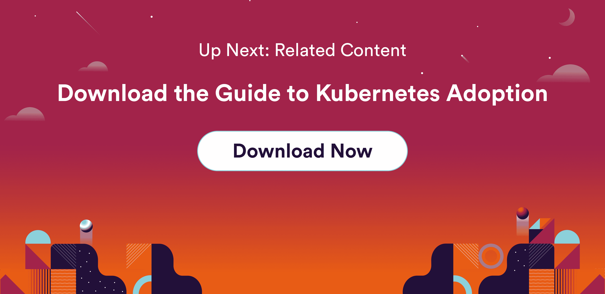

# 为什么受管理的 Kubernetes 能够帮助团队取得成功

> 原文：<https://www.fairwinds.com/blog/why-managed-kubernetes-enables-team-success>

 当过渡到 Kubernetes 时，您自然需要内部专家。从长远来看，这可能是真的。但是 Kubernetes 是管理基础设施的新范例，拥有专业知识是件好事。

## **航海托管服务**

打个比方，假设你经营一家旅游公司，让人们去划皮划艇、玩滑板和漂流。沿途的某个地方，你决定你也想提供游艇航行。你有几个选择来实现这个转变。你可以出去买一艘小帆船，学习航海的基础知识，然后升级到一艘越来越大的船，在你通过反复试验学习如何航行的同时，教沿途的人。最终你会在一艘非常大的船上感到舒适，你会有驾驶这艘船的员工和专业知识。但是要达到你的商业目标需要很长时间。

另一个选择是出去买一艘游艇，并雇佣一群有驾驶经验的人。现在，您可以立即开始将客户送上游艇旅行，并相信即使在长途旅行和暴风雨中，您的客人也会得到安全保障。随着时间的推移，你会让你的人和你雇佣的船员一起工作，这样他们就能掌握诀窍，直到你对自己的人驾驶这艘船充满信心。

## 托管 Kubernetes 服务

现在把这个比作 Kubernetes。你可以出去买一个树莓派(或者一套)然后旋转 Kubernetes 集群。在这个过程中，你会学到基础知识。但是在一组小型计算机上运行 Kubernetes 与在背后有关键任务基础设施的生产环境中运行它是非常不同的。要实现这一点，您需要开始在云环境中(在本地或通过云提供商)做一些事情，尝试一些小的服务，直到您对迁移生产环境感到满意为止。

最终你会取得越来越大的进步，并且对航行感到非常舒适。但是，当你没有经历过的事情出现时，会发生什么呢？一根绳子断了，或者你需要不停地修补船帆？在海上修补船体呢？更可怕的是，如果有一天出现了你不熟悉的风暴。在一场大风暴中保持一切正常运转成为了当务之急，而你身边却没有专家来帮助你。谷歌“我如何驾驶帆船在巨浪中航行？”远不如在甲板上有一个知道如何驾驶飞船的人来的安心。

专业知识不是获取信息的途径，而是经验。让有经验的人在身边，让专业知识唾手可得，这是很有价值的，直到你自己成为一名航海大师。有一个人在身边帮助你学习，你会更快成为一名优秀的水手。

## 支持和知识传授

我们在 Fairwinds 传达的信息是，我们是一家 Kubernetes 支持公司。我们有几种方法来实现这一点。

一是您可以为我们的托管服务 [ClusterOps](/clusterops) 付费。我们可以为你造一艘船，让它今天就为你启航——让它一直漂浮着，直到你准备好慢慢接管它。

已经在海上了？我们有一个名为 [Kubernetes Advisory](/clusterops-advisory) 的支持服务，可以在您掌舵时回答您的问题。

最后，有些人有他们不能与其他人分享的船，这就是为什么我们有软件- [Fairwinds Insights](/insights) -帮助你一路成功-想象一个平台，告诉你在哪里以及如何移动和系紧帆，或者准确地揭示你的船需要什么维护才能保持航行？

> Fairwinds Insights 可供免费使用。可以在这里报名[。](/coming-soon)

知识转移是我们流程的正常部分。在那里看着我们的人带你穿过一个又一个风暴会导致缓慢的知识转移，即使你并不追求它。

有很多方法可以开始这个过程，而且有很多很好的理由现在就登上游艇。在学习一个全新范式的过程中，在别人的帮助下尽早实现目标会让事情变得更加顺利。

你可能会说这就像顺风顺水。

