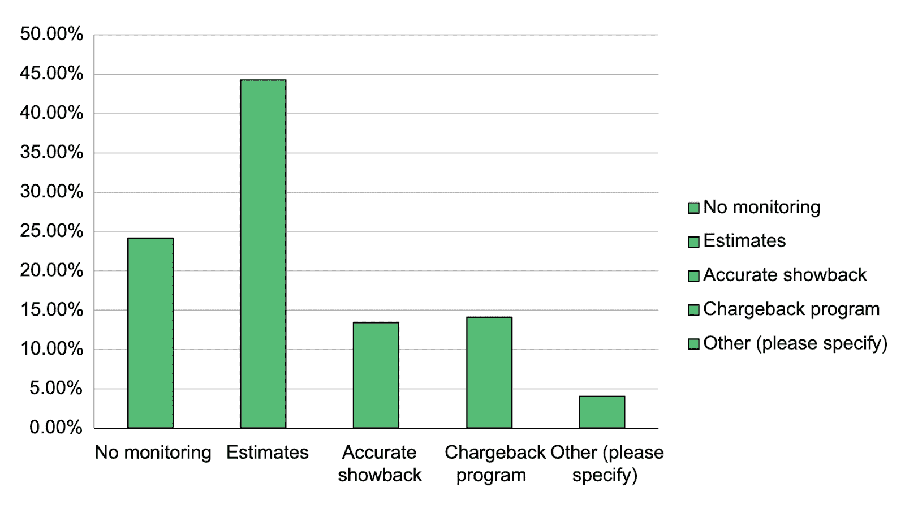

# 你没有监督 Kubernetes 的成本，你应该这样做

> 原文：<https://www.fairwinds.com/blog/youre-not-monitoring-kubernetes-cost-and-you-should-be>

 当我得到第一份(真正的)工作，在一家冰激凌和三明治店洗碗时，我花光了最初几份薪水中的每一分钱。然后我爸建议我开始存点钱。我记得听到这个建议时想，“嗯，是的，我想这是有道理的。”关注这些钱在做什么，并有意为之，这似乎是显而易见的，但我以前从未停下来考虑过。

似乎所有给个人的财务建议都包含两点:

1)尽快开始存钱，哪怕只是一点点

2)创建预算

舒适地步入成年通常需要这两类中至少一类的技能。

令我着迷的是，大多数公司虽然有预算意识，但在谈到云基础架构的成本时，似乎都有 [盲点](https://securityboulevard.com/2022/08/find-your-kubernetes-cost-blind-spots/) 。事实上， [CNCF 最近发布了一份关于 FinOps 和 Kubernetes](https://www.cncf.io/wp-content/uploads/2021/06/FINOPS_Kubernetes_Report.pdf) 的白皮书，其标题字面意思是，“Kubernetes 成本监控不足或不存在导致超支。”报告的标题集中在很多人没有在 Kubernetes 上做成本监控。一点也不。

我已经经历了足够多的公司预算规划会议，相信预算可能是非常普遍的。但我也知道许多公司只是接受云成本的增加，而不会问任何关于钱去了哪里的问题。了解云支出的工程师之间经常开玩笑说，他们会有人问他们关于一次零散的 Twix 购买(这真的是出于商业原因吗？)，但是他们可以在他们公司的虚拟专用云(VPC)中旋转几个 10，000 美元/实例，甚至没有人会注意到。

该报告显示，就 Kubernetes 而言，按集群、命名空间或工作负载划分的成本去向更不明确。在这份报告中，68%的公司表示他们的成本在增加。

我不得不相信，如果你自己的个人预算逐年增加，你会想知道这些钱去了哪里。管理 Kubernetes 花费的软件已经存在，根据你的云花费，你很有可能通过购买和使用它来省钱。事实上，当您要求您的基础设施团队使用软件来管理他们的 Kube 支出时，他们的反应可能是“嗯，是的，我想这是有道理的。”

这份报告值得花些时间仔细研究。你可能是许多忽视你的 Kubernetes 费用的人之一。也许你团队中的某个人告诉你这个问题太难监控了——由于 Kubernetes 的细微差别，你自己很难建立这种逻辑——但这也是像[fair winds Insights](http://fairwinds.com/insights)这样的软件可以解决的问题。

没有理由在不了解云支出去向的情况下开展业务。适用于我 16 岁时的经验仍然适用于你的生意。不一定很难！我们可以帮助简化这一过程——我们的 [免费层](https://www.fairwinds.com/insights-pricing) 是一个低摩擦选项，您可以使用它来快速了解您的 Kubernetes 支出，并进入“嗯，是的，我想这是有道理的”阶段。

**想了解 Kubernetes 对云消费的贡献吗？阅读**[**【Kubernetes 成本优化指南】**](https://www.fairwinds.com/kubernetes-cost-optimization-reg)