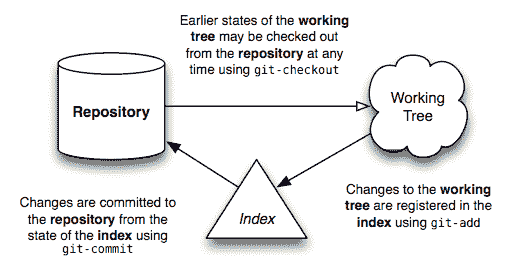

# 简介

> 原文：[`jwiegley.github.io/git-from-the-bottom-up/`](http://jwiegley.github.io/git-from-the-bottom-up/)

欢迎来到 Git 的世界。我希望这份文档能帮助您更好地理解这个强大的内容跟踪系统，并揭示其背后的一丝简洁性——尽管从外部看，其选项可能显得令人眼花缭乱。

在我们深入探讨之前，有一些术语需要首先提及，因为它们将在整篇文本中反复出现：

+   **repository** — **repository** 是一系列 *commits* 的集合，每个 *commit* 都是一个项目 *working tree* 在过去某个日期的存档，无论是在您的机器上还是他人的机器上。它还定义了 HEAD（见下文），用于标识当前工作树起源的分支或提交。最后，它包含一系列 *branches* 和 *tags*，通过名称来标识特定的提交。

+   **the index** — 与您可能使用过的其他类似工具不同，Git 并不是直接从 *working tree* 将更改提交到 *repository*。相反，更改首先注册在称为 **the index** 的东西中。将其视为一种“确认”您更改的方式，一个接一个地，在执行提交（一次性记录所有已批准的更改）之前。有些人更倾向于将其称为“暂存区”，而不是索引。

+   **working tree** — **working tree** 是您文件系统中与 *repository* 相关的任何目录（通常通过其中名为 `.git` 的子目录的存在来指示）。它包括该目录中的所有文件和子目录。

+   **commit** — **commit** 是您工作树在某个时间点的快照。提交时 HEAD（见下文）的状态成为该提交的父代。这就是“修订历史”概念的形成。

+   **branch** — **branch** 只是一个提交的名称（关于提交的更多内容将在稍后讨论），也称为引用。它是提交的父代，定义了其历史，因此典型的“开发分支”概念。

+   **tag** — **tag** 也是一个提交的名称，类似于一个 *branch*，但它的作用始终是命名同一个提交，并且可以有自己的描述文本。

+   **master** — 在大多数仓库中，主线开发是在名为“**master**”的分支上进行的。尽管这是一个典型的默认设置，但它并没有什么特别之处。

+   **HEAD** — **HEAD** 被您的仓库用来定义当前已签出的内容：

    +   如果您签出一个分支，HEAD 将象征性地指向该分支，表示在下一个提交操作之后应该更新分支名称。

    +   如果您签出一个特定的提交，HEAD 仅指向该提交。这被称为分离的 *HEAD*，例如，如果您签出一个标签名称。

事件的一般流程是这样的：在创建仓库之后，你的工作在工作树中进行。一旦你的工作达到一个重要的节点——比如修复了一个错误、工作日结束、所有内容都能编译的时刻——你将你的更改依次添加到索引中。一旦索引包含了你打算提交的所有内容，你就在仓库中记录其内容。下面是一个简单的图表，展示了典型项目的生命周期：

在心中有了这个基本概念后，接下来的部分将尝试描述这些不同的实体如何对 Git 的操作至关重要。
