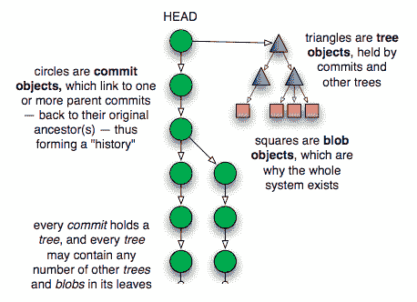

# 提交之美

> 原文：[`jwiegley.github.io/git-from-the-bottom-up/1-Repository/5-the-beauty-of-commits.html`](http://jwiegley.github.io/git-from-the-bottom-up/1-Repository/5-the-beauty-of-commits.html)

一些版本控制系统将“分支”变成了神奇的东西，通常将它们与“主线”或“主干”区分开来，而其他系统则像讨论一个与提交非常不同的概念一样讨论这个概念。但在 Git 中，没有作为独立实体的分支：只有 blob、tree 和提交。由于一个提交可以有一个或多个父提交，而这些提交也可以有父提交，这就是为什么单个提交可以像分支一样被对待：因为它知道通向它的整个历史。

你可以使用 `branch` 命令在任何时候检查所有顶级、引用的提交：

```sh
$ git branch -v
* master 5f1bc85 Initial commit

```

跟我一起说：分支不过是一个指向提交的命名引用。这样，分支和标签是相同的，唯一的区别是标签可以有它们自己的描述，就像它们引用的提交一样。分支只是名字，但标签是描述性的，嗯，就是“标签”。

但事实上，我们根本不需要使用别名。例如，如果我想的话，我可以用提交的哈希 ID 来引用仓库中的所有内容。这里是我直接疯狂地重置我的工作树到特定的提交：

```sh
$ git reset --hard 5f1bc85

```

`-hard` 选项表示要擦除我工作树中当前的所有更改，无论它们是否已注册为提交（关于这个命令的更多内容将在后面讨论）。一个更安全的方法是使用 `checkout`：

```sh
$ git checkout 5f1bc85

```

这里的区别在于，我工作树中的更改文件被保留。如果我向 `checkout` 传递 `-f` 选项，在这种情况下它和 `reset --hard` 的行为相同，除了 `checkout` 只会更改工作树，而 `reset --hard` 会将当前分支的 HEAD 更改为引用指定的树版本。

基于提交的系统另一个优点是，你可以使用单一词汇重新表述甚至最复杂的版本控制术语。例如，如果一个提交有多个父提交，它就是一个“合并提交”——因为它将多个提交合并成了一个。或者，如果一个提交有多个子提交，它代表了“分支”的祖先等。但事实上，Git 对这些事物并没有区别：对于 Git 来说，世界只是一个提交对象的集合，每个提交都包含一个树，该树引用其他树和 blob，这些 blob 存储了你的数据。比这更复杂的东西只是命名学的一个工具。

下面是所有这些部分如何组合在一起的图片：


