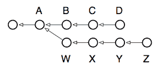
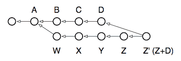
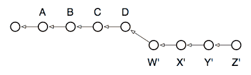

# 分支和 rebase 的力量

> 原文：[`jwiegley.github.io/git-from-the-bottom-up/1-Repository/7-branching-and-the-power-of-rebase.html`](http://jwiegley.github.io/git-from-the-bottom-up/1-Repository/7-branching-and-the-power-of-rebase.html)

Git 中用于操作提交的最强大命令之一是名为 rebase 的命令。基本上，你从每个分支工作开始时，都有一个或多个“基础提交”：这些提交是分支诞生的提交。以下是一个典型的场景，例如。请注意，箭头指向过去，因为每个提交都引用其父（们），而不是其子。因此，D 和 Z 提交代表它们各自分支的头部：



在这种情况下，运行分支将显示两个“头”：`D` 和 `Z`，这两个分支的共同父分支是 A。`show-branch` 的输出只显示了以下信息：

```sh
$ git branch
  Z
* D

$ git show-branch
! [Z] Z
 * [D] D
--
 * [D] D
 * [D^] C
 * [D~2] B
+  [Z]Z
+  [Z^]Y
+  [Z~2] X
+  [Z~3] W
+* [D~3] A

```

阅读这个输出需要一点时间来适应，但本质上它与上面的图表没有不同。这里它告诉我们：

+   我们所在的分支在提交 `A`（也称为提交 `D~3`，如果你愿意，甚至可以称为 `Z~4`）处经历了第一次分叉。`commit^` 语法用于引用提交的父提交，而 `commit~3` 指的是其第三个父提交，或者说是曾祖父母提交。

+   从下往上阅读，第一列（加号）显示了一个名为 `Z` 的分叉分支，有四个提交：`W`、`X`、`Y` 和 `Z`。

+   第二列（星号）显示了当前分支上发生的提交，即三个提交：`B`、`C` 和 `D`。

+   输出的顶部，通过分隔线与底部分开，标识了显示的分支，它们的提交由哪一列标记，以及用于标记的字符。

我们想要执行的操作是将工作分支 `Z` 与主分支 `D` 保持同步。换句话说，我们希望将 `B`、`C` 和 `D` 的工作合并到 `Z` 中。

在其他版本控制系统中，这种操作只能通过使用“分支合并”来完成。实际上，在 Git 中仍然可以使用 `merge` 来进行分支合并，而且在 `Z` 是一个已发布的分支且我们不希望改变其提交历史的情况下，分支合并仍然是必要的。以下是需要运行的命令：

```sh
$ git checkout Z # switch to the Z branch
$ git merge D # merge commits B, C and D into Z

```

这就是合并后的仓库看起来像什么：



如果我们现在检出 `Z` 分支，它将包含之前 `Z` 的内容（现在可以引用为 `Z^`），与 `D` 的内容合并。（但请注意：实际的合并操作可能需要解决 `D` 和 `Z` 状态之间的任何冲突）。

尽管新的`Z`现在包含了`D`的变更，但它还包含了一个新的提交来表示`Z`与`D`的合并：现在显示为`Z’`的提交。这个提交并没有添加任何新内容，但它代表了将`D`和`Z`合并在一起所做的工作。从某种意义上说，它是一个“元提交”，因为其内容仅与仓库内完成的工作相关，而不是与工作树中完成的新工作相关。

然而，有一种方法可以将`Z`分支直接移植到`D`上，有效地将其向前推进时间：通过使用强大的变基命令。这是我们追求的图示：



这种状态最直接地代表了我们所希望完成的事情：我们的本地开发分支`Z`应该基于主分支`D`的最新工作。这就是为什么这个命令被称为“rebase”，因为它改变了它所运行的分支的基提交。如果你反复运行它，你可以无限期地推进一系列补丁，始终与主分支保持同步，但不会在你的开发分支中添加不必要的合并提交。以下是运行这些命令的命令，与上面执行的合并操作进行比较：

```sh
$ git checkout Z # switch to the Z branch
$ git rebase D # change Z’s base commit to point to D

```

为什么这仅适用于本地分支？因为每次你进行变基（rebase）时，你都在潜在地改变分支中的每一个提交。早些时候，当`W`基于`A`时，它只包含将`A`转换为`W`所需的变化。然而，在运行变基之后，`W`将被重写以包含将`D`转换为`W’`所需的变化。甚至从`W`到`X`的转换也被改变了，因为`A+W+X`现在变成了`D+W’+X’`——以此类推。如果这是一个其他人可以看到变更的分支，并且任何下游消费者从`Z`创建了自己的本地分支，那么他们的分支现在将指向旧的`Z`，而不是新的`Z’`。

通常，以下的经验法则可以适用：如果你有一个没有其他分支从其分支出来的本地分支，则使用变基；在其他所有情况下使用合并。当你准备好将本地分支的变更拉回到主分支时，合并也非常有用。
