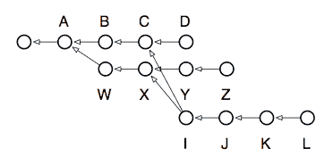
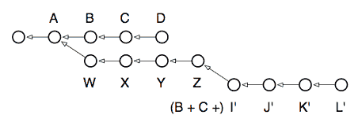

# 交互式重置

> 原文：[`jwiegley.github.io/git-from-the-bottom-up/1-Repository/8-interactive-rebasing.html`](http://jwiegley.github.io/git-from-the-bottom-up/1-Repository/8-interactive-rebasing.html)

当在上次运行 rebase 时，它会自动重写从`W`到`Z`的所有提交，以便将`Z`分支重置到`D`提交（即`D`分支的头部提交）。然而，你可以完全控制这种重写的方式。如果你向`rebase`命令提供`-i`选项，它将弹出一个编辑缓冲区，在那里你可以选择对本地`Z`分支中的每个提交应该做什么：

+   **选择** — 如果你不在交互模式下使用，这是为分支中的每个提交选择的默认行为。这意味着相关的提交应该应用到其（现在已重写）父提交上。对于涉及冲突的每个提交，`rebase`命令给你一个解决它们的机会。

+   **合并** — 一个合并的提交将把其内容“折叠”到其前一个提交的内容中。这可以多次进行。如果你拿上面的示例分支，并合并了其所有提交（除了第一个，它必须是一个**选择**以便**合并**），你最终会得到一个新的`Z`分支，其顶部只有一个基于`D`的提交。如果你有分散在多个提交中的更改，但希望将它们重写为单个提交的历史记录，这很有用。

+   **编辑** — 如果你将一个提交标记为**编辑**，重置过程将停止在该提交处，并让你在 shell 中留下当前工作树设置为反映该提交。索引将注册所有提交的更改，以便在运行`commit`时包含。因此，你可以进行任何你喜欢的更改：修改更改、撤销更改等；提交后，运行`rebase --continue`，该提交将被重写，好像这些更改最初就被做了。

+   **（删除）** — 如果你从交互式重置文件中删除一个提交，或者将其注释掉，该提交将简单地消失，就像它从未被检查入一样。请注意，如果分支中的后续提交依赖于这些更改，这可能会导致合并冲突。

这个命令的强大之处一开始难以理解，但它几乎赋予你无限的控制权来塑造任何分支的形状。你可以用它来做：

+   将多个提交合并为单个提交。

+   重新排序提交。

+   删除你现在后悔的错误更改。

+   将你的分支基础移动到仓库中的任何其他提交上。

+   修改单个提交，以在事后修改更改。

我建议你现在阅读`rebase`的 man 页面，因为它包含了一些很好的例子，展示了这个强大的工具如何被释放出来。为了给你一个最后的印象，这个工具是多么强大，考虑以下场景，如果你有一天想将二级分支`L`迁移为新的`Z`分支头部：



图片上写着：我们有我们的主线开发，`D`，在三个提交之前分支出来，开始对`Z`进行假设性开发。在所有这些事情中间的某个时候，当`C`和`X`分别是它们各自分支的头部时，我们决定开始另一个假设，最终产生了`L`。现在我们发现`L`的代码是好的，但还不够好以至于可以合并回主线，所以我们决定将这些更改移动到开发分支`Z`，让它看起来就像我们最终在一个分支上完成了所有这些。哦，顺便说一下，我们还想快速编辑`J`来更改版权日期，因为我们忘记在更改时是 2008 年了！以下是解开这个结的命令：

```sh
$ git checkout L
$ git rebase -i Z

```

在解决出现的任何冲突后，我现在有了这个仓库：



如您所见，在本地开发方面，变基（rebase）让您对提交在仓库中如何显示拥有无限的控制权。
