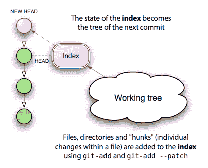

# 索引：中间人

> 原文：[`jwiegley.github.io/git-from-the-bottom-up/2-The-Index/1-meet-the-middle-man.html`](http://jwiegley.github.io/git-from-the-bottom-up/2-The-Index/1-meet-the-middle-man.html)

在你的数据文件（存储在文件系统中）和你的 Git blob（存储在仓库中）之间，存在一个有些奇怪的实体：Git 索引。使这个怪物难以理解的部分是它有一个相当不幸的名字。它是一个索引，因为它指的是你通过运行 add 创建的新树和 blob 的集合。这些新对象将很快被绑定到一个新的树中，以便提交到你的仓库——但在那时，它们只通过索引来引用。这意味着，如果你使用 reset 从索引中注销一个更改，你最终会得到一个孤儿 blob，它将在未来的某个时候被删除。

索引实际上只是你下一个提交的暂存区域，它存在的一个很好的原因是：它支持一种可能对 CVS 或 Subversion 用户来说比较陌生的开发模型，但对 Darcs 用户来说却非常熟悉：能够在阶段性地构建你的下一个提交。



首先，让我说，有一种方法可以几乎完全忽略索引：通过在 commit 时传递`-a`标志。看看 Subversion 是如何工作的，例如。当你输入`svn status`时，你会看到一个列表，列出了在下次调用`svn commit`时将对你的仓库应用的操作。从某种意义上说，这个“下一步行动列表”是一种非正式的索引，它通过比较你的工作树状态和 HEAD 状态来确定。如果`foo.c`文件已被更改，在下次提交时，这些更改将被保存。如果未知文件旁边有一个问号，它将被忽略；但使用`svn add`添加的新文件将被添加到仓库中。

这与使用`commit -a`时发生的情况没有不同：新文件被忽略，但使用 add 添加的新文件将被添加到仓库中，以及任何现有文件的更改。这种交互几乎与 Subversion 的方式相同。

真正的区别在于，在 Subversion 的情况下，你的“下一步行动列表”总是通过查看当前工作树来确定的。在 Git 中，“下一步行动列表”**就是**索引的内容，它代表了将成为 HEAD 下一个状态的内容，你可以在执行`commit`之前直接操作它。这为你提供了一个额外的控制层，允许你提前将这些更改暂存起来。

如果这还不清楚，请考虑以下示例：你有一个可靠的源文件`foo.c`，你对它进行了两组无关的更改。你想要做的是将这些更改分开成两个不同的提交，每个提交都有自己的描述。以下是你在 Subversion 中这样做的方式：

```sh
$ svn diff foo.c > foo.patch
$ vi foo.patch
<edit foo.patch, keeping the changes I want to commit later>
$ patch -p1 -R < foo.patch  # remove the second set of changes
$ svn commit -m "First commit message"
$ patch -p1 < foo.patch  # re-apply the remaining changes
$ svn commit -m "Second commit message"

```

听起来很有趣？现在将这个操作重复多次，以处理一组复杂且动态的变更。这里是使用索引的 Git 版本：

```sh
$ git add --patch foo.c
<select the hunks I want to commit first>
$ git commit -m "First commit message"
$ git add foo.c  # add the remaining changes
$ git commit -m "Second commit message"

```

更重要的是，这会变得更加简单！如果你喜欢 Emacs，Christian Neukirchan 开发的超级工具 `gitsum.el`，为这个可能令人厌烦的过程增添了一抹美丽的色彩。我最近用它来区分一组混合变更中的 11 个单独的提交。谢谢，Christian！
