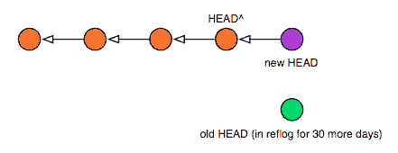
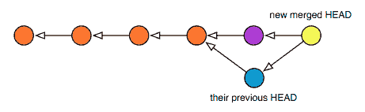

# 进行软重置

> [`jwiegley.github.io/git-from-the-bottom-up/3-Reset/3-doing-a-soft-reset.html`](http://jwiegley.github.io/git-from-the-bottom-up/3-Reset/3-doing-a-soft-reset.html)

如果你使用`--soft`选项来`reset`，这相当于只是将你的 HEAD 引用更改为不同的提交。你的工作树更改保持不变。这意味着以下两个命令是等效的：

```sh
$ git reset --soft HEAD^     # backup HEAD to its parent,
                             # effectively ignoring the last commit
$ git update-ref HEAD HEAD^  # does the same thing, albeit manually

```

在这两种情况下，你的工作树现在位于一个较旧的 HEAD 之上，所以如果你运行`status`，你应该会看到更多更改。这并不是你的文件已经改变，而是它们现在正在与一个较旧的版本进行比较。这可能会给你一个机会，用新的提交替换旧的提交。实际上，如果你想要更改的提交是最近一次提交的，你可以使用`commit --amend`将你的最新更改添加到最后的提交中，就像你一起做了这些更改一样。

但请注意：如果你有下游消费者，并且他们已经在你丢弃的前一个 HEAD 之上进行了工作——即你丢弃的那个——以这种方式更改 HEAD 将强制在他们下一次拉取后自动发生合并。以下是软重置和新的提交之后的树结构：



这里展示了消费者再次拉取后，他们的 HEAD 看起来会是什么样子，颜色显示了各种提交如何匹配：


